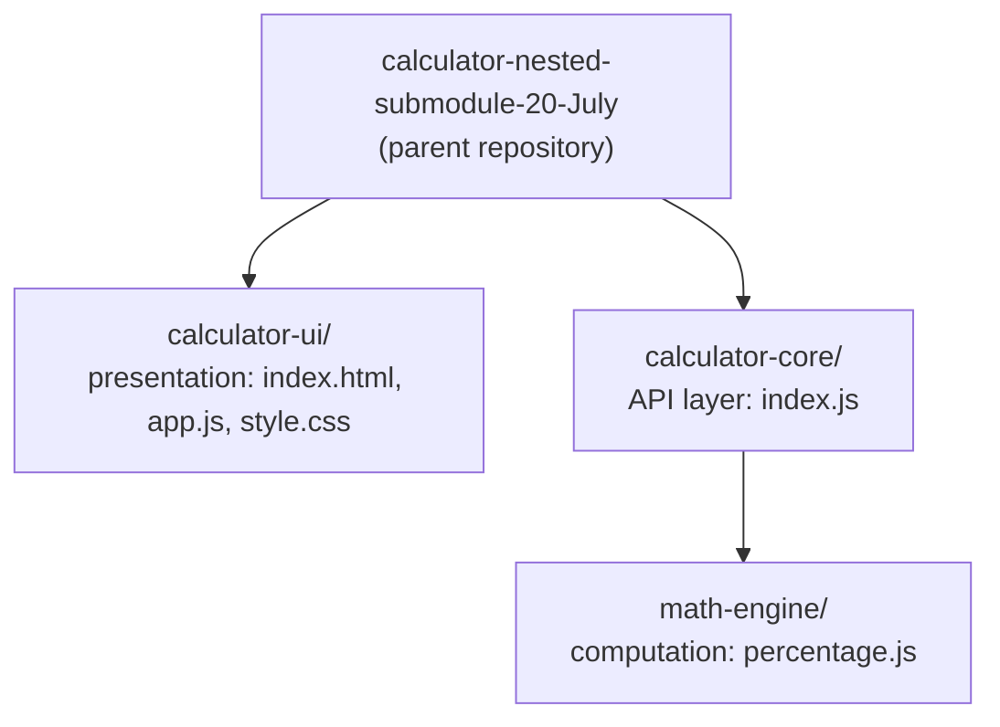
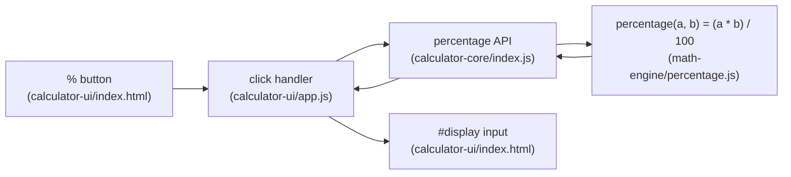

# Calculator — Nested Submodule (Percentage Feature)

**Repository:** `calculator-nested-submodule-20-July`

A minimal calculator built on a **vanilla JavaScript** stack — no UI framework, no
backend, and no database. The project demonstrates a **nested-submodule
architecture** and delivers a single feature as a vertical slice: a **Percentage
(%)** operation that flows from the calculator interface down to the computation
layer and back to the display.

> **Implementation status.** All three layers are implemented, fully tested, and
> fully documented: the **computation layer** (`math-engine`), the **API layer**
> (`calculator-core`), and the **presentation layer** (`calculator-ui`) — the
> latter comprising `index.html`, `app.js`, `style.css`, and the jsdom/Node test
> suites `app.test.js` and `app.node.test.js`. The test suites pass across every
> module (**10** engine, **23** core including the nested engine suite, and **29**
> UI). Every module — the parent repository and all three submodules — carries its
> own `README.md`, so there are no outstanding documentation deliverables.

The codebase is organized into three cooperating modules:

| Module | Role | Key files |
|--------|------|-----------|
| [`calculator-ui`](calculator-ui/README.md) | **Presentation layer** — the browser UI | `index.html`, `app.js`, `style.css`, `app.test.js`, `app.node.test.js`, `README.md` |
| [`calculator-core`](calculator-core/README.md) | **API layer** — a thin delegation layer exposing the percentage API | `index.js` |
| [`math-engine`](calculator-core/math-engine/README.md) | **Computation layer** — pure arithmetic, nested inside `calculator-core` | `percentage.js` |

For a calculation request, data flows in one direction — from the UI down to the
computation layer — and the numeric result flows back up to the display. The
sections below describe the architecture, the percentage feature, and how to
build, test, and run each module.

---

## Architecture — Nested-Submodule Topology

The project mirrors a **nested-submodule** architecture: `calculator-ui` and
`calculator-core` are top-level modules of the parent repository, and `math-engine`
is nested **inside** `calculator-core`. All three are treated as first-class parts
of the project.

### Directory layout

```text
calculator-nested-submodule-20-July/   (parent repository)
├── README.md                          (this file)
├── calculator-ui/                     (presentation module)
│   ├── index.html                     % button + #display input
│   ├── app.js                         click handler -> core API -> display
│   ├── style.css                      button styling
│   ├── app.test.js                    jsdom UI tests (23 tests)
│   ├── app.node.test.js               Node-env defensive tests (6 tests)
│   ├── package.json                   jest + jest-environment-jsdom
│   └── README.md                      UI usage + % button
└── calculator-core/                   (API module)
    ├── index.js                       percentage API (delegates to math-engine)
    ├── index.test.js                  API delegation tests
    ├── package.json                   jest
    ├── README.md
    └── math-engine/                   (computation module, nested)
        ├── percentage.js              percentage(a, b) = (a * b) / 100
        ├── percentage.test.js         unit tests
        ├── package.json               jest
        └── README.md
```

### Topology diagram



**All submodules are first-class.** `calculator-ui`, `calculator-core`, and the
nested `math-engine` are each treated as an integral part of the project; none is
excluded from the documentation or the build. Every module carries
JSDoc-annotated source, and every module — the parent repository, `calculator-ui`,
`calculator-core`, and the nested `math-engine` — carries its own `README.md`. No
documentation deliverable remains outstanding.

**In-tree directories (no `.gitmodules`).** This repository represents the
nested-submodule topology using **in-tree directories** rather than wired Git
submodules. There is intentionally **no `.gitmodules` manifest**, so there are no
submodule initialization or clone steps to perform — checking out the parent
repository brings every module with it.

---

## Percentage Feature

The feature adds a **`%` button** to the calculator UI. When activated, the UI
reads its operands, asks `calculator-core` to compute the percentage, and writes
the numeric result back into the calculator display. All three layers that power
this — the UI markup and click handler, the core API, and the computation
function — are implemented and tested today (see **Implementation status** above).

### Semantics

The percentage operation is implemented as a **binary** function so its signature
matches the calculator's other binary operations:

```text
percentage(a, b) = (a * b) / 100        ("b percent of a")
```

| `a` | `b` | `percentage(a, b)` | Reading |
|----:|----:|-------------------:|---------|
| 200 | 10 | 20 | 10% of 200 |
| 50 | 50 | 25 | 50% of 50 |
| 100 | 0 | 0 | 0% of 100 |
| -80 | 25 | -20 | 25% of -80 |
| 40 | 12.5 | 5 | 12.5% of 40 |

The function is a pure, stateless, constant-time calculation with no I/O.

### End-to-end data & control flow

The full path below — from the `%` button through the core API to the engine and
back to the display — is implemented and exercised by the test suites today.



1. The user clicks the `%` button in `calculator-ui/index.html`.
2. The click handler in `calculator-ui/app.js` reads the operand(s) and calls the
   percentage API.
3. `calculator-core/index.js` delegates to the engine via
   `require('./math-engine/percentage')`.
4. `math-engine/percentage.js` computes `(a * b) / 100` and returns the number.
5. The result flows back up through the core API to the UI handler.
6. The handler writes the value into the `<input id="display">` element, so the
   user sees the result.

### UI to core module boundary

The UI runs as plain **browser JavaScript**, while `calculator-core` and
`math-engine` are authored as **Node.js CommonJS** (`module.exports`) modules so
they can be unit-tested with Jest. A browser cannot call Node's `require()`
directly, so the project's **preferred** approach is a **UMD / dual-export**
pattern: each shared module file works both under Node `require()` (for tests) and
via a browser `<script>` include (for the UI). This keeps the production
dependency footprint at zero — **no bundler is introduced**. The exact export
mechanism lives in the module sources.

---

## Build & Test

Each module is an **independent npm package** with its own `package.json` that
declares a `"test": "jest"` script. There are **no runtime/production
dependencies** — the only packages are development-time test tooling.

### Dev tooling

| Package | Version | Used by | Purpose |
|---------|---------|---------|---------|
| `jest` | `^30.4.2` | all three modules | Test runner; native CommonJS support (no transform required) |
| `jest-environment-jsdom` | `^30.4.1` | `calculator-ui` only | Provides the jsdom DOM environment for UI tests |

**Node.js runtime.** Jest 30 supports Node.js `^18.14.0 || ^20.0.0 || ^22.0.0 || >=24.0.0`. The verified
development runtime is **Node.js 22.x** with **npm 11.x**.

### Install & run tests (per module)

Each module is installed and tested independently. Run the commands from the
parent repository root — each is wrapped in a subshell `( … )` so its `cd` does
**not** persist into the next block, letting the three run one after another:

```bash
# Computation layer (nested module)
(cd calculator-core/math-engine && npm install && npm test)

# API layer
(cd calculator-core && npm install && npm test)

# Presentation layer (uses the jsdom + Node environments)
(cd calculator-ui && npm install && npm test)
```

`npm test` invokes `jest`, which discovers and runs the module's `*.test.js` files.
Current suite sizes are **`math-engine` 10 tests**, **`calculator-ui` 29 tests**, and
**`calculator-core` 23 tests**. The `calculator-ui` count spans **two** suites:
`app.test.js` (23 jsdom tests) plus `app.node.test.js` (6 tests that run in the
default Node environment via a `@jest-environment node` docblock, covering the
no-`document` and missing-display defensive paths). The `calculator-core` count is
likewise **two** suites under Jest's default discovery: `index.test.js` (13 API
tests) plus the nested `math-engine/percentage.test.js` (10). Run
`npx jest index.test.js` in `calculator-core` to target only the 13-test core API
suite.

### Run the UI

The UI is a static page — no server is required.

1. Open `calculator-ui/index.html` directly in a web browser.
2. Enter the first operand (the base) and press **`%`** to store it; the display
   clears and a status line confirms the stored value.
3. Enter the percent and press **`%`** again.
4. The computed percentage appears in the calculator display
   (`<input id="display">`), and the status line announces the result.

---

## Documentation & Submodule Scope

Documentation is a first-class deliverable of this project. **Every module — the
parent repository and all submodules, including the nested `math-engine` — is in
scope for its own `README.md`, with every function/API annotated with JSDoc.** No
submodule is skipped or excluded. The parent, `calculator-ui`, `calculator-core`,
and `math-engine` READMEs — and the JSDoc across every module's source — all exist
today; no README remains pending.

Per-module documentation:

- [`calculator-ui/README.md`](calculator-ui/README.md) — the presentation layer,
  the `%` button, and how to run the UI.
- [`calculator-core/README.md`](calculator-core/README.md) — the percentage API
  surface and its wiring to `math-engine`.
- [`calculator-core/math-engine/README.md`](calculator-core/math-engine/README.md)
  — the `percentage(a, b)` computation and its unit tests.

---

## Project Layout Recap

| Path | Purpose |
|------|---------|
| `calculator-ui/index.html` | Calculator markup: the `%` button and the `#display` input |
| `calculator-ui/app.js` | Click handler: reads operands, calls the core API, updates `#display` |
| `calculator-ui/style.css` | Button and layout styling |
| `calculator-ui/app.test.js` | jsdom-based UI tests for the `%` button and display update (23 tests) |
| `calculator-ui/app.node.test.js` | Node-environment defensive tests: no-`document` safety and the missing-display fail-safe (6 tests) |
| `calculator-core/index.js` | Percentage API; delegates to `math-engine` |
| `calculator-core/index.test.js` | Tests proving the API delegates to the engine (mock/spy) plus the browser (UMD) dependency contract |
| `calculator-core/math-engine/percentage.js` | `percentage(a, b) = (a * b) / 100` |
| `calculator-core/math-engine/percentage.test.js` | Unit tests for the percentage function |
| `**/package.json` | Per-module Jest tooling and `test` script |
| `**/README.md` | Per-module documentation at every level (parent, `calculator-ui`, `calculator-core`, `math-engine`) |

---

## License

Released under the **MIT License**, consistent with the `license` field declared
in each module's `package.json`.
