# Technical Specification

# 1. Introduction

## 1.1 Executive Summary

This Technical Specification documents the repository **`calculator-nested-submodule-20-July`** (GitHub: `Sandeep01Kumar/calculator-nested-submodule-20-July`) exactly as it exists at its current and only commit. A comprehensive investigation of the repository — using both direct terminal inspection of the Git working tree and the semantic repository-inspection tooling — establishes that the repository is at an **inception / placeholder stage**. It contains no application source code, no build tooling, and no functional implementation of any kind.

The entire tracked content of the repository is a **single file named `calculator-ui`** that holds only one byte: a newline character. It was introduced in a single commit whose message, "Create calculator-ui," is the default message GitHub generates when a new, empty file is created through its web interface. Because the substantive system this repository is presumably intended to hold has not yet been built, this Introduction documents the observable facts truthfully rather than describing a system that does not yet exist.

**Repository at a Glance**

| Attribute | Observed Value |
|-----------|----------------|
| Repository name | `calculator-nested-submodule-20-July` |
| Default branch | `main` (tracking `origin/main` at the same commit) |
| Total commits | 1 (`34307f8` — "Create calculator-ui") |
| Tracked files (non-Git) | 1 (`calculator-ui`) |
| `calculator-ui` size / contents | 1 byte — a single newline (`\n`), i.e. effectively empty |
| Source code / manifests / config | None present |
| Git submodules | None (`.gitmodules` absent; `calculator-ui` is a regular blob, mode `100644`) |

**Project Overview.** At the documented commit, the project consists solely of the placeholder file `calculator-ui`. There is no arithmetic logic, no user-interface code, no dependency manifest (for example, no `package.json`, `requirements.txt`, or equivalent), no configuration, no documentation, no tests, and no continuous-integration definitions. The only signals of *intended* purpose are the names chosen for the repository and the file: the repository name references a "calculator" and "nested submodule," and the file name `calculator-ui` references a calculator user interface. These are naming signals of intent only; they are not backed by any implemented behavior in the repository.

**Core Business Problem.** No business problem, requirement, or use case is described anywhere in the repository — there is no README, specification, issue backlog, or code from which a problem statement could be derived. Consequently the core business problem cannot be established from evidence. The repository name implies an aspiration to deliver a calculator application (potentially composed of nested Git submodules), but the repository provides no artifacts that define or address such a problem.

**Key Stakeholders and Users.** The only stakeholder identifiable from repository evidence is the single commit author, recorded in Git history as `Sandeep01Kumar <sandeep@blitzy.com>`. No end-user roles, personas, product owners, or consumer systems are documented anywhere in the repository, so a stakeholder or user community cannot be enumerated from evidence.

**Expected Business Impact and Value Proposition.** Because no functionality has been implemented, the repository delivers no runtime capability and therefore no realized business value at this time. Its present value is limited to serving as an initialized version-control container and a named placeholder into which a calculator user interface — and, as the repository name suggests, a nested-submodule structure — could subsequently be developed. Any impact or value proposition will materialize only once implementation begins; none can be substantiated from the current contents.

> **Documentation note.** Every statement in this Introduction is grounded in what was directly observed in the repository at commit `34307f8`. Where the repository contains no evidence for an element requested by this specification (for example, measurable KPIs, integrations, or user groups), that absence is stated plainly rather than inferred or fabricated.


## 1.2 System Overview

This section describes the system as it can be observed in the repository at commit `34307f8`. Because the repository is at an inception stage, the "system" presently comprises only version-control scaffolding and a single placeholder file. Each element requested below is reported against actual evidence; where no evidence exists, the absence is stated explicitly.

### 1.2.1 Project Context

**Business context and market positioning.** The repository contains no product description, README, specification, license, or any other narrative artifact. As a result, there is no evidence of a business context, target market, competitive positioning, or intended commercial use. The only contextual signal available is the naming of the repository (`calculator-nested-submodule-20-July`) and its single file (`calculator-ui`), which together imply an intent to build a calculator user interface, potentially organized using nested Git submodules. This is an inference from naming only and is not corroborated by any content.

**Current system limitations (replacement/upgrade context).** There is no evidence that this repository replaces or upgrades a pre-existing system. Git history shows a single commit ("Create calculator-ui") that introduces the placeholder file, with no prior baseline, migration notes, or references to a legacy application. The project is therefore best characterized as a greenfield initialization rather than a replacement effort, and no "current system" limitations can be documented from evidence.

**Integration with the existing enterprise landscape.** No integration points are present. The repository declares no dependencies, no API clients or servers, no configuration for external services, no environment files, and — despite the repository name — no Git submodules (there is no `.gitmodules` file, and `calculator-ui` is a regular file blob rather than a submodule reference). Consequently, there is no evidence of integration with any enterprise systems, data stores, identity providers, or third-party services.

### 1.2.2 High-Level Description

**Primary system capabilities.** No runtime capabilities are implemented. The repository contains no executable code, no arithmetic/calculation logic, and no user-interface assets, so it exposes no functionality that a user or system could invoke.

**Major system components.** At the documented commit, the repository is composed of exactly the following observable artifacts. The `calculator-ui` file — the only application-level artifact — is effectively empty (a single newline byte).

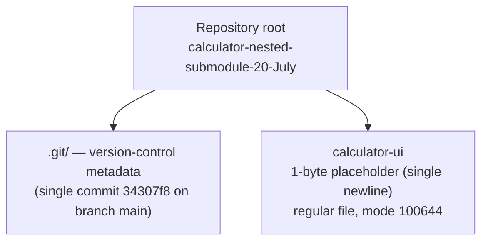
```mermaid
flowchart TD
    Root["Repository root<br/>calculator-nested-submodule-20-July"]
    Git[".git/ — version-control metadata<br/>(single commit 34307f8 on branch main)"]
    File["calculator-ui<br/>1-byte placeholder (single newline)<br/>regular file, mode 100644"]
    Root --> Git
    Root --> File
```

There is no front-end module, back-end service, library, or submodule to describe. The file name `calculator-ui` suggests an intended user-interface component, but the file itself carries no implementation.

**Core technical approach.** No technical approach is evidenced. The repository does not select or reveal a programming language, framework, runtime, package manager, build system, or architectural style, because it contains no source or configuration files of any kind. The repository name's reference to a "nested submodule" hints at an intended modular structure assembled from nested Git submodules, but no submodule configuration exists, so this remains an unrealized naming signal rather than an observed approach.

### 1.2.3 Success Criteria

The repository defines no measurable objectives, critical success factors, or key performance indicators. There is no specification, acceptance criteria, test suite, service-level objective, or metrics/monitoring configuration from which such criteria could be drawn. The following table records each requested category against the available evidence.

| Success-Criteria Category | Status in Repository | Evidence Basis |
|---------------------------|----------------------|----------------|
| Measurable objectives | None defined | No spec, README, or requirements artifact present |
| Critical success factors | None defined | No planning or design documentation present |
| Key performance indicators (KPIs) | None defined | No metrics, monitoring, SLO, or analytics configuration present |

Because none of these are present, no KPIs or objectives are asserted in this specification; introducing any would require fabricating information not found in the codebase. Success criteria should be authored once the project's requirements and implementation begin to take shape.


## 1.3 Scope

This section delineates what the repository actually contains at commit `34307f8` (in-scope) versus what it does not contain (out-of-scope). Given the inception state of the repository, the in-scope surface is deliberately minimal, and most functionality one would associate with the project's naming is absent and therefore out of scope for the current state.

### 1.3.1 In-Scope Elements

**Core features and functionalities.** No features or functionalities are implemented. The single tracked file, `calculator-ui`, is effectively empty (one newline byte) and contains no logic, markup, or configuration. The only element genuinely "in scope" — in the sense of being present in the repository — is the initialized Git version-control scaffolding together with this placeholder file.

| Core Aspect | Present at Documented Commit? | Evidence |
|-------------|-------------------------------|----------|
| Must-have capabilities | None | No source or executable artifacts exist |
| Primary user workflows | None | No UI, entry point, or interaction logic exists |
| Essential integrations | None | No dependencies, clients, or service configuration exist |
| Key technical requirements | None defined | No spec, manifest, or configuration files exist |

**Implementation boundaries.** The system boundary is a single Git repository containing one branch (`main`) and one placeholder file, with no runtime, deployment target, or executable surface. Everything below reflects the observable extent of that boundary.

| Boundary Dimension | Observed Extent | Evidence |
|--------------------|-----------------|----------|
| System boundary | One Git repository; one branch (`main`); one file (`calculator-ui`); no runtime | `git ls-files`, `git branch -a`, working-tree inspection |
| User groups covered | None identifiable (only the commit author appears in history) | Git commit metadata (`Sandeep01Kumar`) |
| Geographic / market coverage | None documented | No product, localization, or deployment artifacts exist |
| Data domains included | None | No data models, schemas, migrations, or stored data exist |

### 1.3.2 Out-of-Scope Elements

Because the repository is a placeholder, effectively all substantive capability lies outside its current scope. The items below are **not present** at the documented commit; several are directly implied by the project's naming and would be natural candidates for future work, but none are implemented today.

**Excluded features and capabilities (not present in the repository).**

| Excluded Area | Notes |
|---------------|-------|
| Calculator arithmetic / computation logic | No calculation engine or expression handling exists |
| Calculator user interface (implied by `calculator-ui`) | The file name implies a UI, but no markup, styling, or UI code exists |
| Application entry point, build, and packaging | No manifest, build script, or runnable artifact exists |
| Automated tests and CI/CD | No test suite or pipeline configuration exists |

**Future-phase considerations.** The following are not commitments found in the repository but are the natural next steps suggested by its naming and empty state: implementing the calculator user interface referenced by `calculator-ui`; introducing the "nested submodule" structure implied by the repository name (currently there is no `.gitmodules` file and no submodule); and adding dependency management, build tooling, tests, and continuous integration. These are noted as context only and are out of scope for the present state.

**Integration points not covered.** No integration is in scope. There are no external APIs, databases, authentication providers, message queues, or third-party services referenced or configured anywhere in the repository, so all such integrations are out of scope at this time.

**Unsupported use cases.** Because no functionality exists, the repository supports no end-user or system use cases at the documented commit. Any use case one might associate with a calculator application (for example, performing arithmetic through a user interface) is unsupported in the current state.


## 1.4 References

The following repository artifacts were inspected as the evidentiary basis for this Introduction. No external or web sources were required.

**Files and folders examined**

- `calculator-ui` — The sole tracked (non-Git) file in the repository; established that it is a 1-byte placeholder containing only a newline character and carries no implementation, markup, or configuration.
- `/` (repository root) — Established the complete top-level structure: only the `.git/` metadata directory and the single `calculator-ui` file are present; no source, manifest, configuration, documentation, test, or CI/CD artifacts exist.
- `.git/` (version-control metadata) — Established the repository history and state: a single commit (`34307f8`, "Create calculator-ui", authored by `Sandeep01Kumar <sandeep@blitzy.com>`), a single branch (`main`, tracking `origin/main` at the same commit), no tags or stashes, no submodule configuration, and an object database of exactly three objects (one commit, one tree, one blob).

**Verification methods**

- Git working-tree and history inspection (`git ls-files`, `git ls-tree -r HEAD`, `git branch -a`, `git tag`, `git log --all`, `git cat-file --batch-all-objects`, `git config --list`) — Confirmed the single-file inventory, the regular-file mode (`100644`) of `calculator-ui` (i.e., not a submodule gitlink), the absence of a `.gitmodules` file, and the effectively-empty file contents (`od -c` showing a single `\n`).
- Filesystem sweep (`find` for source, manifest, configuration, documentation, and Git-meta file patterns) — Confirmed zero matches beyond the single placeholder file.
- Repository-inspection tooling (`get_source_folder_contents`, `get_file_summary`, `search_files`) — Returned empty/`null`/`[]` results consistent with the terminal evidence, corroborating the effectively-empty state of the repository index.


# 2. Product Requirements

## 2.1 Requirements Baseline and Documentation Approach

This Product Requirements section documents the discrete, testable features of the **`calculator-nested-submodule-20-July`** repository exactly as they can be derived from its tracked contents at the sole commit `34307f8`. A comprehensive investigation — combining direct Git working-tree inspection with the semantic repository-inspection tooling — establishes that the repository is at an **inception / placeholder stage** and contains **no implemented product features**. Accordingly, this section reports an evidence-based *absence* of features and requirements rather than describing capabilities that do not exist in the code.

This framing sub-section records the baseline against which every subsequent sub-section (2.2 Feature Catalog through 2.6 Traceability Matrix) is written, states the identifier conventions that would govern feature and requirement traceability, and enumerates the assumptions and constraints that bound the analysis. It aligns with and does not repeat the findings already established in **Section 1.2 System Overview** and **Section 1.3 Scope**, to which the reader is referred for the full system-level context.

### 2.1.1 Requirements Baseline

The requirements baseline is the observable state of the repository at its only commit. Every claim in Section 2 is measured against this baseline; nothing outside it is asserted.

| Baseline Attribute | Observed Value | Evidence Source |
|--------------------|----------------|-----------------|
| Documented commit | `34307f8` — "Create calculator-ui" (single commit) | `git log`, `git show-ref` |
| Tracked application files | 1 — `calculator-ui` | `git ls-files` |
| `calculator-ui` contents | 1 byte: a single newline (`\n`), effectively empty | `od -c calculator-ui`, blob `8b13789` |
| Source / manifest / config / test / CI files | None present | Full working-tree sweep (0 matches) |
| Implemented product features | **0** | No executable, markup, or logic artifacts exist |

**Interpretation.** Because the single tracked file is effectively empty and no other source, configuration, or manifest artifact exists, there is no code from which a feature could be observed. The repository therefore has an empty feature inventory at the documented commit. The only signals of *intended* purpose are naming signals — the repository name references a "calculator" assembled from a "nested submodule" structure, and the file name `calculator-ui` references a calculator user interface. As established in Section 1.2, these are intent signals only and are not backed by any implemented behavior; they are surfaced in Section 2.2 strictly as non-committal, unimplemented candidate areas.

### 2.1.2 Identifier and Documentation Conventions

The section prompt prescribes stable identifier formats for features and their requirements. Because no features exist at the documented commit, **no identifiers are assigned** in this specification. The conventions are nonetheless recorded here so that, once implementation begins, features and requirements can be captured consistently and traceably.

| Identifier Type | Prescribed Format | Purpose | Current Assignments |
|-----------------|-------------------|---------|---------------------|
| Feature ID | `F-XXX` (zero-padded, e.g. `F-001`) | Uniquely identify one discrete, testable feature | None — 0 features exist |
| Requirement ID | `F-XXX-RQ-YYY` | Identify one functional requirement of feature `F-XXX` | None — 0 requirements exist |
| Priority (feature) | Critical / High / Medium / Low | Rank feature delivery importance | Not applicable — no features |
| Priority (requirement) | Must-Have / Should-Have / Could-Have | Rank requirement importance (MoSCoW) | Not applicable — no requirements |

Feature status values follow the prescribed lifecycle (Proposed / Approved / In Development / Completed). Since the repository contains only a placeholder file introduced in a single commit, any future feature would begin at the **Proposed** stage; the current commit does not evidence an approved or in-development status for any capability.

### 2.1.3 Assumptions and Constraints

The following assumptions and constraints govern this section and are stated explicitly so that readers understand the boundaries of the analysis.

- **Evidence-only scope.** Every statement is grounded in artifacts observed at commit `34307f8`. No SLAs, KPIs, performance targets, business rules, or integration behaviors are asserted, because none are present in the repository.
- **Naming is not implementation.** The repository and file names imply a calculator UI and a nested-submodule structure, but no such implementation exists. Naming is treated as aspirational context only and never as a delivered feature.
- **No submodules present.** Despite the repository name, there is no `.gitmodules` file and `calculator-ui` is a regular file blob (mode `100644`), not a submodule gitlink. No nested-submodule composition can be documented.
- **No external inputs.** No user-provided repository context, attachments, or implementation rules were supplied for this section; therefore no external constraints modify the evidence-based findings.
- **Forward-looking content is clearly labeled.** Where this section describes conventions or templates for *future* population (identifier formats, empty requirement tables, an empty traceability matrix), such content is explicitly marked as not-yet-applicable and is never presented as an existing requirement.

These constraints are consistent with the out-of-scope determinations in Section 1.3, which records that calculator arithmetic, the calculator user interface, application entry points, build/packaging, tests, and CI/CD are all absent from the current repository.

## 2.2 Feature Catalog

The feature catalog enumerates the discrete, testable features implemented in the repository. At commit `34307f8` the repository contains no source code, markup, configuration, or logic of any kind, so **the feature catalog is empty**. No feature identifiers (`F-XXX`) are assigned because there are no observable features to identify. This finding is consistent with Section 1.3, which records that no core features or functionalities are implemented.

### 2.2.1 Feature Inventory

The complete inventory of implemented features at the documented commit is shown below. It is intentionally empty and reflects the absence of any executable or declarative artifact.

| Feature ID | Feature Name | Category | Status |
|------------|--------------|----------|--------|
| _(none)_ | No features are implemented at commit `34307f8` | _n/a_ | _n/a_ |

No feature can be documented against the prescribed metadata attributes (ID, Name, Category, Priority, Status) because the repository provides no artifact from which any such attribute could be observed. The sole tracked file, `calculator-ui`, is a 1-byte placeholder (a single newline) and implements nothing.

### 2.2.2 Feature Documentation Template (Not Yet Populated)

The section prompt prescribes a per-feature record comprising Feature Metadata, a Description, and Dependencies. Because zero features exist, none of these records are populated. The template below is recorded to define the structure that will be used once features are introduced; every field is currently **not applicable**.

| Record Group | Prescribed Fields | Populated At Commit `34307f8`? |
|--------------|-------------------|--------------------------------|
| Feature Metadata | Unique ID (`F-XXX`), Name, Category, Priority, Status | No — 0 features |
| Description | Overview, Business Value, User Benefits, Technical Context | No — 0 features |
| Dependencies | Prerequisite Features, System Dependencies, External Dependencies, Integration Requirements | No — 0 features |

Because there are no features, there are also no prerequisite features, no system dependencies, no external dependencies, and no integration requirements to record. The repository declares no dependency manifest (for example, there is no `package.json` or `requirements.txt`) and configures no external services, consistent with the integration findings in Section 1.2.

### 2.2.3 Naming-Signal Candidate Areas (Aspirational — Not Implemented)

The repository and file names carry signals of *intended* purpose. The areas below are **not features** and are **not assigned feature identifiers**; they are documented here for context only, mirroring the future-phase considerations already recorded in Section 1.3. None of them is present in the code at the documented commit.

| Candidate Area (Intent Only) | Naming Source | Implementation Status |
|------------------------------|---------------|-----------------------|
| Calculator user interface | File name `calculator-ui` | Not implemented — no markup, styling, or UI code exists |
| Calculator arithmetic / computation | Repository name `calculator-…` | Not implemented — no calculation logic exists |
| Nested Git submodule composition | Repository name `…-nested-submodule-…` | Not implemented — no `.gitmodules` file; no submodule gitlink exists |

These candidate areas are natural next steps suggested by the naming, but they are unimplemented aspirations rather than delivered features. They must not be interpreted as committed requirements; any future work would enter the catalog as new `F-XXX` records beginning at the **Proposed** status.

## 2.3 Functional Requirements

Functional requirements are defined per feature using the identifier format `F-XXX-RQ-YYY`. Because the feature catalog in Section 2.2 is empty, **no functional requirements exist** at commit `34307f8`, and no requirement identifiers are authored. The single tracked file provides no input handling, no output, no processing logic, and no validation from which a testable requirement could be derived.

### 2.3.1 Functional Requirements Status

The complete set of functional requirements at the documented commit is empty, as shown below.

| Requirement ID | Parent Feature | Description | Status |
|----------------|----------------|-------------|--------|
| _(none)_ | _(none)_ | No functional requirements are defined at commit `34307f8` | _n/a_ |

Because there are no requirements, there is nothing to assign a Must-Have / Should-Have / Could-Have priority or a High / Medium / Low complexity rating, and there are no acceptance criteria to verify.

### 2.3.2 Requirements Table Template (Not Yet Populated)

The section prompt prescribes a three-part requirements record for each feature. The template below defines the structure that will be populated once features and requirements are introduced. At the documented commit, none of these groups contains any entries.

| Record Group | Prescribed Fields | Populated At Commit `34307f8`? |
|--------------|-------------------|--------------------------------|
| Requirement Details | Requirement ID (`F-XXX-RQ-YYY`), Description, Acceptance Criteria, Priority (MoSCoW), Complexity | No — 0 requirements |
| Technical Specifications | Input Parameters, Output/Response, Performance Criteria, Data Requirements | No — 0 requirements |
| Validation Rules | Business Rules, Data Validation, Security Requirements, Compliance Requirements | No — 0 requirements |

No input parameters, outputs, performance criteria, or data requirements can be documented because the repository defines no interface, no data model, and no runtime. Likewise, no business rules, data-validation rules, security requirements, or compliance requirements are present in the code.

### 2.3.3 Testability and Acceptance-Criteria Approach

The prompt requires that requirements be testable and carry acceptance criteria. No such requirements can be written today because there is nothing to test — the repository contains no test suite and no executable behavior (consistent with Section 1.3, which records automated tests and CI/CD as out of scope). The following approach is recorded for future population and is **not** an existing requirement:

- Each future requirement will be phrased as a single, observable, verifiable behavior and assigned a unique `F-XXX-RQ-YYY` identifier under its parent feature.
- Each requirement will carry explicit acceptance criteria expressed so that a test can pass or fail unambiguously.
- Each requirement will record a MoSCoW priority and a complexity rating to support planning and estimation.

Until features are implemented, this sub-section remains an empty, structurally-defined placeholder rather than a set of enforceable requirements.

## 2.4 Feature Relationships

Feature relationships — dependency maps, integration points, shared components, and common services — describe how discrete features interconnect. Since Section 2.2 establishes that **zero features exist** at commit `34307f8`, there are **no relationships to document**. The prompt's directive to document only relationships clearly evident in the source code therefore yields an empty result: no dependency, integration, or sharing relationship can be observed because there is nothing between which a relationship could form.

### 2.4.1 Feature Dependency Map

There are no features and therefore no dependency edges. The diagram below depicts the entire observable structure of the repository at the documented commit: a single placeholder file under the repository root, with no feature nodes and no dependency relationships. It corresponds to the repository-structure diagram in Section 1.2.2.

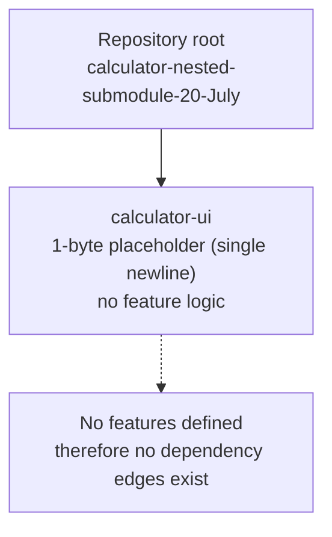
```mermaid
flowchart TD
    Root["Repository root<br/>calculator-nested-submodule-20-July"]
    Placeholder["calculator-ui<br/>1-byte placeholder (single newline)<br/>no feature logic"]
    NoFeatures["No features defined<br/>therefore no dependency edges exist"]
    Root --> Placeholder
    Placeholder -.-> NoFeatures
```

### 2.4.2 Integration Points, Shared Components, and Common Services

No integration points, shared components, or common services are present. The repository declares no dependencies, exposes no APIs or clients, configures no external services, and contains no reusable modules or shared runtime. The table records each relationship type against the available evidence.

| Relationship Type | Present At Commit `34307f8`? | Evidence Basis |
|-------------------|------------------------------|----------------|
| Feature-to-feature dependencies | None | 0 features exist to depend on one another |
| Integration points | None | No APIs, clients, message queues, or service configuration exist |
| Shared components | None | No source modules or libraries exist to be shared |
| Common services | None | No runtime, service, or cross-cutting utility exists |

Because the repository name references a "nested submodule" structure, one might expect inter-module relationships assembled from Git submodules; however, as established in Section 2.1.3, no `.gitmodules` file exists and `calculator-ui` is a regular file blob rather than a submodule reference. No submodule-based composition or relationship can therefore be documented.

## 2.5 Implementation Considerations

Implementation considerations capture the technical constraints, performance requirements, scalability considerations, security implications, and maintenance requirements associated with each feature. Because no features are implemented at commit `34307f8`, there are **no per-feature implementation considerations** to record. No such properties are defined anywhere in the repository, which contains no source, configuration, build, or deployment artifacts from which they could be derived.

### 2.5.1 Implementation Considerations Status

The table records each requested consideration dimension against the available evidence. Every dimension is undefined at the documented commit.

| Consideration Dimension | Defined At Commit `34307f8`? | Evidence Basis |
|-------------------------|------------------------------|----------------|
| Technical constraints | None | No programming language, framework, runtime, or package manager is selected |
| Performance requirements | None | No performance targets, benchmarks, or SLAs exist |
| Scalability considerations | None | No runtime, deployment target, or architecture exists |
| Security implications | None | No authentication, data handling, secrets, or exposed surface exists |
| Maintenance requirements | None | No build tooling, tests, CI/CD, or documentation exists |

### 2.5.2 Observable Repository-Level Considerations

The only implementation-relevant artifacts that can be observed are the initialized version-control scaffolding and the single placeholder file. These carry no functional behavior and impose no runtime, security, or performance obligations.

- **Version-control scaffolding.** The repository has one branch (`main`, tracking `origin/main`) and a single commit (`34307f8`). This is the extent of the implemented "system" and is documented more fully in Section 1.2.2.
- **Placeholder file.** `calculator-ui` is a 1-byte file containing only a newline. It is a regular file blob (mode `100644`), not a submodule gitlink, and holds no logic, markup, or configuration.
- **Forward-looking note (not a current requirement).** Any future implementation would need to introduce a language/runtime choice, build and packaging tooling, tests, and — if the repository name's intent is realized — a nested-submodule structure. These are aspirational next steps consistent with the future-phase considerations in Section 1.3, not obligations evidenced by the current code.

Because no features, interfaces, or runtime exist, no constraints, performance targets, scalability strategies, security controls, or maintenance procedures are asserted; doing so would require fabricating information absent from the repository.

## 2.6 Traceability Matrix

A requirements traceability matrix links each functional requirement to its parent feature, its acceptance criteria, and its verification status, ensuring end-to-end coverage. Because Section 2.2 records zero features and Section 2.3 records zero functional requirements, **the traceability matrix is empty** at commit `34307f8`. There is nothing to trace, and no coverage can be asserted.

### 2.6.1 Requirements Traceability Matrix

The matrix below is the complete traceability record at the documented commit. It contains no rows, reflecting the absence of features and requirements.

| Feature ID | Requirement ID | Acceptance Criterion | Verification Status |
|------------|----------------|----------------------|---------------------|
| _(none)_ | _(none)_ | _(none)_ | _Not applicable — 0 requirements_ |

Once features (`F-XXX`) and requirements (`F-XXX-RQ-YYY`) are introduced, each requirement will occupy one row that traces from its parent feature through its acceptance criterion to a verification status (for example, Not Started / Passed / Failed). Until then, the matrix remains a structurally-defined placeholder rather than an active coverage record.

### 2.6.2 Cross-Reference Index

The section prompt asks that requirements reference related process flowcharts and link to relevant technical specifications. As there are no requirements, there are no requirement-specific flowcharts. The related artifacts that do exist elsewhere in this specification are indexed below for navigation.

| Related Artifact | Location | Relationship |
|------------------|----------|--------------|
| Repository-structure flowchart | Section 1.2.2 High-Level Description | Depicts the only components present (root, `.git/`, `calculator-ui`) |
| Feature dependency map | Section 2.4.1 Feature Dependency Map | Shows the empty feature graph for this section |
| In-scope / out-of-scope determination | Section 1.3 Scope | Establishes that no features or integrations are present |
| Evidence references | Section 2.7 References | Lists the artifacts underpinning Section 2 |

No process flowcharts depicting feature behavior exist, because no feature behavior is implemented. The only diagrams available are the structural diagrams referenced above, which portray the repository's placeholder state rather than any functional flow.

## 2.7 References

The following repository artifacts and specification sections form the evidentiary basis for Section 2. All findings were verified by direct Git working-tree inspection and corroborated by the semantic repository-inspection tooling. No external or web sources were required.

**Files and folders examined**

- `calculator-ui` — The sole tracked (non-Git) file; a 1-byte placeholder containing only a newline character. Established the empty feature inventory (Section 2.2), the absence of functional requirements (Section 2.3), and that it is a regular file blob (mode `100644`), not a submodule gitlink.
- `/` (repository root) — Established the complete top-level structure: only the `.git/` metadata directory and the single `calculator-ui` file are present; no source, manifest, configuration, test, CI/CD, or `.gitmodules` artifacts exist.
- `.git/` (version-control metadata) — Established the repository state used throughout Section 2: a single commit (`34307f8`, "Create calculator-ui"), a single branch (`main`, tracking `origin/main`), no tags or stashes, no submodule configuration, and an object database of exactly three objects (one commit, one blob, one tree).

**Verification methods**

- Git inspection (`git ls-files`, `git ls-tree -r HEAD`, `git show-ref`, `git log`, `git stash list`, `git cat-file --batch-all-objects`) — Confirmed the single-file inventory, the regular-file mode of `calculator-ui`, the absence of `.gitmodules`, and the effectively-empty file contents (`od -c` showing a single `\n`).
- Filesystem sweep (`find` for source, manifest, configuration, documentation, and build/CI file patterns) — Confirmed zero matches beyond the single placeholder file.
- Repository-inspection tooling (`get_source_folder_contents`, `get_file_summary`, `search_files`, `search_folders`) — Returned empty/`null`/`[]` results consistent with the terminal evidence, corroborating the effectively-empty state.

**Cross-referenced specification sections**

- Section 1.1 Executive Summary — Corroborated the inception/placeholder state and the "Repository at a Glance" facts.
- Section 1.2 System Overview — Provided the repository-structure flowchart referenced in Sections 2.4.1 and 2.6.2 and confirmed the absence of capabilities, components, and integrations.
- Section 1.3 Scope — Confirmed the in-scope/out-of-scope determination (no features, integrations, or use cases present) referenced throughout Section 2.
- Section 1.4 References — Confirmed the shared evidentiary basis and verification methods.

# 3. Technology Stack

## 3.1 Programming Languages

This section documents the programming languages used across the platform's components, as observed in the repository at commit `34307f8`. **No programming language is used or selected anywhere in the repository.** The repository contains no source files of any kind; its sole tracked artifact, `calculator-ui`, is a 1‑byte placeholder holding a single newline character, carries no file extension, no shebang line, and no code from which a language could be inferred. This finding is consistent with Sections 1.2 and 2.5, which record that no language, framework, or runtime has been selected.

Because Section 3 documents an inception‑stage repository, the same evidentiary baseline applies to every subsection that follows: each requested technology category is reported against actual evidence, and where no evidence exists the absence is stated explicitly rather than inferred or fabricated.

### 3.1.1 Languages by Platform / Component

A comprehensive file‑extension sweep of the working tree (excluding `.git/`) returned zero source files. The table below records each candidate platform/component that the repository's naming implies, against the language actually observed.

| Platform / Component | Language Observed | Version | Status | Evidence |
|---|---|---|---|---|
| Any backend service | None | n/a | Not implemented | No `.py`, `.js`, `.ts`, `.go`, `.rb`, `.java`, `.kt` files present |
| Web front‑end (implied by `calculator-ui`) | None | n/a | Not implemented | No `.html`, `.css`, `.js`, `.ts`, `.jsx`, `.tsx` files present |
| Native / mobile / desktop app | None | n/a | Not implemented | No `.swift`, `.kt`, `.m`, `.cs`, `.cpp` files present |
| Placeholder file `calculator-ui` | None (extensionless) | n/a | Present but empty | 1‑byte file, single newline, no language markers |

No version numbers can be reported for any language because no language toolchain, manifest, or source file exists from which a version could be pinned or observed.

### 3.1.2 Selection Criteria and Constraints

No language selection has been made, so no selection criteria have been exercised and no language‑imposed constraints or dependencies exist at the documented commit.

- **Selection criteria:** None applied. The repository provides no README, architecture decision record, specification, or manifest documenting why any language was or would be chosen.
- **Constraints:** None. With no language runtime committed, there are no interpreter, compiler, or version‑compatibility constraints, and no language‑level dependencies.
- **Dependencies:** None. No language‑specific dependency manifest (for example `requirements.txt` or `package.json`) is present; see Section 3.3.

The following diagram summarizes the language‑selection status observed in the repository.

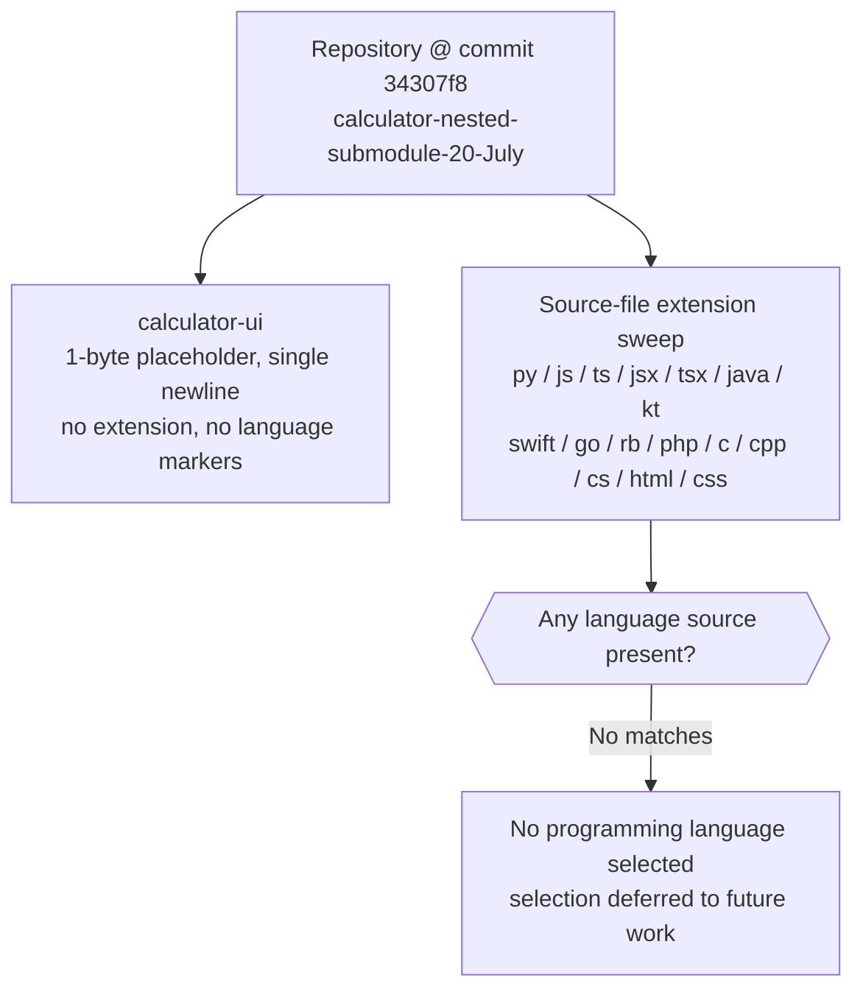
```mermaid
flowchart TD
    Repo["Repository @ commit 34307f8<br/>calculator-nested-submodule-20-July"]
    Repo --> Only["calculator-ui<br/>1-byte placeholder, single newline<br/>no extension, no language markers"]
    Repo --> Sweep["Source-file extension sweep<br/>py / js / ts / jsx / tsx / java / kt<br/>swift / go / rb / php / c / cpp / cs / html / css"]
    Sweep --> Result{{"Any language source present?"}}
    Result -->|No matches| NoLangSel["No programming language selected<br/>selection deferred to future work"]
```

### 3.1.3 Forward-Looking Reference Default (Not Adopted)

> **Reference only — not implemented.** The organization's greenfield project template proposes default language choices per component. These are recorded purely as forward‑looking context, mirroring the future‑phase considerations in Section 1.3. **None of these languages is present, referenced, configured, or committed in the repository, and no version is pinned.** They would become applicable only if and when implementation begins.

| Component (Template) | Reference‑Default Language | Adopted in Repo? |
|---|---|---|
| Backend | Python | No |
| Web front‑end | TypeScript (with React) | No |
| Cross‑platform mobile | TypeScript (React Native) | No |
| iOS native | Swift | No |
| Android native | Kotlin | No |
| macOS native | Objective‑C | No |

## 3.2 Frameworks & Libraries

This section documents the application frameworks and supporting libraries used by the system at commit `34307f8`. **No framework or library is used, declared, or vendored anywhere in the repository.** Framework and library adoption is normally evidenced by a dependency manifest (for example `package.json`, `requirements.txt`, `pyproject.toml`, `pom.xml`, `build.gradle`, or `Gemfile`); no such manifest exists in the repository, and no framework configuration files, import statements, or vendored library directories (for example `node_modules/` or a virtual environment) are present.

### 3.2.1 Core Frameworks and Supporting Libraries

| Category | Framework / Library | Version | Status | Evidence |
|---|---|---|---|---|
| Core application framework | None | n/a | Not implemented | No manifest declaring a framework; no framework config files |
| UI / front‑end library | None | n/a | Not implemented | No `package.json`; no web assets or component files |
| Supporting / utility libraries | None | n/a | Not implemented | No lockfile or vendored dependencies (see Section 3.3) |
| Testing framework | None | n/a | Not implemented | No test files or test‑runner configuration present |

No version numbers can be reported because no framework or library is declared in any manifest or lockfile.

### 3.2.2 Compatibility Requirements

No compatibility requirements exist at the documented commit. Compatibility constraints — such as language‑runtime version ranges, peer‑dependency versions, or a framework‑to‑library version matrix — can only arise once a framework and its dependencies are declared. Because the repository declares none, there are no version ranges, peer dependencies, or engine constraints to satisfy, and consequently no compatibility risks to manage.

### 3.2.3 Justification and Forward-Looking Reference Default (Not Adopted)

Because no framework has been adopted, there is no implemented choice to justify. Any justification would be authored alongside the first manifest that introduces a framework; no such manifest or justification exists today.

> **Reference only — not implemented.** The organization's greenfield template proposes the following default frameworks. They are listed as forward‑looking context and are **not present, configured, or version‑pinned in the repository.**

| Component (Template) | Reference‑Default Framework | Adopted in Repo? |
|---|---|---|
| Backend web framework | Flask (Python) | No |
| AI / LLM orchestration | LangChain | No |
| Web UI | React | No |
| Web styling | TailwindCSS | No |
| Cross‑platform mobile | React Native | No |
| Desktop shell | Electron | No |

When any framework is eventually introduced, its selected version, transitive libraries, and compatibility matrix should be recorded here and traced back to the requirements catalog in Section 2.

## 3.3 Open Source Dependencies

This section documents the third‑party and open‑source libraries the system depends on at commit `34307f8`. **The repository declares no open‑source dependencies.** There is no dependency manifest, no lockfile, no vendored dependency directory, and no reference to any package registry anywhere in the tracked content. This is consistent with Section 2.2, which records that the repository "declares no dependency manifest (for example, there is no `package.json` or `requirements.txt`)."

### 3.3.1 Declared Dependencies, Lockfiles, and Registries

The table records each common dependency‑management ecosystem against what is actually present in the repository.

| Ecosystem | Manifest Searched | Lockfile Searched | Present? |
|---|---|---|---|
| Node / npm | `package.json` | `package-lock.json`, `yarn.lock`, `pnpm-lock.yaml` | No |
| Python | `requirements.txt`, `pyproject.toml`, `Pipfile` | `poetry.lock`, `Pipfile.lock` | No |
| Java / JVM | `pom.xml`, `build.gradle` | — | No |
| Ruby | `Gemfile` | `Gemfile.lock` | No |
| Go | `go.mod` | `go.sum` | No |
| Vendored code | `node_modules/`, `vendor/` | — | No |

No package registries (for example npm, PyPI, Maven Central, RubyGems) are referenced, and therefore **no dependency names or versions can be enumerated** — the dependency count at the documented commit is zero.

### 3.3.2 Supply-Chain Security Implications

The empty dependency graph has two security‑relevant consequences:

- **No current third‑party attack surface.** With zero direct or transitive dependencies, the repository carries no known‑vulnerability exposure, no license‑compliance obligations, and no risk of a compromised upstream package at this commit.
- **No supply‑chain controls yet established.** Correspondingly, there is no dependency pinning, no lockfile integrity hashing, no Software Bill of Materials (SBOM), and no automated dependency scanning (for example, no Dependabot or equivalent configuration under `.github/`). These controls should be introduced together with the first dependency manifest so that supply‑chain risk is governed from the outset.

### 3.3.3 Forward-Looking Reference Default (Not Adopted)

> **Reference only — not implemented.** If implementation follows the organization's greenfield template, open‑source dependencies would be resolved from the registries below. **No such registry, manifest, or dependency is present or version‑pinned in the repository today.**

| Anticipated Ecosystem (Template) | Reference‑Default Registry | Adopted in Repo? |
|---|---|---|
| Python backend | PyPI | No |
| JavaScript / TypeScript front‑end & mobile | npm | No |

## 3.4 Third-Party Services

This section documents external services the system integrates with at commit `34307f8`. **The repository integrates with no third‑party services of any kind.** No external APIs, authentication providers, monitoring/observability tools, or cloud services are referenced, configured, or credentialed anywhere in the tracked content. This is consistent with Section 1.2, which records that "no integration points are present," and with Section 1.3, which places all integrations out of scope at the current state.

### 3.4.1 Third-Party Service Integration Status

The table covers each service category requested for this specification against the evidence in the repository.

| Service Category | Examples Looked For | Integrated? | Evidence |
|---|---|---|---|
| External APIs / integrations | HTTP/SDK clients, endpoint URLs, webhooks, `.env` config | No | No source, SDK import, or configuration file exists |
| Authentication services | Auth0, OAuth/OIDC, SAML, JWT, identity‑provider config | No | No auth library, callback route, or credential config |
| Monitoring / observability | APM, logging, metrics, tracing, error tracking, analytics | No | No agent, exporter, or telemetry configuration |
| Cloud services | AWS/GCP/Azure SDKs, service config, IaC, secrets | No | No cloud SDK, service manifest, or IaC file present |

Notably, although the repository name contains "nested‑submodule," there is **no `.gitmodules` file and no submodule gitlink**, so the repository does not integrate any external code repository as a submodule either (see Sections 1.2 and 2.2).

### 3.4.2 Security Implications

Because no external service is integrated, the repository exposes **no application‑level integration attack surface** and commits **no application secrets, API keys, or service credentials** in its tracked content — the only tracked file is a 1‑byte placeholder. This aligns with Section 2.5, which records that no "authentication, data handling, secrets, or exposed surface" exists. When third‑party services are eventually introduced, secure secret management (for example environment‑injected credentials or a managed secrets store rather than committed values) and least‑privilege service credentials should be established as part of that work.

### 3.4.3 Forward-Looking Reference Default (Not Adopted)

> **Reference only — not implemented.** The organization's greenfield template proposes the third‑party services below. **None is present, configured, or credentialed in the repository, and no account, endpoint, or version is defined.**

| Capability (Template) | Reference‑Default Service | Adopted in Repo? |
|---|---|---|
| Cloud platform | AWS | No |
| Authentication | Auth0 | No |

## 3.5 Databases & Storage

This section documents the databases and storage technologies used by the system at commit `34307f8`. **No database or storage technology is used, configured, or referenced.** The repository contains no database drivers, connection strings, object‑relational mappers, schema or migration files, SQL, cache clients, or object‑storage configuration. This is consistent with Section 1.3, which records that no data domains, data models, schemas, migrations, or stored data exist, and with Section 1.2, which finds no configuration for external data stores.

### 3.5.1 Databases, Persistence, Caching, and Storage Status

| Storage Concern | Evidence Looked For | Present? |
|---|---|---|
| Primary database | Driver/client library, connection string, DB config | No |
| Secondary database | Additional datastore driver or config | No |
| Data models / schema / migrations | ORM models, schema files, migration directory, `*.sql` | No |
| Caching layer | Redis / Memcached client or configuration | No |
| Object / file / blob storage | S3 / GCS / Azure Blob SDK or config, stored assets | No |

No versions, connection endpoints, or storage buckets can be reported because none are declared anywhere in the repository.

### 3.5.2 Data Persistence Strategy

No data persistence strategy is defined. No data is modeled, stored, or read by the repository; the sole tracked file, `calculator-ui`, holds a single newline byte and represents no application data. A persistence strategy (data model, storage engine, backup/retention, and consistency approach) will need to be defined when a data domain is first introduced — none of the "data domains included" is populated at the documented commit, per Section 1.3.1.

### 3.5.3 Forward-Looking Reference Default (Not Adopted)

> **Reference only — not implemented.** The organization's greenfield template proposes the datastore below. **No database, cache, or storage service is present, configured, or version‑pinned in the repository.**

| Storage Role (Template) | Reference‑Default Technology | Adopted in Repo? |
|---|---|---|
| Primary application database | MongoDB | No |

## 3.6 Development & Deployment

This section documents the development tooling, build system, containerization, and CI/CD used by the project at commit `34307f8`. **The only development‑related artifact present is the Git version‑control scaffolding.** No build system, container definition, continuous‑integration pipeline, or infrastructure‑as‑code exists. This is consistent with Section 2.5, which records that no "build tooling, tests, CI/CD, or documentation" exists.

### 3.6.1 Development Tools

Git is the only observable development tool: the repository has a single branch (`main`, tracking `origin/main`) and a single commit (`34307f8`). The commit subject, "Create calculator-ui," is the default message GitHub generates when a new file is created through its web interface, indicating the placeholder was most likely created via the GitHub web UI rather than through a local development toolchain (see Section 1.1). No editor, linter, or formatter configuration (for example `.editorconfig`, `.eslintrc`, `.prettierrc`, or a pre‑commit hook config), no `.gitignore`, and no IDE project files are present.

### 3.6.2 Build System, Containerization, CI/CD, and Infrastructure as Code

| Capability | Evidence Looked For | Present? |
|---|---|---|
| Build system | `Makefile`, npm scripts, Gradle/Maven, build config | No |
| Containerization | `Dockerfile`, `docker-compose.yml`, `.dockerignore` | No |
| CI/CD pipeline | `.github/workflows/`, `.gitlab-ci.yml`, `Jenkinsfile`, `.circleci/` | No |
| Infrastructure as Code | Terraform `*.tf`, CloudFormation, Pulumi, Ansible | No |

The diagram below depicts the observed authoring flow and the absent downstream automation stages.

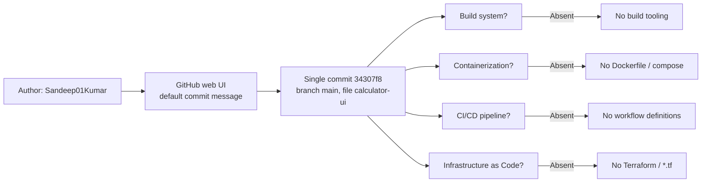
```mermaid
flowchart LR
    Author["Author: Sandeep01Kumar"] --> WebUI["GitHub web UI<br/>default commit message"]
    WebUI --> Commit["Single commit 34307f8<br/>branch main, file calculator-ui"]
    Commit --> Build["Build system?"]
    Build -->|Absent| NoBuild["No build tooling"]
    Commit --> Container["Containerization?"]
    Container -->|Absent| NoContainer["No Dockerfile / compose"]
    Commit --> CICD["CI/CD pipeline?"]
    CICD -->|Absent| NoCICD["No workflow definitions"]
    Commit --> IaC["Infrastructure as Code?"]
    IaC -->|Absent| NoIaC["No Terraform / *.tf"]
```

### 3.6.3 Forward-Looking Reference Default (Not Adopted)

> **Reference only — not implemented.** The organization's greenfield template proposes the development and deployment stack below. **None of these tools is present, configured, or version‑pinned in the repository.**

| Concern (Template) | Reference‑Default Tool | Adopted in Repo? |
|---|---|---|
| Containerization | Docker | No |
| Infrastructure as Code | Terraform | No |
| CI/CD | GitHub Actions | No |

When a toolchain is introduced, the build, containerization, CI/CD, and IaC choices — with pinned versions — should be recorded here and traced to the maintenance and deployment requirements that Section 2 will capture once features exist.

## 3.7 References

The following repository artifacts and Technical Specification sections were examined as evidence for Section 3. No web sources were consulted; every finding derives from direct inspection of the repository at commit `34307f8`.

**Repository artifacts examined**

- `calculator-ui` — the sole tracked file; a 1‑byte placeholder (single newline, Git mode `100644`). Established that no source code, dependency manifest, or configuration of any kind exists, and that no language/framework/runtime is selected.
- `/` (repository root) — top‑level structure; confirmed to contain only `.git/` and `calculator-ui`, with no source files, manifests, lockfiles, `Dockerfile`, CI/CD definitions, or IaC files.
- `.git/` — version‑control metadata; established the single commit `34307f8` ("Create calculator-ui", author `Sandeep01Kumar`), the single `main` branch tracking `origin/main`, and the absence of any `.gitmodules` file or submodule gitlink.

**Technical Specification sections cross‑referenced**

- Section 1.1 Executive Summary — inception/placeholder state; GitHub web‑UI default commit message; absence of manifests, submodules, and configuration.
- Section 1.2 System Overview — no runtime capabilities; no language, framework, runtime, package manager, or build system selected; no integration points.
- Section 1.3 Scope — no data domains, no integrations, and future‑phase considerations recorded as out of scope.
- Section 2.2 Feature Catalog — empty feature catalog; explicit finding that no dependency manifest is declared.
- Section 2.5 Implementation Considerations — no technical constraints, security surface, build tooling, tests, or CI/CD defined.

# 4. Process Flowchart

## 4.1 System Workflows

This section documents the process flows, workflows, and state transitions that can be observed in the repository at commit `34307f8`. As established in Sections 1.2, 1.3, and 2.2, the repository is at an inception stage: its only tracked artifact is a 1-byte placeholder file (`calculator-ui`) added in a single commit, and it contains no source code, no configuration, no build tooling, and no runtime. Consequently, there are no application-level business processes, integrations, state machines, or error-handling flows to diagram.

In keeping with the evidence-based approach used throughout this specification, each workflow category required by the section prompt is reported against actual evidence; where no implementation exists, the absence is stated explicitly and no workflow is invented. The diagrams in this section therefore depict the repository's true, minimal reality — its version-control provenance and current placeholder state — rather than hypothetical application behavior. Because there are no functional requirements defined (Section 2.3), there are no requirement identifiers (`F-XXX-RQ-YYY`) for any flow to reference.

### 4.1.1 Core Business Processes

No core business processes are implemented in the repository. There is no executable entry point, no user interface, and no calculation or domain logic, so there are no end-to-end user journeys, no system interactions, no application decision points, and no error-handling paths that a user or another system could traverse. A sweep of all tracked content for process-related constructs (routes, controllers, handlers, services, endpoints, events, jobs, state transitions, validation, and error handling) returns no matches, consistent with the empty feature catalog recorded in Section 2.2.

The only process that can be observed from repository evidence is the version-control activity that produced the current state: a single file was created and committed, leaving the repository in an inception/placeholder state with no runtime to execute. The high-level workflow below depicts this actual provenance and terminates at the point where an application workflow would begin — a point the repository has not yet reached.

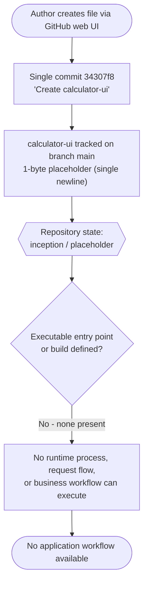
```mermaid
flowchart TD
    Start([Author creates file via GitHub web UI]) --> Commit["Single commit 34307f8<br/>'Create calculator-ui'"]
    Commit --> Track["calculator-ui tracked on branch main<br/>1-byte placeholder (single newline)"]
    Track --> State{{"Repository state:<br/>inception / placeholder"}}
    State --> Runtime{"Executable entry point<br/>or build defined?"}
    Runtime -->|No - none present| NoRuntime["No runtime process, request flow,<br/>or business workflow can execute"]
    NoRuntime --> End([No application workflow available])
```

The single decision node shown above ("Executable entry point or build defined?") is a documentation device that evaluates repository evidence, not an application decision point; it resolves to "No" because no such artifact exists. The following table maps each requested core-process element to the observed evidence.

| Requested Element | Status at Commit `34307f8` | Evidence |
|-------------------|----------------------------|----------|
| End-to-end user journeys | None | No UI, entry point, or interaction logic exists |
| System interactions | None (application level) | No services, handlers, or runtime components exist |
| Decision points | None (application level) | No conditional business logic exists in tracked content |
| Error-handling paths | None | No code executes, so no error can be raised or handled |

### 4.1.2 Integration Workflows

No integration workflows are implemented. The repository declares no dependencies, exposes and consumes no APIs, configures no message brokers or event streams, and defines no batch or scheduled jobs. There is no data flowing between systems because there is no system logic and no data model. This is consistent with Section 1.2 ("No integration points are present") and Section 1.3 ("No integration is in scope").

The only interaction observable from repository evidence is at the version-control layer: the commit metadata for `34307f8` shows the file was authored by the repository owner and committed through GitHub (the commit carries a GitHub GPG signature and the default "Create &lt;file&gt;" web-UI message). The sequence diagram below documents this version-control provenance as the sole observed interaction and explicitly notes the absence of any application-level integration.

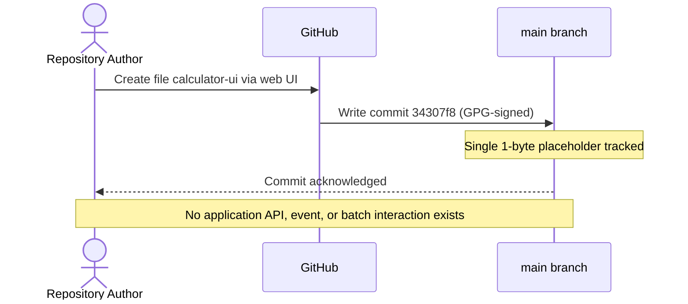
```mermaid
sequenceDiagram
    actor Author as Repository Author
    participant GH as GitHub
    participant Repo as main branch
    Author->>GH: Create file calculator-ui via web UI
    GH->>Repo: Write commit 34307f8 (GPG-signed)
    Note over Repo: Single 1-byte placeholder tracked
    Repo-->>Author: Commit acknowledged
    Note over Author,Repo: No application API, event, or batch interaction exists
```

The interaction depicted is version-control activity (a developer publishing a file through GitHub), not an application integration; it is included only because it is the single interaction for which the repository provides direct evidence. The following table maps each requested integration category to the observed evidence.

| Requested Category | Status at Commit `34307f8` | Evidence |
|--------------------|----------------------------|----------|
| Data flow between systems | None | No data model, no persistence, no inter-system messaging |
| API interactions | None | No API client or server, no route/endpoint definitions |
| Event processing flows | None | No event bus, broker, or handler configuration |
| Batch processing sequences | None | No scheduled job, cron, or batch runner defined |

## 4.2 Workflow Decomposition and Validation Rules

This sub-section addresses the flowchart requirements and validation rules prescribed by the section prompt — the elements that each major workflow diagram would contain, and the rules that would be enforced at each step. Because no features or workflows are implemented (Sections 2.2 and 2.3), there is nothing to decompose into these elements today. The structure below records what each future workflow diagram will contain once features are introduced, and confirms the current absence against evidence.

### 4.2.1 Per-Feature Process Flows

The section prompt requires a detailed process flow for each core feature. Section 2.2 records an empty feature catalog (zero `F-XXX` features), so there are no core features from which to derive per-feature process flows, and none are drawn. The naming signals noted elsewhere in this specification — a calculator user interface implied by `calculator-ui`, arithmetic computation implied by the repository name, and a nested-submodule composition implied by the repository name — are explicitly aspirational and unimplemented; they are not features and therefore do not yield process flows.

| Candidate Area (Intent Only) | Naming Source | Process Flow Status |
|------------------------------|---------------|---------------------|
| Calculator user interface | File `calculator-ui` | Not applicable — no UI code, so no interaction flow |
| Calculator arithmetic / computation | Repository name `calculator-...` | Not applicable — no calculation logic, so no processing flow |
| Nested Git submodule composition | Repository name `...-nested-submodule` | Not applicable — no `.gitmodules`, so no assembly/build flow |

When features are implemented, each will be documented here as a dedicated flowchart traceable to its parent feature (`F-XXX`) and functional requirements (`F-XXX-RQ-YYY`) per the conventions established in Sections 2.2 and 2.3.

### 4.2.2 Flowchart Element Coverage

For each major workflow, the prompt requires the diagram to show start and end points, process steps, decision diamonds, system boundaries, user touchpoints, error states and recovery paths, and timing/SLA considerations. Because there are no application workflows at commit `34307f8`, none of these elements can be populated from evidence. The single flowchart present in this specification (Section 4.1.1) depicts version-control provenance rather than an application workflow; its start/end nodes and its one decision node are documentation devices, not application constructs.

| Flowchart Element | Present in an Application Workflow? | Evidence |
|-------------------|-------------------------------------|----------|
| Start and end points | No application workflow exists | No entry point or terminal state in code |
| Process steps | None | No executable statements or business steps exist |
| Decision diamonds | None (application level) | No conditional/branching business logic exists |
| System boundaries | Single Git repository; no runtime boundary | `git ls-files`; no service/process boundary defined |
| User touchpoints | None | No UI, CLI, or API surface exists |
| Error states and recovery paths | None | No code executes, so no error/recovery state exists |
| Timing / SLA considerations | None documented | No performance targets, timeouts, or SLAs defined (Section 2.3) |

No timing constraints or service-level agreements are asserted, because none are defined anywhere in the repository; introducing any would require fabricating information not found in the codebase, consistent with the approach used in Sections 1.2 and 2.3.

### 4.2.3 Validation Rules and Authorization Checkpoints

The prompt requires the business rules, data-validation requirements, authorization checkpoints, and regulatory-compliance checks that would be enforced at each workflow step. None are implemented. There is no input handling, no data model, no authentication or authorization layer, and no compliance configuration anywhere in the repository, so there are no validation rules to enforce at any step. This is consistent with Section 2.3, which records that no business rules, data-validation rules, security requirements, or compliance requirements are present.

| Category | Status at Commit `34307f8` | Evidence |
|----------|----------------------------|----------|
| Business rules per step | None | No business logic or process steps exist |
| Data validation requirements | None | No inputs, schema, or validation code exist |
| Authorization checkpoints | None (application level) | No authn/authz layer, roles, or guards exist |
| Regulatory compliance checks | None | No compliance policy, control, or configuration exists |

The only access control observable is at the version-control layer: repository push access is governed by GitHub, as evidenced by the GitHub-committed, GPG-signed commit `34307f8`. This is platform-level governance of the repository, not an application authorization checkpoint.

## 4.3 Technical Implementation Flows

This sub-section addresses the technical-implementation concerns prescribed by the prompt — how the system manages state and how it handles errors. Both require executable code and a runtime, neither of which exists at commit `34307f8`. The findings below are reported against evidence and cross-referenced with Sections 1.2, 2.3, and 3 (Technology Stack), which record that no language, framework, runtime, data store, or cache has been selected.

### 4.3.1 State Management

No application state management exists. There is no data model, no database or file-based persistence, no cache, and no transactional code, so there are no state transitions, persistence points, caching requirements, or transaction boundaries to document. The repository defines no runtime in which state could be held or mutated.

The only "state" that can be observed is the version-control state of the repository itself: a single immutable commit (`34307f8`) records one tracked blob (`calculator-ui`). This is Git object state, not application or domain state, and it is depicted as a lifecycle in Section 4.4.

| State-Management Concern | Status at Commit `34307f8` | Evidence |
|--------------------------|----------------------------|----------|
| State transitions | None (application level) | No state machine, status field, or lifecycle code exists |
| Data persistence points | None | No database, ORM, schema, migration, or file I/O exists |
| Caching requirements | None | No cache client, layer, or configuration exists |
| Transaction boundaries | None | No transactional code or unit-of-work boundary exists |

The persistence and caching findings are consistent with Section 3.5 (Databases & Storage), which records that no primary or secondary data store, caching technology, or storage service is present.

### 4.3.2 Error Handling

No error-handling mechanisms exist. Because the repository contains no executable code, there is no path along which an error could be raised, retried, escalated, or recovered from. There are no try/catch or equivalent constructs, no retry policies, no fallback logic, no notification or alerting integrations, and no recovery procedures. This is consistent with Sections 1.2 and 2.3, which record the absence of runtime behavior and of security/operational requirements.

The flowchart below expresses this reality: any attempt to invoke the application short-circuits immediately because no executable entry point exists, so no error-handling path is ever reached.

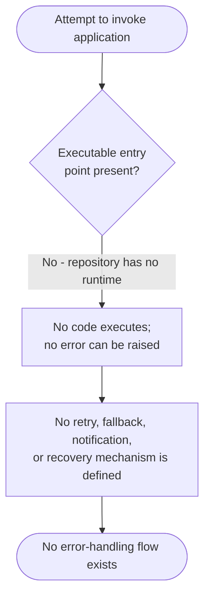
```mermaid
flowchart TD
    A([Attempt to invoke application]) --> B{"Executable entry<br/>point present?"}
    B -->|"No - repository has no runtime"| C["No code executes;<br/>no error can be raised"]
    C --> D["No retry, fallback, notification,<br/>or recovery mechanism is defined"]
    D --> E([No error-handling flow exists])
```

| Error-Handling Mechanism | Status at Commit `34307f8` | Evidence |
|--------------------------|----------------------------|----------|
| Retry mechanisms | None | No retry policy, backoff, or re-invocation logic exists |
| Fallback processes | None | No degraded-mode or alternative-path logic exists |
| Error notification flows | None | No logging, alerting, or notification integration exists |
| Recovery procedures | None | No compensating action, rollback, or self-heal logic exists |

When runtime code is introduced, this sub-section will document its actual error taxonomy, retry/backoff policies, fallback behavior, notification routing, and recovery procedures, each traceable to the relevant functional requirements (`F-XXX-RQ-YYY`).

## 4.4 State Transition Diagrams

The section prompt requires state transition diagrams. No application state machine is implemented at commit `34307f8` — there is no status field, lifecycle, or workflow engine anywhere in the repository (Section 4.3.1). The only state that can be modeled from evidence is the version-control lifecycle of the repository, which currently has a single, terminal committed state.

The diagram below models that repository lifecycle. It has exactly one committed state — the inception/placeholder state established by commit `34307f8`, in which `calculator-ui` exists as a 1-byte placeholder — and no further transitions, because no subsequent commits, branches, or content changes exist.

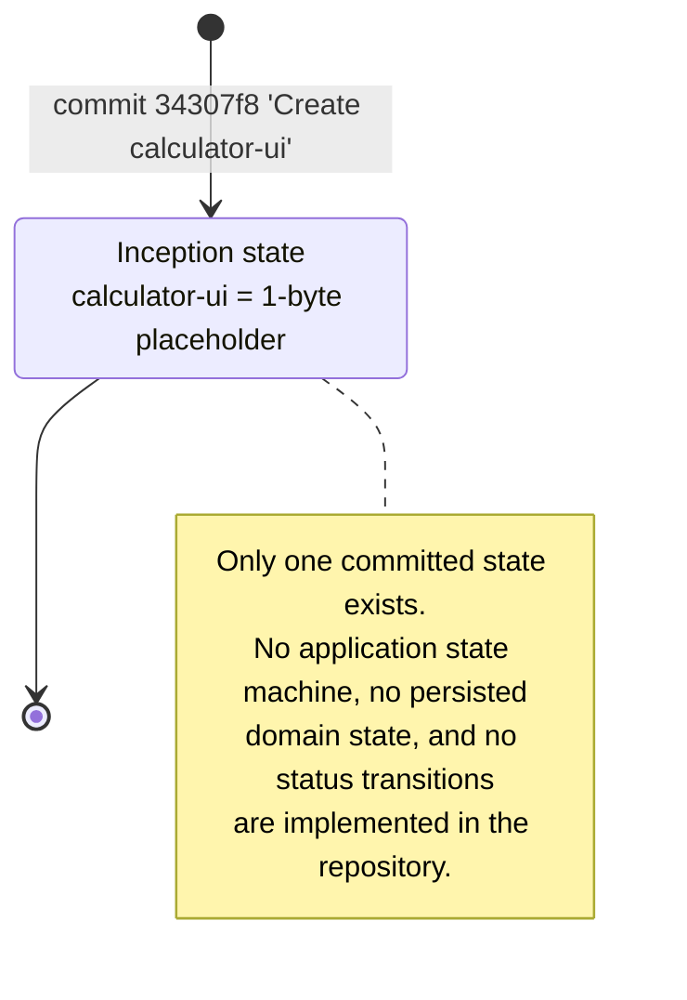
```mermaid
stateDiagram-v2
    [*] --> PlaceholderCommitted: commit 34307f8 'Create calculator-ui'
    PlaceholderCommitted: Inception state<br/>calculator-ui = 1-byte placeholder
    PlaceholderCommitted --> [*]
    note right of PlaceholderCommitted
        Only one committed state exists.
        No application state machine, no persisted
        domain state, and no status transitions
        are implemented in the repository.
    end note
```

This is Git repository state, not application or domain state; it is provided because it is the only state model supported by repository evidence. No application-level state transition diagram is presented, as doing so would require fabricating a state machine that the codebase does not contain.

When features are implemented, this sub-section will contain the actual application state machines (for example, the lifecycle of any calculation session, entity, or request), each expressed as a `stateDiagram-v2` with clearly defined initial states, transitions, guards, and terminal states, and traceable to the parent feature (`F-XXX`) and its functional requirements (`F-XXX-RQ-YYY`).

## 4.5 References

The following repository artifacts and previously authored specification sections were examined as evidence for this Process Flowchart section. All findings are drawn from the repository at commit `34307f8`; no web sources were consulted.

**Files and folders examined**

- `calculator-ui` — The repository's only tracked file (a 1-byte placeholder containing a single newline); established the absence of any user interface, calculation, workflow, integration, state, or error-handling logic.
- Repository root (`/`) — Established the top-level structure: only `calculator-ui` and the `.git/` metadata directory exist; there are no source, configuration, or build directories from which a workflow could be derived.
- `.git/` (version-control metadata) — Established repository provenance used in the diagrams: a single commit `34307f8` ("Create calculator-ui") on the only branch `main`, committed through GitHub and GPG-signed, with no submodules (no `.gitmodules`), no additional branches, and no other objects. Verified via `git ls-files`, `git ls-tree -r HEAD`, `git log`, `git branch -a`, `git submodule status`, and a `git grep` keyword sweep for workflow/process/integration constructs (zero matches).

**Cross-referenced Technical Specification sections**

- Section 1.2 System Overview — Confirmed no runtime capabilities and no integration points exist.
- Section 1.3 Scope — Confirmed no core features, user workflows, or integrations are in scope.
- Section 2.2 Feature Catalog — Confirmed an empty feature catalog (zero `F-XXX` features); basis for the absence of per-feature process flows.
- Section 2.3 Functional Requirements — Confirmed no functional requirements, business rules, data-validation rules, security requirements, or compliance requirements exist.
- Section 3.5 Databases & Storage — Confirmed no primary/secondary data store, persistence strategy, or caching technology exists; basis for the state-management findings in Section 4.3.1.

# 5. System Architecture

## 5.1 High-Level Architecture

This section documents the system architecture that can be observed in the repository at commit `34307f8`. As established in Sections 1.2, 1.3, 2.2, 3.1, and 4.1, the repository is at an **inception stage**: its only tracked artifact is a 1-byte placeholder file (`calculator-ui`, a single newline) created in a single commit, and it contains no source code, no configuration, no dependency manifests, no build tooling, and no runtime. Consequently, **no application-level system architecture has been implemented**, and there are no components, data flows, or external integrations to describe beyond the repository's own version-control scaffolding.

In keeping with the evidence-based approach used throughout this specification, each element required by the section prompt is reported against actual repository evidence. Where no implementation exists, the absence is stated explicitly and no architecture is invented. The naming signals carried by the repository (`calculator-nested-submodule-20-July`) and its file (`calculator-ui`) are treated strictly as **aspirational intent**, never as delivered architecture.

### 5.1.1 System Overview

**Overall architecture style and rationale.** No application architecture style (for example monolith, layered, microservices, event-driven, or client/server) is implemented or selected. A full-tree inspection at commit `34307f8` finds no source files, no manifests, and no configuration from which an architectural style could be inferred. The only structure that physically exists is a **Git version-control scaffold**: a single repository, a single branch (`main`), a single commit, and a single 1-byte file. No design rationale is documented anywhere in the repository — there is no README, architecture decision record, or specification. The repository name's reference to a "nested submodule" hints at an *intended* modular composition assembled from nested Git submodules, but there is **no `.gitmodules` file and no submodule gitlink** (`calculator-ui` is an ordinary blob at mode `100644`), so this remains an unrealized naming signal rather than an observed style.

**Key architectural principles and patterns.** None are evidenced. Because the repository contains no executable or declarative artifacts, there is no code that could embody a design pattern, a separation-of-concerns boundary, a dependency-inversion seam, or any other architectural principle. No principle can be asserted from evidence, and asserting one would require fabricating information the codebase does not contain.

**System boundaries and major interfaces.** The system boundary at the documented commit is exactly **one Git repository** containing one branch and one placeholder file, with no runtime, deployment target, or executable surface. The only interface that exists is the **version-control interface** (Git, hosted on GitHub) through which the author created and committed the placeholder file. There is no network interface, no HTTP/API surface, no user interface, no message channel, and no data plane. The diagram below depicts this true, minimal boundary; the dashed edge records the explicit absence of any external integration.

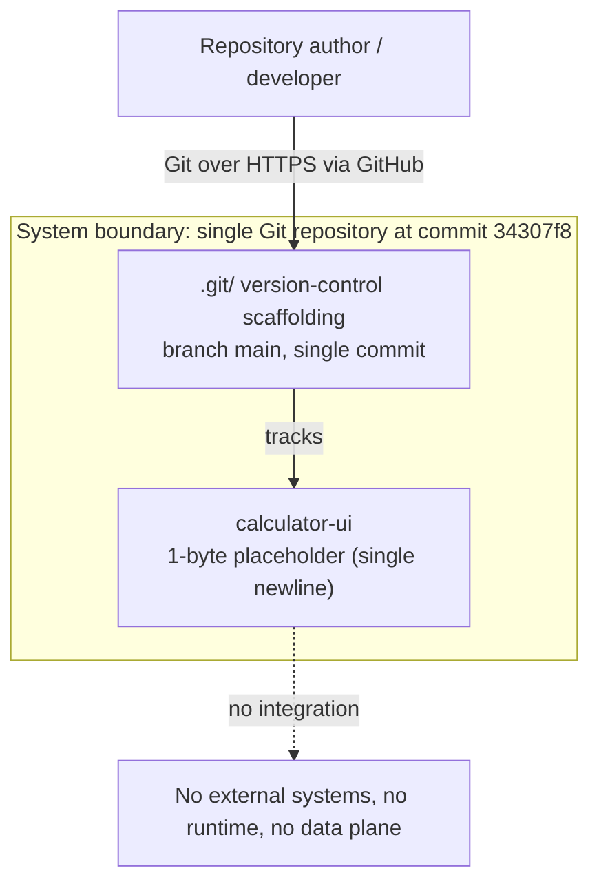
```mermaid
flowchart TD
    Dev["Repository author / developer"]
    subgraph Boundary["System boundary: single Git repository at commit 34307f8"]
        direction TB
        Git[".git/ version-control scaffolding<br/>branch main, single commit"]
        File["calculator-ui<br/>1-byte placeholder (single newline)"]
        Git -->|"tracks"| File
    end
    None["No external systems, no runtime, no data plane"]
    Dev -->|"Git over HTTPS via GitHub"| Git
    File -.->|"no integration"| None
```

### 5.1.2 Core Components Table

The repository exposes no application components. The only observable elements are the version-control scaffolding and the placeholder file it tracks. The table below records these against the requested attributes; the requested "Key Dependencies" and "Integration Points" columns are consolidated (the section's four-column limit applies), and "Critical Considerations" captures the implications for future work.

| Component | Primary Responsibility | Dependencies & Integration Points | Critical Considerations |
|-----------|------------------------|-----------------------------------|-------------------------|
| Version-control scaffolding (`.git/`) | Track history and provenance of the repository (one branch `main`, one commit `34307f8`) | Depends on Git; integrates only with the GitHub remote (`origin/main`) at the VCS layer | This is infrastructure, not an application component; it executes no business logic |
| `calculator-ui` placeholder | Reserve a filename; holds no logic (1-byte single newline) | None — no imports, no callers, no runtime dependents | Effectively empty; a UI is implied by the name but no markup/style/script exists |
| Application components (services, UI, calculation engine) | Not implemented | Not applicable | Would be introduced as new components once implementation begins |

### 5.1.3 Data Flow Description

**Primary data flows between components.** No application data flows exist. There are no components exchanging data, no request/response paths, no events, and no batch pipelines, because no runtime or logic is present. The only data movement that ever occurred is the one-time **version-control write** that recorded the `calculator-ui` blob into the repository during commit `34307f8`.

**Integration patterns and protocols.** No integration patterns (such as synchronous request/reply, publish/subscribe, or message queues) and no application protocols (such as HTTP, gRPC, or AMQP) are implemented or configured. The only protocol involved anywhere is the Git version-control protocol used to publish the commit through GitHub.

**Data transformation points.** None. With no code executing and no data model, there is no parsing, validation, serialization, mapping, or any other transformation of data.

**Key data stores and caches.** None. As documented in Section 3.5, the repository declares no database, no object/blob storage, and no caching layer (for example Redis or Memcached); there are no connection strings, drivers, ORMs, schemas, or migrations. The single tracked file represents no application data — it is a placeholder holding one newline byte.

### 5.1.4 External Integration Points

The repository integrates with no external application systems. Consistent with Sections 1.2, 3.4, and 3.5, there are no external APIs, authentication providers, databases, message brokers, monitoring services, or cloud services referenced, configured, or credentialed anywhere in the tracked content. The only external touchpoint of any kind is the **GitHub remote** used for version control, which operates at the VCS layer and is not an application integration. The requested "Data Exchange Pattern" and "Protocol/Format" attributes are consolidated to respect the four-column limit, and "SLA Requirements" are folded into the Status column (no service levels are defined anywhere in the repository).

| External System / Category | Integration Type | Protocol / Format & Exchange Pattern | Status (incl. SLA) |
|----------------------------|------------------|--------------------------------------|--------------------|
| GitHub remote (`origin/main`) | Version control only (not an application integration) | Git over HTTPS; one-time commit publish | Present at VCS layer; no SLA defined |
| External APIs / integrations | None | None | Not implemented; no SLA |
| Authentication / identity providers | None | None | Not implemented; no SLA |
| Databases / object storage / caches | None | None | Not implemented; no SLA |
| Message brokers / event streams | None | None | Not implemented; no SLA |
| Monitoring / cloud services | None | None | Not implemented; no SLA |

No service-level agreements, response-time targets, throughput commitments, or availability objectives are defined anywhere in the repository; introducing any here would be fabrication. Such requirements would be authored alongside the first real integration.

## 5.2 Component Details

The section prompt requests, for each major component, its purpose and responsibilities, technologies and frameworks, key interfaces and APIs, data-persistence requirements, and scaling considerations. At commit `34307f8` the repository contains **no application components**. The only elements that physically exist are the Git version-control scaffolding and the `calculator-ui` placeholder file it tracks; neither is an application component, and neither implements any behavior. Each requested facet is therefore reported against actual evidence below, and no component behavior is invented.

### 5.2.1 Observable Components and Their Details

The following matrix documents the two observable elements against the five requested facets. Neither element executes logic, exposes an API, persists application data, or is subject to runtime scaling.

| Facet | Version-Control Scaffolding (`.git/`) | `calculator-ui` Placeholder |
|-------|----------------------------------------|-----------------------------|
| Purpose & responsibilities | Records repository history/provenance (branch `main`, commit `34307f8`) | Reserves a filename; holds no logic (single newline byte) |
| Technologies & frameworks | Git only; no application framework | None — extensionless 1-byte file, no language or framework markers |
| Key interfaces & APIs | Git CLI/remote operations against the GitHub remote; no application API | None — no functions, endpoints, exports, or entry points |
| Data-persistence requirements | Stores Git objects (1 commit, 1 tree, 1 blob); no application datastore | None — represents no application data (see Section 3.5) |
| Scaling considerations | Not applicable; version-control metadata, not a runtime | Not applicable; no runtime to scale, no load path |

No application component (for example a UI shell, a calculation engine, an API service, or a persistence layer) is present. When implementation begins, each such component would be documented here with its own purpose, technology, interfaces, persistence needs, and scaling profile, and would be traceable to the feature catalog (Section 2.2), which is currently empty.

### 5.2.2 Component Interaction Diagram

There are no application components and therefore no inter-component interactions. The only interaction observable from repository evidence is the version-control relationship in which the `.git` scaffolding tracks the placeholder file. The diagram depicts this true reality; the dashed edge records the explicit absence of any inter-component call path.

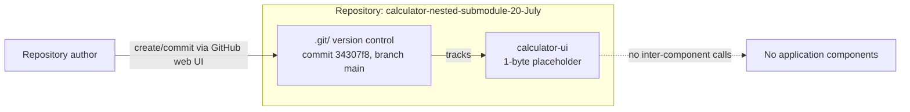
```mermaid
flowchart LR
    Author["Repository author"]
    subgraph Repo["Repository: calculator-nested-submodule-20-July"]
        direction TB
        VCS[".git/ version control<br/>commit 34307f8, branch main"]
        Placeholder["calculator-ui<br/>1-byte placeholder"]
        VCS -->|"tracks"| Placeholder
    end
    NoRT["No application components"]
    Author -->|"create/commit via GitHub web UI"| VCS
    Placeholder -.->|"no inter-component calls"| NoRT
```

### 5.2.3 State Transition Diagram

No application state machine exists — there is no status field, lifecycle, or workflow engine anywhere in the repository (consistent with Section 4.4). The only state that can be modeled from evidence is the repository's own version-control lifecycle, which has a single, terminal committed state established by commit `34307f8`. This is Git repository state, not application or domain state.

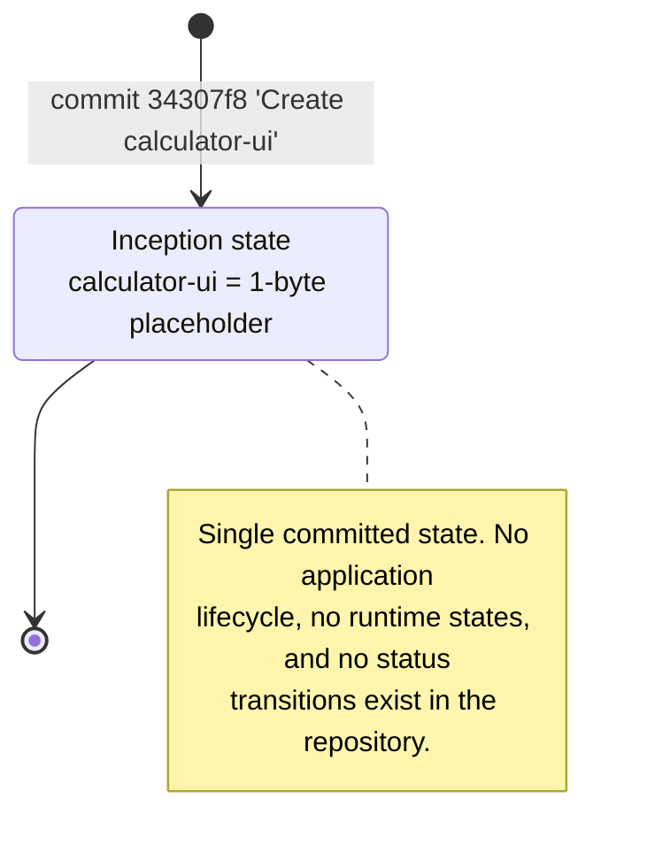
```mermaid
stateDiagram-v2
    [*] --> PlaceholderCommitted: commit 34307f8 'Create calculator-ui'
    PlaceholderCommitted: Inception state<br/>calculator-ui = 1-byte placeholder
    PlaceholderCommitted --> [*]
    note right of PlaceholderCommitted
        Single committed state. No application
        lifecycle, no runtime states, and no status
        transitions exist in the repository.
    end note
```

### 5.2.4 Sequence Diagram — Version-Control Provenance (Key Flow)

No application request/response, event, or batch flow exists. The only sequence observable from repository evidence is the version-control provenance that produced the current state: the author created `calculator-ui` through the GitHub web interface, and GitHub recorded the single GPG-signed commit on `main`. This is included because it is the only flow for which the repository provides direct evidence; it is version-control activity, not an application flow.

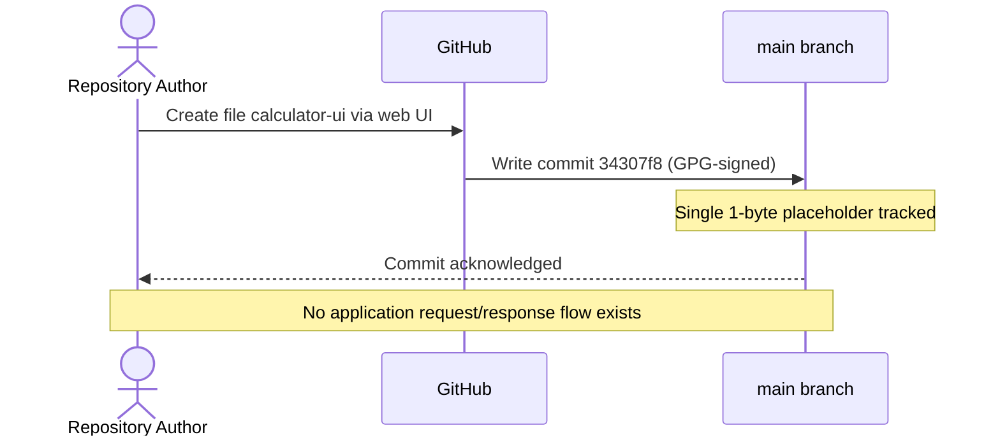
```mermaid
sequenceDiagram
    actor Author as Repository Author
    participant GH as GitHub
    participant Repo as main branch
    Author->>GH: Create file calculator-ui via web UI
    GH->>Repo: Write commit 34307f8 (GPG-signed)
    Note over Repo: Single 1-byte placeholder tracked
    Repo-->>Author: Commit acknowledged
    Note over Author,Repo: No application request/response flow exists
```

## 5.3 Technical Decisions

This section documents and justifies the architecture and technology decisions observable in the repository at commit `34307f8`. **No architectural or technical decision is recorded anywhere in the repository.** There is no architecture decision record (ADR), README, design document, specification, or manifest from which a decision — or its rationale and tradeoffs — could be read. Consistent with Sections 3.1–3.6, no language, framework, communication pattern, datastore, cache, or security mechanism has been selected. Each decision area required by the prompt is therefore reported against actual evidence, and no decision or justification is fabricated.

### 5.3.1 Decision Status by Area

The table records each requested decision area against the evidence. In every case the decision is **deferred to the first implementation**, because no artifact yet exists to constrain or justify a choice.

| Decision Area | Decision Recorded? | Evidence Basis | Status |
|---------------|--------------------|----------------|--------|
| Architecture style & tradeoffs | No | No source, config, or design doc at `34307f8` | Deferred to first implementation |
| Communication pattern | No | No API/protocol, client, or server code or config | Deferred to first implementation |
| Data storage solution | No | No DB driver/schema/connection (Section 3.5) | Deferred to first implementation |
| Caching strategy | No | No cache client or configuration (Section 3.5) | Deferred to first implementation |
| Security mechanism | No | No auth, secrets, or crypto code/config (Section 3.4) | Deferred to first implementation |

**The one decision with evidentiary support.** The only choice that can be inferred from evidence is the decision to *initialize the project as an empty, greenfield repository*: the commit subject "Create calculator-ui" is the GitHub web-UI default for creating a new file, and the sole artifact is a 1-byte placeholder. The tradeoff of this posture is explicit — it preserves maximum flexibility (no premature commitment to any language, framework, datastore, or protocol) at the cost of providing **no architectural guidance, no reference implementation, and no guardrails** for future contributors. The repository name's "nested-submodule" signal suggests an *intended future* decision to compose the system from nested Git submodules, but that decision has not been made (no `.gitmodules`, no gitlink), so it carries no tradeoffs to evaluate today.

### 5.3.2 Decision Tree

The diagram models how an architecture-style decision is evaluated against the repository's current evidence. Every branch that the actual repository satisfies (no source/config, no ADR/design doc) leads to the same terminal outcome: the decision is not selected and is deferred. The "Yes" branches are shown for completeness but are not reached at commit `34307f8`.

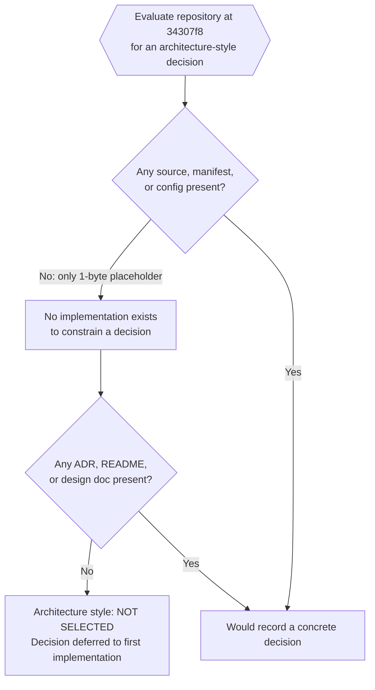
```mermaid
flowchart TD
    Start{{"Evaluate repository at 34307f8<br/>for an architecture-style decision"}}
    Start --> Q1{"Any source, manifest,<br/>or config present?"}
    Q1 -->|"No: only 1-byte placeholder"| NoImpl["No implementation exists<br/>to constrain a decision"]
    NoImpl --> Q2{"Any ADR, README,<br/>or design doc present?"}
    Q2 -->|"No"| Deferred["Architecture style: NOT SELECTED<br/>Decision deferred to first implementation"]
    Q1 -->|"Yes"| Would["Would record a concrete decision"]
    Q2 -->|"Yes"| Would
```

### 5.3.3 Architecture Decision Records (ADRs)

**No ADRs exist in the repository.** There is no `docs/adr/` directory, no decision log, and no Markdown or text file of any kind (a full-tree sweep at commit `34307f8` returns zero documentation artifacts). Accordingly, no historical design decision can be cited.

The record structure below defines the ADR format that will be used once decisions begin to be made; every field is currently **not populated** because no decision has been recorded.

| ADR Field | Description | Populated at `34307f8`? |
|-----------|-------------|-------------------------|
| Title & ID | Sequential identifier and short decision name | No — 0 ADRs |
| Status | Proposed / Accepted / Superseded | No — 0 ADRs |
| Context | Forces and constraints motivating the decision | No — 0 ADRs |
| Decision & Consequences | The choice made and its resulting tradeoffs | No — 0 ADRs |

To document the observed baseline honestly (rather than to assert a design choice the repository does not contain), the single record below captures the *factual current state* — that all binding technical decisions are, by evidence, deferred:

- **ADR-0000 — Architecture and technology decisions deferred at inception (observed baseline).**
  - **Status:** Observed at commit `34307f8` (records repository state, not a design endorsement).
  - **Context:** The repository is a greenfield initialization containing only version-control scaffolding and a 1-byte `calculator-ui` placeholder; no language, framework, datastore, protocol, or security mechanism is present.
  - **Decision:** No architecture style or technology has been selected; all such decisions are deferred to the first implementation commit.
  - **Consequences:** Maximum design flexibility is retained, but no guidance or guardrails exist yet; future contributors must author concrete ADRs (starting at ADR-0001) as real decisions are made, each traceable to the features (Section 2.2) and requirements (Section 2.3) they support.

## 5.4 Cross-Cutting Concerns

Cross-cutting concerns are capabilities that would normally span an application's components — monitoring, logging, error handling, security, performance, and recovery. At commit `34307f8` the repository has **no runtime and no code**, so none of these concerns is implemented; there is nothing to observe, log, secure, or recover at the application level. Each concern is reported against actual evidence below, and no capability, metric, or SLA is invented. The only genuinely durable facts pertain to the version-control layer and are labeled as such.

### 5.4.1 Status of Cross-Cutting Concerns

| Cross-Cutting Concern | Implemented at `34307f8`? | Evidence |
|-----------------------|---------------------------|----------|
| Monitoring & observability | No | No APM/metrics/health-check agent or configuration (Section 3.4) |
| Logging & tracing | No | No logging library, log config, or trace instrumentation present |
| Error handling | No | No code executes, so no error can be raised or handled (Section 4.3) |
| Authentication & authorization | No | No auth library, identity config, or access-control logic (Section 3.4) |
| Performance requirements & SLAs | None defined | No specification, SLO, benchmark, or performance test present |
| Disaster recovery | No application-level DR | No backup/restore/failover config; only Git remote provenance exists |

### 5.4.2 Monitoring, Observability, Logging, and Tracing

No monitoring or observability is configured: there is no metrics exporter, no health or readiness endpoint, no dashboard, and no error-tracking or analytics agent. No logging or tracing exists either — the repository declares no logging framework, no log configuration, and no distributed-tracing instrumentation. Because there is no running process, there are no logs, traces, or metrics to emit. These capabilities would be introduced together with the first runtime component.

### 5.4.3 Error Handling Patterns

No error-handling pattern (for example try/catch boundaries, retries with backoff, circuit breakers, fallbacks, or error-notification flows) is implemented, because no code executes. As documented in Section 4.3, there is no path along which an error could be raised, caught, retried, or reported. The diagram models this reality as a documentation device: the evaluation of "could an application error be raised?" terminates at "no error-handling flow exists" for the current commit.

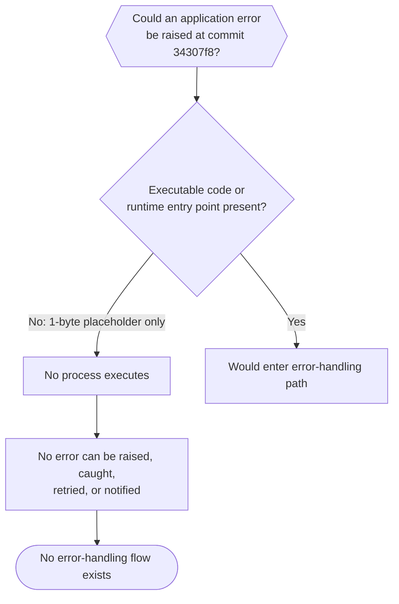
```mermaid
flowchart TD
    Trigger{{"Could an application error<br/>be raised at commit 34307f8?"}}
    Trigger --> Q1{"Executable code or<br/>runtime entry point present?"}
    Q1 -->|"No: 1-byte placeholder only"| NoRuntime["No process executes"]
    NoRuntime --> NoError["No error can be raised, caught,<br/>retried, or notified"]
    NoError --> End(["No error-handling flow exists"])
    Q1 -->|"Yes"| Handle["Would enter error-handling path"]
```

### 5.4.4 Authentication and Authorization

No authentication or authorization framework is present. Consistent with Section 3.4, the repository contains no identity provider integration (for example OAuth/OIDC, SAML, or JWT handling), no session or token management, no access-control logic, and no committed secrets or credentials. The only access control that applies is the version-control layer's own permissions on the GitHub repository, which govern who may push commits — this is a hosting-platform concern, not an application-level authorization framework.

### 5.4.5 Performance Requirements and SLAs

No performance requirements, service-level objectives, or service-level agreements are defined anywhere in the repository. There is no specification, no performance budget, no benchmark, and no load or latency test. The sole tracked artifact is a 1-byte placeholder with no runtime behavior, so no throughput, latency, or availability characteristic can be measured or asserted. Any performance targets or SLAs would need to be authored once functional requirements (Section 2.3) and a runtime exist; asserting any here would be fabrication.

### 5.4.6 Disaster Recovery

No application-level disaster-recovery procedure is defined: there is no backup or restore process, no failover or replication configuration, and no recovery-time or recovery-point objective (RTO/RPO), because there is no application, data, or runtime to recover. The only recovery capability that genuinely exists is at the **version-control layer**: the repository's complete state at commit `34307f8` is preserved in Git history and mirrored to the GitHub remote (`origin/main`), so the current placeholder state can be reconstituted by re-cloning the remote. This is source-code provenance, not an application recovery capability. A proper DR strategy (data backups, retention, and failover) would be defined when a data domain and runtime are first introduced (see Section 3.5).

## 5.5 References

The following repository artifacts and specification sections were examined as evidence for Section 5. All architectural findings above are grounded in these sources; no external web sources were consulted.

**Repository files and folders inspected**

- `calculator-ui` - The sole tracked file; a 1-byte placeholder containing a single newline (blob `8b137891791fe96927ad78e64b0aad7bded08bdc`). Established that no application component, interface, data, or logic exists.
- `/` (repository root) - Established the complete top-level structure: only `.git/` and the single `calculator-ui` file are present; no source, manifests, configuration, build tooling, docs, or `.gitmodules`.
- `.git/` (version-control metadata) - Established repository provenance: a single commit `34307f8` ("Create calculator-ui") on branch `main`, mirrored to the GitHub remote `origin/main`, authored by Sandeep01Kumar and committed via GitHub (GPG-signed). Confirmed no submodules, no additional branches, and only three Git objects (one commit, one tree, one blob).

**Cross-referenced Technical Specification sections**

- `1.2 System Overview` - Confirmed the inception-stage characterization and absence of runtime capabilities, components, and integrations.
- `1.3 Scope` - Confirmed no features/functionalities and no integrations are in scope at the documented commit.
- `2.2 Feature Catalog` - Confirmed the empty feature catalog and the aspirational-only treatment of naming signals.
- `2.3 Functional Requirements` - Basis for noting that performance requirements/SLAs would be authored alongside functional requirements.
- `3.1 Programming Languages` - Confirmed no language/framework/runtime is selected.
- `3.4 Third-Party Services` - Confirmed no external services, authentication, monitoring, or committed secrets.
- `3.5 Databases & Storage` - Confirmed no databases, caches, storage, or persistence strategy.
- `4.1 System Workflows` - Confirmed no business processes or integration workflows; basis for the version-control provenance framing.
- `4.3 Technical Implementation Flows` - Confirmed no error-handling, state-management, or transaction logic.
- `4.4 State Transition Diagrams` - Basis for the single-committed-state repository lifecycle model reused in Section 5.2.3.

# 6. SYSTEM COMPONENTS DESIGN

## 6.1 Core Services Architecture

### 6.1.1 Applicability Determination

**Core Services Architecture is not applicable for this system.**

The repository (`calculator-nested-submodule-20-July`) is at an inception stage at commit `34307f8`. Its only tracked artifact is a single 1-byte placeholder file, `calculator-ui`, whose entire content is one newline character (`0x0a`); there is no source code, no runtime, no build or deployment tooling, and no service of any kind. A core services architecture presupposes the existence of one or more independently deployable service components, an inter-service communication fabric, and runtime infrastructure for scaling and resilience — none of which exists here. This determination is consistent with Section 5.1 (no application architecture style is implemented) and Section 1.2 (the system comprises only version-control scaffolding and a placeholder file).

The following criteria were evaluated directly against the repository; each is absent at the documented commit.

| Applicability Criterion | Evidence Sought | Present? | Evidence Basis |
|---|---|---|---|
| Distinct / deployable service components | Multiple entry points, service definitions, Compose services | No | Only the 1-byte `calculator-ui` exists; no executable code |
| Distributed / multi-node architecture | Cluster or orchestration manifests (Kubernetes/Helm), multi-process topology | No | No orchestration manifests present (Section 3.6) |
| Inter-service communication | REST/gRPC clients, message brokers, event streams | No | Keyword search of tracked content returns zero matches (Section 3.4) |
| Service runtime / process | Executable entry point, server bind/listen, process manager | No | `calculator-ui` is a single newline byte; no runtime exists |
| Deployment / orchestration substrate | Dockerfile, Compose, Kubernetes, Terraform/IaC | No | None present (Sections 3.6 and 5.1) |

Diagram 6.1.1 depicts the repository's actual composition and confirms the absence of any service topology or runtime surface. The dashed edge records the explicit absence of a service; the diagram deliberately depicts only what genuinely exists.

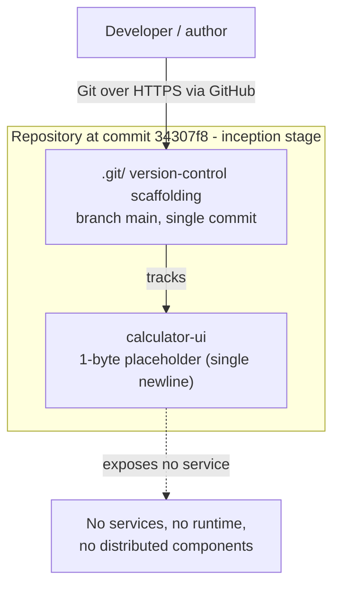
```mermaid
flowchart TD
    Dev["Developer / author"]
    subgraph Repo["Repository at commit 34307f8 - inception stage"]
        direction TB
        Git[".git/ version-control scaffolding<br/>branch main, single commit"]
        File["calculator-ui<br/>1-byte placeholder (single newline)"]
        Git -->|"tracks"| File
    end
    NoSvc["No services, no runtime,<br/>no distributed components"]
    Dev -->|"Git over HTTPS via GitHub"| Git
    File -.->|"exposes no service"| NoSvc
```

**Diagram 6.1.1 — Actual Repository Composition (no service topology exists).**

Because no services exist, the canonical building blocks of a core services architecture — service discovery, load balancing, circuit breakers, retry/fallback logic, auto-scaling, failover, and data redundancy — are likewise absent. To keep this specification complete and verifiable, Sections 6.1.2 through 6.1.4 record each requested area of the prompt (Service Components, Scalability Design, and Resilience Patterns) against actual evidence rather than omitting them, and Section 6.1.5 records the conditions under which this section would become applicable. Disaster-recovery and error-handling behavior are additionally documented in Section 5.4 and cross-referenced where relevant. No service-level objectives, throughput targets, or availability figures are asserted anywhere in this section, because none are defined in the repository; introducing any would be fabrication.

### 6.1.2 Service Components Assessment

This sub-section evaluates each of the six service-component concerns enumerated by the prompt. All are absent at commit `34307f8` for a single root reason: the repository contains no service and no executable runtime, so there are no components to bound, connect, discover, balance, or protect with resilience wrappers.

| Service-Component Concern | Evidence Sought | Status | Evidence / Cross-Reference |
|---|---|---|---|
| Service boundaries & responsibilities | Distinct modules/services with defined ownership | Not present | Single 1-byte file; no code to decompose (Section 5.1) |
| Inter-service communication patterns | REST/gRPC, messaging, or event streams between services | Not present | No clients/brokers; keyword search zero (Section 3.4) |
| Service discovery | Registry (Consul/Eureka), DNS-SD, platform Service objects | Not present | No registry or discovery configuration |
| Load balancing | Reverse proxy/LB (nginx/HAProxy/Envoy), Ingress, client-side LB | Not present | No proxy, balancer, or ingress config (Section 3.6) |
| Circuit breaker patterns | Breaker wrappers around remote calls | Not present | No code and no remote calls (Section 5.4.3) |
| Retry & fallback mechanisms | Retry-with-backoff, fallback handlers | Not present | No error-handling flow exists (Section 5.4.3) |

**Service boundaries and responsibilities.** There is one tracked artifact and no executable code, so there is nothing to decompose into services and no responsibilities to assign. As documented in Section 5.1, no architectural style or component boundary is implemented — the only structure that physically exists is the Git version-control scaffold.

**Inter-service communication patterns.** No communication fabric is present: there are no HTTP/gRPC clients or servers, no message brokers or event streams, and no queues. Section 3.4 confirms the repository integrates with no external services and exposes no API surface, and a search across the tracked content for service, endpoint, route, and API terms returns no matches.

**Service discovery.** No service registry (such as Consul or Eureka), DNS-based discovery, or platform-native service abstraction (such as a Kubernetes Service) is configured, because there are no service instances to register or resolve.

**Load balancing.** No load-balancing tier exists: there is no reverse proxy or balancer (nginx, HAProxy, Envoy), no Ingress, and no client-side balancing, consistent with the absence of any deployment substrate documented in Section 3.6.

**Circuit breakers, retries, and fallbacks.** No resilience wrappers around remote calls are implemented. As documented in Section 5.4.3, no code executes, so there is no path along which a call could fail, be retried with backoff, be short-circuited by a breaker, or fall back to an alternative response.

Diagram 6.1.2 models the current service-interaction reality: a single non-executable placeholder with no callable endpoint and no peer services. The service constructs that a distributed system would provide are grouped and explicitly labeled as not present.

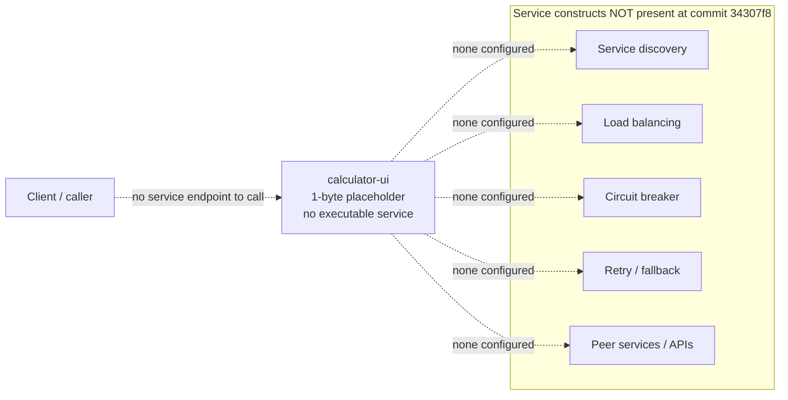
```mermaid
flowchart LR
    Client["Client / caller"]
    Artifact["calculator-ui<br/>1-byte placeholder<br/>no executable service"]
    Client -.->|"no service endpoint to call"| Artifact
    subgraph Absent["Service constructs NOT present at commit 34307f8"]
        direction TB
        Disc["Service discovery"]
        LB["Load balancing"]
        CB["Circuit breaker"]
        Retry["Retry / fallback"]
        Peer["Peer services / APIs"]
    end
    Artifact -.->|"none configured"| Disc
    Artifact -.->|"none configured"| LB
    Artifact -.->|"none configured"| CB
    Artifact -.->|"none configured"| Retry
    Artifact -.->|"none configured"| Peer
```

**Diagram 6.1.2 — Service Interaction (current state): one placeholder artifact, no endpoints, no peer services, and no service-component constructs configured.**

### 6.1.3 Scalability Design Assessment

Scalability design governs how a system adds capacity under load. Because the repository has no runtime, no deployment target, and no defined performance requirements, none of the scalability dimensions requested by the prompt is defined at commit `34307f8`. Section 2.5 explicitly records scalability considerations as "None" (no runtime, deployment target, or architecture exists), and Section 5.4.5 records that no performance requirements, SLOs, or SLAs are defined anywhere in the repository.

| Scalability Concern | Evidence Sought | Status | Evidence / Cross-Reference |
|---|---|---|---|
| Horizontal / vertical scaling | Replica sets, instance sizing, multi-instance deploy | Not present | No runtime or deploy target (Sections 2.5, 3.6) |
| Auto-scaling triggers & rules | HPA/ASG policies, metric thresholds (CPU/RPS/queue depth) | Not present | No orchestration or metrics (Sections 3.6, 5.4.2) |
| Resource allocation strategy | CPU/memory requests, limits, quotas | Not present | No container image or runtime spec (Section 3.6) |
| Performance optimization | Caching, connection pooling, async processing, profiling | Not present | No code; no caching layer (Sections 3.5, 5.4.5) |
| Capacity planning guidelines | Baselines, growth forecasts, load/latency tests | Not present | No metrics, benchmarks, or SLAs (Sections 2.5, 5.4.5) |

**Horizontal and vertical scaling approach.** No deployable unit exists, so there is neither a horizontal (add-instances) nor a vertical (resize-instance) scaling approach; there is nothing to replicate or resize.

**Auto-scaling triggers and rules.** No autoscaler (for example a Kubernetes Horizontal Pod Autoscaler or a cloud auto-scaling group) and no trigger metrics (CPU, memory, request rate, or queue depth) are configured, consistent with the absence of orchestration (Section 3.6) and monitoring/metrics (Section 5.4.2).

**Resource allocation strategy.** No CPU/memory requests, limits, or quotas are declared, because no container image or runtime specification exists (Section 3.6).

**Performance optimization techniques.** No caching, connection pooling, asynchronous processing, or profiling is present. Section 3.5 confirms no caching layer, and Section 5.4.5 confirms no performance budget or benchmark exists.

**Capacity planning guidelines.** No capacity baselines, growth forecasts, or load/latency tests exist, and there are no metrics or SLAs from which capacity could be planned (Sections 2.5 and 5.4.5).

Diagram 6.1.3 contrasts what is present (a single non-executable artifact) with the scaling constructs a scalable service architecture would provide, all of which are explicitly marked as not present.

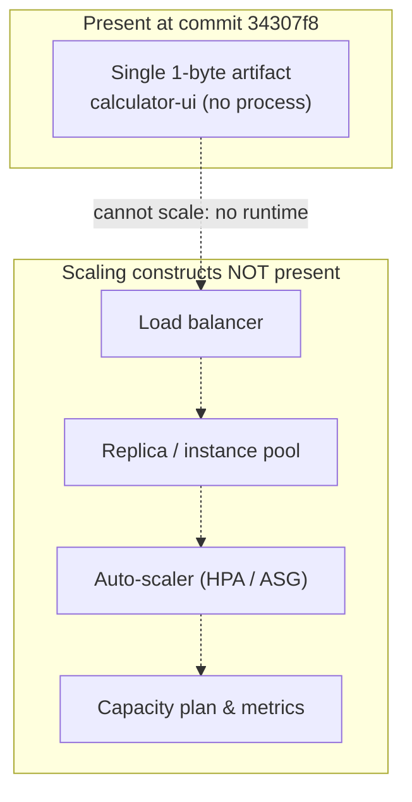
```mermaid
flowchart TD
    subgraph Present["Present at commit 34307f8"]
        direction TB
        One["Single 1-byte artifact<br/>calculator-ui (no process)"]
    end
    subgraph AbsentScale["Scaling constructs NOT present"]
        direction TB
        LB2["Load balancer"]
        Pool["Replica / instance pool"]
        AS["Auto-scaler (HPA / ASG)"]
        Cap["Capacity plan & metrics"]
    end
    One -.->|"cannot scale: no runtime"| LB2
    LB2 -.-> Pool
    Pool -.-> AS
    AS -.-> Cap
```

**Diagram 6.1.3 — Scalability Architecture (current state): a single non-scalable placeholder; no load balancer, replica pool, auto-scaler, or capacity plan exists.**

### 6.1.4 Resilience Patterns Assessment

Resilience patterns keep a system available and correct in the presence of faults. No application-level resilience pattern is implemented at commit `34307f8`, because there is no runtime, no service instance, and no data to protect. The only genuine recovery capability that exists operates at the version-control layer and is documented in Section 5.4.6.

| Resilience Concern | Evidence Sought | Status | Evidence / Cross-Reference |
|---|---|---|---|
| Fault tolerance mechanisms | Redundancy, health/readiness checks, self-healing | Not present | No runtime or process (Section 5.4.3) |
| Disaster recovery procedures | Backup/restore, RTO/RPO, failover runbooks | No application DR | Only VCS provenance / re-clone (Section 5.4.6) |
| Data redundancy approach | Replication, multi-AZ, backups | Not present | No datastore or data (Section 3.5) |
| Failover configurations | Standby instances, leader election, DNS failover | Not present | No instances to fail over between |
| Service degradation policies | Graceful degradation, load shedding, feature flags | Not present | No service to degrade |

**Fault tolerance mechanisms.** No redundancy, health/readiness probes, or self-healing behavior is present, because no process runs. As documented in Section 5.4.3, no code executes, so no fault can arise or be tolerated.

**Disaster recovery procedures.** No application-level disaster recovery is defined: there is no backup/restore process, no recovery-time or recovery-point objective (RTO/RPO), and no failover runbook. Consistent with Section 5.4.6, the only recovery capability that genuinely exists is at the version-control layer — the repository state at commit `34307f8` is preserved in Git history and mirrored to the GitHub remote (`origin/main`), so the placeholder state can be reconstituted by re-cloning. This is source-code provenance, not an application recovery capability.

**Data redundancy approach.** No data redundancy exists, because no datastore and no application data exist. Section 3.5 confirms the repository declares no database, cache, or object storage, and defines no persistence strategy; the only tracked file holds a single newline byte and represents no application data.

**Failover configurations.** No failover configuration (standby instances, leader election, or DNS failover) is present, because there are no instances or endpoints to fail over between.

**Service degradation policies.** No graceful-degradation, load-shedding, or feature-flag policy is defined, because there is no service whose behavior could be degraded under stress.

Diagram 6.1.4 shows that application resilience constructs are absent, while the only recovery mechanism that genuinely exists — version-control provenance via the GitHub remote — is a source-code capability rather than application disaster recovery.

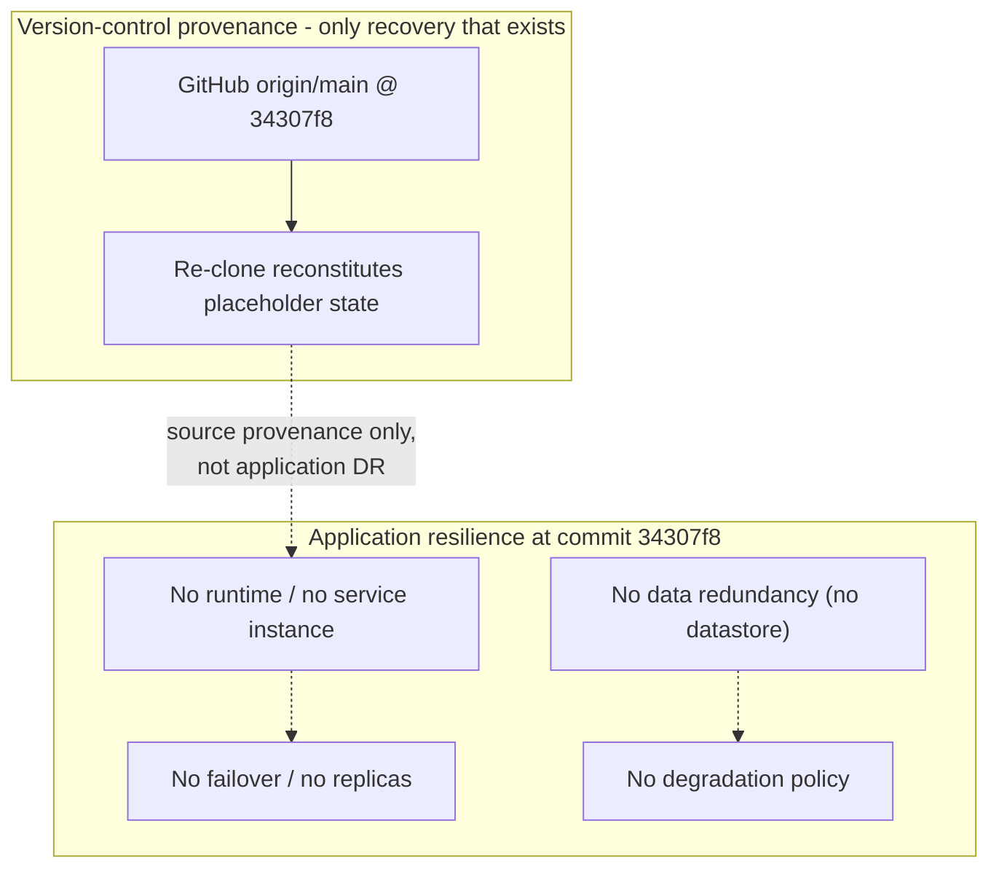
```mermaid
flowchart TD
    subgraph AppRes["Application resilience at commit 34307f8"]
        direction TB
        NoRT["No runtime / no service instance"]
        NoRed["No data redundancy (no datastore)"]
        NoFO["No failover / no replicas"]
        NoDeg["No degradation policy"]
        NoRT -.-> NoFO
        NoRed -.-> NoDeg
    end
    subgraph VCS["Version-control provenance - only recovery that exists"]
        direction TB
        Origin["GitHub origin/main @ 34307f8"]
        Reclone["Re-clone reconstitutes placeholder state"]
        Origin --> Reclone
    end
    Reclone -.->|"source provenance only,<br/>not application DR"| NoRT
```

**Diagram 6.1.4 — Resilience Pattern Implementations (current state): no fault tolerance, data redundancy, failover, or degradation policy; only version-control provenance provides recovery.**

### 6.1.5 Conditions for Future Applicability

> **Forward-looking guidance — not current state.** The following describes the conditions under which a Core Services Architecture section would become applicable. Nothing below is implemented, configured, or selected at commit `34307f8`; it is included solely to guide future authorship and must not be read as delivered architecture. This mirrors the "Reference only — not adopted" convention used in Sections 3.4, 3.5, and 3.6.

This section becomes applicable only when the repository introduces distinct, independently deployable service components (or a distributed, multi-process runtime) that communicate at runtime. If the project instead realizes its naming intent as a single client-side calculator UI, it may remain a monolithic/single-artifact system, in which case Core Services Architecture would continue to be not applicable and the relevant design would be captured by the high-level architecture in Section 5 instead.

The table maps concrete triggers to the content that would then need to be authored here. Specific technologies, metric thresholds, and service levels are intentionally omitted because none has been chosen; they would be recorded only when actually adopted.

| If the System Later Introduces... | Then Section 6.1 Would Document... |
|---|---|
| A second independently deployable service with runtime calls | Service boundaries/responsibilities and the communication pattern (synchronous REST/gRPC vs. asynchronous messaging) |
| A service registry or platform service abstraction | The service discovery mechanism and resolution strategy |
| A reverse proxy, load balancer, or ingress | The load balancing strategy and health-check integration |
| Remote calls guarded by resilience wrappers | Circuit breaker, retry-with-backoff, and fallback policies |
| An orchestrated or replicated deployment | Horizontal/vertical scaling approach, auto-scaling triggers, and resource allocation |
| A datastore with replication or backups | Data redundancy approach, failover configuration, and RTO/RPO targets |

Until at least one such trigger is present in the codebase, this section should continue to state that Core Services Architecture is not applicable, in keeping with the evidence-based approach used throughout this specification.

### 6.1.6 References

The following repository artifacts and technical-specification sections were examined as evidence for this section.

**Repository files and folders (verified at commit `34307f8`):**

- `calculator-ui` - the sole tracked artifact; a 1-byte file containing a single newline, mode `100644` (a regular blob, not a submodule gitlink). Established the absence of any service, runtime, or configuration.
- Repository root (working tree `main_0d6e40/`) - a full-tree sweep confirmed the only non-Git file is `calculator-ui`; no service definitions, deployment/orchestration manifests, or scaling/resilience configuration exist.
- `.git/` (version-control scaffolding) - established the single commit `34307f8` ("Create calculator-ui"), single branch `main`, the GitHub `origin/main` remote, and (via `git ls-tree` and `git submodule status`) the absence of any submodule despite the repository name.

**Cross-referenced Technical Specification sections:**

- `1.2 System Overview` - the system comprises only version-control scaffolding and a placeholder file (inception stage).
- `2.5 Implementation Considerations` - scalability considerations and performance requirements are both recorded as "None."
- `3.4 Third-Party Services` - no external APIs, integrations, authentication, monitoring, or cloud services (basis for absent inter-service communication and service discovery).
- `3.5 Databases & Storage` - no database, cache, or object storage and no persistence strategy (basis for absent data redundancy).
- `3.6 Development & Deployment` - no build system, containerization, CI/CD, or infrastructure-as-code (basis for absent deployment/scaling substrate).
- `5.1 High-Level Architecture` - no application architecture style, components, or data flows are implemented; system boundary is a single Git repository.
- `5.4 Cross-Cutting Concerns` - no disaster recovery beyond version-control provenance (5.4.6), no error handling/retry/circuit breaker/fallback (5.4.3), no monitoring/metrics (5.4.2), and no performance requirements or SLAs (5.4.5).

## 6.2 Database Design

### 6.2.1 Applicability Determination

**Database Design is not applicable to this system.**

The repository (`calculator-nested-submodule-20-July`) is at an inception stage at commit `34307f8`. Its only tracked artifact is a single 1-byte placeholder file, `calculator-ui`, whose entire content is one newline character (`0x0a`) and whose Git mode is `100644` (an ordinary blob, not a submodule gitlink). There is no database, no persistent storage, no cache, no object or blob storage, no object-relational mapper (ORM), and no schema, migration, or SQL file of any kind. A database design presupposes at least one persisted data store with a defined data model, keys, and access paths — none of which exists here.

This determination was reached by direct inspection of the repository and is consistent with findings already recorded elsewhere in this specification. Section 3.5 records that no database or storage technology is used, configured, or referenced and that no persistence strategy is defined. Section 5.1.3 records that there are no data stores or caches and that the only data movement that ever occurred was the one-time version-control write of the placeholder blob. Section 6.1.4 records that no data redundancy exists because no datastore and no application data exist. Sections 1.2 and 1.3 record that the system has no data domains, data models, schemas, migrations, or stored data.

A keyword sweep of the tracked content for database, ORM, schema, migration, cache, and object-storage indicators (for example `postgres`, `mysql`, `mongo`, `sqlite`, `redis`, `memcached`, `s3`, `schema`, `migration`, `orm`, `prisma`, `typeorm`, `jdbc`, `hibernate`, `dynamodb`, `cassandra`) returns zero matches, and no manifest or configuration file (`*.json`, `*.sql`, `*.yml`, `*.yaml`, `*.env`, `*.toml`, `Dockerfile`, `docker-compose*`, `*.prisma`) exists from which a datastore could be declared.

The following criteria were evaluated directly against the repository; each is absent at the documented commit.

| Persistence Concern | Evidence Sought | Present? | Evidence Basis |
|---|---|---|---|
| Primary database | Driver/client library, connection string, DB config | No | Only the 1-byte `calculator-ui` exists; no code or config (Section 3.5) |
| Secondary / NoSQL datastore | Additional datastore driver or configuration | No | No driver, DSN, or config file present |
| Data model / schema / migrations | ORM models, schema files, migration directory, `*.sql` | No | Keyword search returns zero matches; no data domains (Section 1.3) |
| Caching layer | Redis / Memcached client or configuration | No | No cache client or config (Sections 3.5, 5.1.3) |
| Object / file / blob storage | S3 / GCS / Azure Blob SDK or config, stored assets | No | No SDK or bucket configuration present |
| Persisted application data | Stored records, seed data, or data files | No | Sole file holds one newline byte; represents no data (Section 1.2) |

Diagram 6.2.1 depicts the repository's actual persistence surface at commit `34307f8`: a single non-data placeholder tracked by version control, with every conventional persistence tier explicitly absent. The dashed edges record the deliberate absence of each tier; the diagram depicts only what genuinely exists.

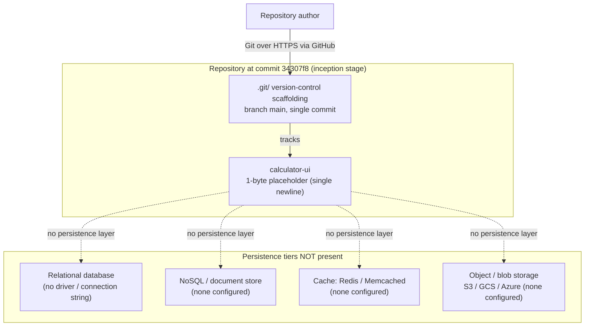
```mermaid
flowchart TD
    Dev["Repository author"]
    subgraph Repo["Repository at commit 34307f8 (inception stage)"]
        direction TB
        Git[".git/ version-control scaffolding<br/>branch main, single commit"]
        File["calculator-ui<br/>1-byte placeholder (single newline)"]
        Git -->|"tracks"| File
    end
    subgraph Absent["Persistence tiers NOT present"]
        direction TB
        RDBMS["Relational database<br/>(no driver / connection string)"]
        NoSQL["NoSQL / document store<br/>(none configured)"]
        Cache["Cache: Redis / Memcached<br/>(none configured)"]
        Blob["Object / blob storage<br/>S3 / GCS / Azure (none configured)"]
    end
    Dev -->|"Git over HTTPS via GitHub"| Git
    File -.->|"no persistence layer"| RDBMS
    File -.->|"no persistence layer"| NoSQL
    File -.->|"no persistence layer"| Cache
    File -.->|"no persistence layer"| Blob
```

**Diagram 6.2.1 — Actual Persistence Surface (no datastore, cache, or object storage exists).**

To keep this specification complete and verifiable, Sections 6.2.2 through 6.2.5 record each area requested by the section prompt — Schema Design, Data Management, Compliance Considerations, and Performance Optimization — against actual evidence rather than omitting them, and Section 6.2.6 records the conditions under which this section would become applicable. No storage engines, index definitions, retention windows, replication factors, or performance targets are asserted anywhere in this section, because none is defined in the repository; introducing any would be fabrication.

### 6.2.2 Schema Design Assessment

This sub-section evaluates each of the six schema-design concerns enumerated by the prompt. All are absent at commit `34307f8` for a single root reason: the repository defines no datastore and no data model, so there are no entities to relate, no structures to describe, no columns to index, no data to partition, no nodes to replicate, and no data to back up.

| Schema Concern | Evidence Sought | Status | Evidence / Cross-Reference |
|---|---|---|---|
| Entity relationships | Entities/tables with foreign-key or reference links | Not present | No data model of any kind (Sections 1.3, 3.5) |
| Data models & structures | ORM classes, table/collection definitions, DTOs | Not present | No source or schema files; sole file is 1-byte placeholder |
| Indexing strategy | Index definitions, `CREATE INDEX`, unique keys | Not present | No schema to index; keyword search zero (Section 6.2.1) |
| Partitioning approach | Range/hash/list partitions, sharding keys | Not present | No datastore to partition (Section 3.5) |
| Replication configuration | Primary/replica topology, replica set, WAL streaming | Not present | No datastore and no runtime (Sections 3.5, 6.1.4) |
| Backup architecture | Snapshot/dump jobs, PITR, backup targets | No application backup | Only version-control provenance exists (Section 5.4.6) |

**Entity relationships.** No entities exist, so no relationships (one-to-one, one-to-many, or many-to-many), foreign keys, or association tables are defined. The repository contains no data model from which entities could be derived.

**Data models and structures.** No data models or structures are defined. There are no ORM model classes, relational table definitions, document/collection schemas, data-transfer objects, or type definitions, because the repository holds no source code — only the 1-byte `calculator-ui` placeholder, which represents no data.

**Indexing strategy.** No indexing strategy exists. Because there are no tables, collections, or columns, there are no primary, secondary, unique, composite, partial, or full-text indexes to define or tune.

**Partitioning approach.** No partitioning approach exists. There is no datastore and no data volume, so range, hash, list, or composite partitioning and horizontal sharding are all inapplicable.

**Replication configuration.** No database replication is configured. There is no primary/replica topology, replica set, streaming/WAL replication, or multi-region configuration, consistent with the absence of any datastore (Section 3.5) and the absence of data redundancy documented in Section 6.1.4.

**Backup architecture.** No application-level backup architecture exists. There are no snapshot or dump jobs, no point-in-time-recovery configuration, and no backup targets. As documented in Section 5.4.6, the only recovery capability that genuinely exists is at the version-control layer — the state at commit `34307f8` is preserved in Git history and mirrored to the GitHub remote (`origin/main`) — which is source-code provenance, not a database backup.

**Indexes and constraints inventory.** The section prompt requires that all indexes and constraints be documented. The complete, verified inventory at commit `34307f8` is empty: every schema object type has a defined count of zero.

| Schema Object | Defined? | Count | Evidence |
|---|---|---|---|
| Tables / collections | No | 0 | No schema or ORM definitions (Section 3.5) |
| Columns / fields | No | 0 | No table or document structures exist |
| Primary keys | No | 0 | No tables to key |
| Foreign keys | No | 0 | No inter-entity references exist |
| Unique constraints | No | 0 | No columns to constrain |
| Check / not-null constraints | No | 0 | No columns to constrain |
| Secondary indexes | No | 0 | No schema to index |
| Sequences / identity generators | No | 0 | No auto-increment or identity columns exist |

Because zero entities, relationships, tables, columns, keys, indexes, and constraints exist, a conventional entity-relationship diagram has nothing to depict. Diagram 6.2.2 is therefore a deliberately degenerate ER diagram that documents the empty data model explicitly rather than fabricating tables that do not exist.

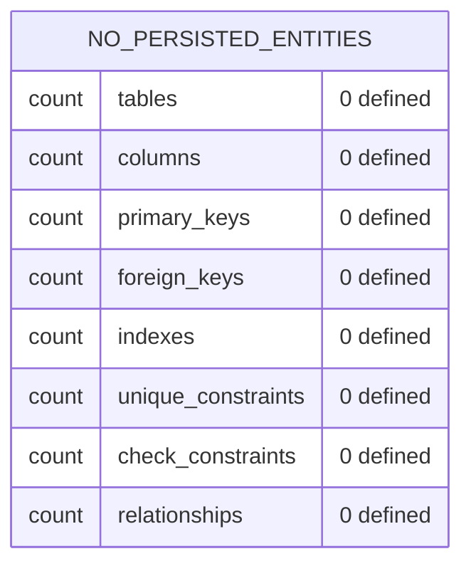
```mermaid
erDiagram
    NO_PERSISTED_ENTITIES {
        count tables "0 defined"
        count columns "0 defined"
        count primary_keys "0 defined"
        count foreign_keys "0 defined"
        count indexes "0 defined"
        count unique_constraints "0 defined"
        count check_constraints "0 defined"
        count relationships "0 defined"
    }
```

**Diagram 6.2.2 — Entity-Relationship Diagram (empty data model): zero entities, columns, keys, indexes, constraints, and relationships are defined.**

Diagram 6.2.3 documents the replication and backup posture. No database replication topology exists; the only redundancy that genuinely exists is version-control mirroring of the repository to the GitHub remote, which preserves source provenance rather than replicating application data.

```mermaid
flowchart TD
    Primary["No primary database node"]
    subgraph AbsentRepl["Replication topology NOT present at 34307f8"]
        direction TB
        Replica["Read replica(s)"]
        Standby["Hot standby / failover node"]
        Shard["Shard / partition"]
    end
    Primary -.->|"no replication configured"| Replica
    Primary -.->|"no failover configured"| Standby
    Primary -.->|"no partitioning configured"| Shard
    subgraph VCSonly["Only redundancy that exists: version control"]
        direction TB
        Local["Local clone (main_0d6e40)"]
        Remote["GitHub origin/main @ 34307f8"]
        Local -->|"git push / fetch mirrors state"| Remote
    end
```

**Diagram 6.2.3 — Replication Architecture (current state): no database replica, standby, or shard exists; only version-control mirroring to `origin/main` provides redundancy, and that is source provenance rather than data replication.**

### 6.2.3 Data Management Assessment

This sub-section evaluates each data-management concern enumerated by the prompt. All are absent at commit `34307f8` because the repository stores no application data and defines no datastore against which data could be migrated, versioned, archived, retrieved, or cached.

| Data-Management Concern | Evidence Sought | Status | Evidence / Cross-Reference |
|---|---|---|---|
| Migration procedures | Migration files/tool (Flyway, Liquibase, Alembic, Prisma) | Not present | No schema and no migration directory (Section 6.2.1) |
| Versioning strategy | Schema/version table, data-version columns | Not present | No schema to version; only Git versions source (Section 5.4.6) |
| Archival policies | Cold-storage tiering, archive jobs, TTL sweeps | Not present | No data to archive (Sections 1.3, 3.5) |
| Storage & retrieval mechanisms | DAO/repository layer, queries, connection code | Not present | No data-access code; only Git object read/write |
| Caching policies | Cache client, TTL/eviction policy, invalidation logic | Not present | No cache layer configured (Sections 3.5, 5.1.3) |

**Migration procedures.** No database migration procedure exists. There is no migration tool (for example Flyway, Liquibase, Alembic, or Prisma Migrate), no migration directory, no versioned change scripts, and no schema baseline, because there is no schema to evolve.

**Versioning strategy.** No data or schema versioning strategy exists. There is no schema-version table, no migration-version tracking, and no per-record version or optimistic-concurrency column. The only versioning present in the repository is source-code version control via Git (a single commit, `34307f8`, on branch `main`), which versions the source tree, not persisted application data or a database schema (Section 5.4.6).

**Archival policies.** No archival policy exists. There is no data-lifecycle tiering to cold storage, no archive or purge job, and no time-to-live sweep, because no data is generated or stored (Sections 1.3 and 3.5).

**Data storage and retrieval mechanisms.** No application storage or retrieval mechanism exists. There is no data-access layer (DAO/repository), no query code, no serialization/deserialization, and no connection management. The only storage-and-retrieval mechanism that physically operates is Git's content-addressable object store, which recorded the `calculator-ui` blob during the single commit and can return it on checkout — a version-control mechanism, not an application data plane.

**Caching policies.** No caching policy exists. There is no in-process or distributed cache (for example Redis or Memcached), no cache-aside/read-through/write-through pattern, no time-to-live or eviction policy, and no cache-invalidation logic, consistent with the absence of any caching layer recorded in Sections 3.5 and 5.1.3.

Diagram 6.2.4 depicts the only data movement that has ever occurred in the repository: the one-time version-control write of the placeholder blob during commit `34307f8`. There is no runtime read path, query, or data-access flow; the dashed edge records the deliberate absence of any application read/query.

```mermaid
flowchart LR
    Author["Author (Sandeep01Kumar)"]
    Commit["Commit 34307f8<br/>'Create calculator-ui'"]
    Blob["Git blob 8b13789<br/>calculator-ui (1 byte, 0x0a)"]
    Origin["GitHub origin/main"]
    Reader["Any application read / query path"]
    Author -->|"git add + commit"| Commit
    Commit -->|"writes blob into .git object store"| Blob
    Commit -->|"git push"| Origin
    Blob -.->|"no runtime read, no query"| Reader
```

**Diagram 6.2.4 — Data Flow (current state): the sole data movement is a one-time version-control blob write; no application storage, retrieval, migration, or cache flow exists.**

### 6.2.4 Compliance Considerations Assessment

This sub-section evaluates each data-compliance concern enumerated by the prompt. Because the repository collects, stores, and processes no application data at commit `34307f8`, none of these controls is required or implemented at the application level. Where a genuinely comparable capability exists at the version-control layer, it is identified as such and never conflated with an application data control.

| Compliance Concern | Evidence Sought | Status | Evidence / Cross-Reference |
|---|---|---|---|
| Data retention rules | Retention windows, TTL, purge schedules | Not present | No stored data to retain (Sections 1.3, 3.5) |
| Backup & fault tolerance | Backup/restore, failover, RTO/RPO | No application-level | Only Git provenance to `origin/main` (Section 5.4.6) |
| Privacy controls | PII handling, consent, encryption at rest/in transit | Not present | No personal or application data is stored |
| Audit mechanisms | Audit log tables, change-data capture, access logs | Not present | No application logging (Section 5.4.2) |
| Access controls | DB roles/grants, row-level security, app authorization | Not present | No auth logic; only GitHub push permissions (Section 5.4.4) |

**Data retention rules.** No data-retention rule is defined, because no data is stored. There is no retention window, time-to-live, legal-hold, or purge schedule. The only artifact retained indefinitely is the source tree in Git history; this is source-code provenance, not managed application-data retention.

**Backup and fault-tolerance policies.** No application-level backup, restore, or fault-tolerance policy is defined, and no recovery-time or recovery-point objective (RTO/RPO) is stated anywhere in the repository. As documented in Section 5.4.6, the only recovery capability that genuinely exists is version-control provenance: the state at commit `34307f8` is preserved in Git history and mirrored to the GitHub remote (`origin/main`), so the placeholder state can be reconstituted by re-cloning. Consistent with Section 6.1.4, there is no data redundancy because there is no datastore and no application data.

**Privacy controls.** No privacy controls are implemented because no personal data or application data is collected, stored, or processed. There is no personally identifiable information (PII) store, no consent or data-subject-rights handling, and no encryption-at-rest or encryption-in-transit configuration, because there is no data plane. The only personal datum present anywhere in the repository is the commit author identity in Git metadata (`Sandeep01Kumar <sandeep@blitzy.com>`), which is version-control provenance rather than application data managed by the system.

**Audit mechanisms.** No application audit mechanism exists. There is no audit-log table, change-data-capture stream, or access log, consistent with the absence of any logging, monitoring, or observability instrumentation documented in Section 5.4.2. The only audit trail that genuinely exists is the immutable, GPG-signed Git commit history (a single commit, `34307f8`), which records who changed the source and when — version-control provenance, not application-level data auditing.

**Access controls.** No application or database access control is implemented. There are no database roles or grants, no row-/column-level security, and no application authorization logic. As documented in Section 5.4.4, the only access control that applies is the GitHub repository's version-control permissions, which govern who may push commits; this is a hosting-platform concern, not an application- or database-level authorization framework.

### 6.2.5 Performance Optimization Assessment

This sub-section evaluates each database performance-optimization concern enumerated by the prompt. All are absent at commit `34307f8` because there is no datastore, no query workload, no connection, and no data volume to optimize. Consistent with Section 5.4.5, no performance requirements, service-level objectives, or benchmarks are defined anywhere in the repository, so no optimization target could be asserted without fabrication.

| Performance Concern | Evidence Sought | Status | Evidence / Cross-Reference |
|---|---|---|---|
| Query optimization patterns | Query plans, `EXPLAIN`, index/denormalization tuning | Not present | No queries or schema (Sections 6.2.1, 6.2.2) |
| Caching strategy | Cache tier, TTL/eviction, hit-ratio tuning | Not present | No cache configured (Sections 3.5, 6.2.3) |
| Connection pooling | Pool library, min/max sizing, timeout config | Not present | No database driver or connection (Section 3.5) |
| Read/write splitting | Primary/replica routing, read-only endpoints | Not present | No replica topology (Section 6.2.2) |
| Batch processing approach | Bulk load/ETL jobs, batch inserts, schedulers | Not present | No runtime or batch job (Sections 4.1, 5.4.5) |

**Query optimization patterns.** No query optimization exists. There are no queries, no query planner or `EXPLAIN` analysis, no index-based tuning, no denormalization or materialized views, and no slow-query monitoring, because there is no datastore and no schema to query.

**Caching strategy.** No caching strategy exists. There is no application, query-result, or object cache; no time-to-live or eviction tuning; and no hit-ratio target. This matches the absence of any caching layer recorded in Sections 3.5 and 5.1.3 and the caching-policy assessment in Section 6.2.3.

**Connection pooling.** No connection pooling exists. There is no database driver or client, so there is no connection pool, no minimum/maximum pool sizing, no acquisition timeout, and no idle-connection reaping to configure (Section 3.5).

**Read/write splitting.** No read/write splitting exists. There is no primary/replica topology, no read-only endpoint, and no routing layer to direct reads to replicas and writes to a primary, consistent with the absence of any replication configuration documented in Section 6.2.2.

**Batch processing approach.** No batch processing approach exists. There are no bulk-load or ETL jobs, no batched inserts/updates, and no scheduler or job runner. Section 4.1 records no batch-processing sequences, and Section 5.4.5 records no performance workload against which batching could be designed.

### 6.2.6 Conditions for Future Applicability

> **Forward-looking guidance — not current state.** The following describes the conditions under which a Database Design section would become applicable. Nothing below is implemented, configured, or selected at commit `34307f8`; it is included solely to guide future authorship and must not be read as delivered design. This mirrors the "Reference only — not adopted" convention used in Sections 3.4, 3.5, and 3.6.

This section becomes applicable only when the repository introduces at least one persisted data store — a relational database, a NoSQL/document store, a cache treated as a system of record, or object/blob storage that holds application data — together with a data model and the code that reads from or writes to it. Until such a data domain exists, Database Design remains not applicable, in keeping with the evidence-based approach used throughout this specification.

As recorded in Section 3.5.3, the organization's greenfield template proposes **MongoDB** as a reference-default primary database, but that default is explicitly **not adopted, configured, or version-pinned** anywhere in this repository. Should the project adopt it — or any other engine — the concrete schema, indexes, and operational parameters would be documented here only once they actually exist in the codebase.

The table maps concrete triggers to the content that would then need to be authored in this section. Specific technologies, index definitions, retention windows, replication factors, and performance targets are intentionally omitted because none has been chosen; they would be recorded only when actually adopted.

| If the System Later Introduces... | Then Section 6.2 Would Document... |
|---|---|
| A relational database with a schema and migrations | Entity relationships, data models, indexing strategy, constraint definitions, and migration/versioning procedures |
| A NoSQL / document or key-value store | Collection/document models, partition and shard keys, and the consistency model |
| A caching tier (for example Redis or Memcached) | Caching strategy, TTL/eviction policy, and cache-invalidation logic |
| A replicated or backed-up datastore | Replication topology, backup architecture, and RTO/RPO targets |
| Data classified as personal or sensitive | Data-retention rules, privacy controls (encryption, consent), and audit mechanisms |
| A connection-pooled data-access layer | Connection pooling, query-optimization patterns, and read/write splitting |

Until at least one such trigger is present in the codebase, this section should continue to state that Database Design is not applicable.

### 6.2.7 References

The following repository artifacts and technical-specification sections were examined as evidence for this section. All repository facts were verified directly at commit `34307f8`.

**Repository files and folders (verified at commit `34307f8`):**

- `calculator-ui` - the sole tracked artifact; a 1-byte file containing a single newline (`0x0a`), Git mode `100644` (a regular blob, not a submodule gitlink). Established the absence of any datastore, data model, schema, or persisted application data.
- Repository root (working tree `main_0d6e40/`) - a full-tree sweep confirmed the only non-Git file is `calculator-ui`; no schema, migration, ORM, SQL, cache, object-storage, manifest, or configuration files exist. A keyword search for database/persistence indicators returned zero matches.
- `.git/` (version-control scaffolding) - established the single commit `34307f8` ("Create calculator-ui"), the single branch `main`, the GitHub `origin/main` remote, and the absence of any `.gitmodules`/submodule. This is the only durable provenance that exists, and it operates at the version-control layer rather than as an application datastore or backup.

**Cross-referenced Technical Specification sections:**

- `1.2 System Overview` - the system comprises only version-control scaffolding and a 1-byte placeholder file (inception stage); no data stores or caches.
- `1.3 Scope` - no data domains, data models, schemas, migrations, or stored data are in scope.
- `3.5 Databases & Storage` - no database, cache, or object storage is used or configured, and no persistence strategy is defined; MongoDB is cited only as a reference default that is not adopted (Section 3.5.3).
- `5.1 High-Level Architecture` - Section 5.1.3 records no data stores or caches and confirms the only data movement was the one-time version-control blob write.
- `5.4 Cross-Cutting Concerns` - Section 5.4.2 (no logging/monitoring, basis for absent audit), 5.4.4 (no authorization; only GitHub push permissions, basis for absent access controls), 5.4.5 (no performance requirements/SLAs), and 5.4.6 (no application-level disaster recovery; only version-control provenance).
- `6.1 Core Services Architecture` - Section 6.1.4 records no data redundancy because no datastore and no application data exist.

## 6.3 Integration Architecture

### 6.3.1 Applicability Determination

**Integration Architecture is not applicable for this system.**

The repository (`calculator-nested-submodule-20-July`) is at an inception stage at commit `34307f8`. Its only tracked artifact is a single 1-byte placeholder file, `calculator-ui`, whose entire content is one newline character (`0x0a`) and whose Git mode is `100644` (an ordinary blob, not a submodule gitlink). There is no application code, no runtime, no server or client, no API surface, no message broker or queue, and no configuration that references any external system. An integration architecture presupposes at least one boundary across which the system exchanges data with another system — an inbound or outbound API, a message channel, a batch/stream pipeline, or a third-party service contract — and none of these exists here.

This determination was reached by direct inspection of the repository and is consistent with findings recorded elsewhere in this specification. Section 3.4 records that the repository integrates with no third-party services of any kind — no external APIs, authentication providers, monitoring tools, or cloud services are referenced, configured, or credentialed. Section 5.1.4 records that the only external touchpoint of any kind is the GitHub remote used for version control, which operates at the version-control (VCS) layer and is explicitly **not an application integration**. Section 6.1 records that there is no inter-service communication (no HTTP/gRPC clients or servers, no message brokers or event streams, no queues), and Section 5.4 records that no authentication/authorization, error handling, monitoring, or performance/SLA definitions exist.

A keyword sweep of the tracked content for integration indicators (for example `api`, `rest`, `grpc`, `graphql`, `webhook`, `http`, `endpoint`, `route`, `oauth`, `oidc`, `saml`, `jwt`, `token`, `kafka`, `rabbitmq`, `amqp`, `mqtt`, `sqs`, `sns`, `pubsub`, `nats`, `redis`, `queue`, `stream`, `gateway`, `swagger`, `openapi`, `soap`, `broker`, `celery`, `cron`, `batch`, `etl`) returns **zero matches**, and no manifest or configuration file (`*.json`, `*.yml`, `*.yaml`, `*.env`, `*.toml`, `Dockerfile`, `docker-compose*`, `openapi*`, `*.proto`, `*.wsdl`) exists from which an integration could be declared. Notably, although the repository name contains "nested-submodule," there is **no `.gitmodules` file and no submodule gitlink**, so the repository does not even integrate an external code repository as a submodule.

The following criteria were evaluated directly against the repository; each is absent at the documented commit.

| Integration Concern | Evidence Sought | Present? | Evidence Basis |
|---|---|---|---|
| Inbound API surface | HTTP/REST/gRPC/GraphQL server, route/controller definitions, socket bind/listen | No | Only the 1-byte `calculator-ui` exists; keyword sweep zero (Sections 5.1, 6.1) |
| Outbound integration / SDK clients | HTTP or SDK clients, endpoint URLs, webhook callbacks | No | No source, SDK import, or configuration file present (Section 3.4) |
| Auth for integrations | OAuth/OIDC/SAML/JWT, API keys, token or session management | No | No auth library or credential config (Sections 3.4, 5.4.4) |
| Message broker / queue / event stream | Kafka/RabbitMQ/SQS/SNS/NATS/Redis clients, producers/consumers | No | No broker client or configuration; keyword sweep zero (Section 6.1) |
| Batch / stream / ETL processing | Schedulers, cron, batch jobs, stream processors | No | No runtime or job exists (Sections 4.1, 6.2.5) |
| API gateway / reverse proxy | Gateway/ingress/nginx/HAProxy/Envoy configuration | No | No deployment substrate present (Section 3.6) |
| External service contracts | OpenAPI/Swagger, WSDL, protobuf IDL, SLA documents | No | No contract or specification file present |
| Git submodule integration | `.gitmodules` file, submodule gitlink (mode `160000`) | No | No `.gitmodules`; `calculator-ui` is a mode `100644` blob (Section 3.4) |

Diagram 6.3.1 depicts the repository's actual integration surface at commit `34307f8`: a single non-integrating placeholder tracked by version control, with every conventional integration tier explicitly absent. The dashed edges record the deliberate absence of each tier; the diagram depicts only what genuinely exists. The developer-to-Git edge is the sole real edge, and it operates at the version-control layer rather than as an application integration.

```mermaid
flowchart TD
    Dev["Repository author / developer"]
    subgraph Repo["Repository at commit 34307f8 - inception stage"]
        direction TB
        Git[".git/ version-control scaffolding<br/>branch main, single commit"]
        File["calculator-ui<br/>1-byte placeholder (single newline)"]
        Git -->|"tracks"| File
    end
    subgraph AbsentIntf["Integration surfaces NOT present at commit 34307f8"]
        direction TB
        InAPI["Inbound API surface<br/>(REST / gRPC / GraphQL)"]
        OutAPI["Outbound API / SDK clients"]
        Broker["Message broker / queue / stream"]
        Ext["Third-party / external services"]
        GW["API gateway / reverse proxy"]
    end
    Dev -->|"Git over HTTPS via GitHub"| Git
    File -.->|"exposes no integration"| InAPI
    File -.->|"calls no service"| OutAPI
    File -.->|"publishes/consumes nothing"| Broker
    File -.->|"no contract"| Ext
    File -.->|"none configured"| GW
```

**Diagram 6.3.1 — Actual Integration Surface (no API, message channel, or external system exists).**

Because no integration exists, the canonical building blocks of an integration architecture — protocol bindings, authentication and authorization for callers, rate limiting, API versioning, message queues and streams, batch pipelines, API gateways, and external service contracts — are likewise absent. To keep this specification complete and verifiable, Sections 6.3.2 through 6.3.4 record each requested area of the prompt (API Design, Message Processing, and External Systems) against actual evidence rather than omitting them, and Section 6.3.5 records the conditions under which this section would become applicable. No protocols, rate limits, versioning schemes, message-delivery guarantees, or service-level agreements are asserted anywhere in this section, because none is defined in the repository; introducing any would be fabrication.

### 6.3.2 API Design Assessment

This sub-section evaluates each of the six API-design concerns enumerated by the prompt. All are absent at commit `34307f8` for a single root reason: the repository exposes and consumes **no API**. There is no server that binds a port, no route/endpoint/controller definition, and no client that calls a remote API, so there is no protocol to specify, no caller to authenticate or authorize, no traffic to rate-limit, no surface to version, and no contract to document. This is consistent with Section 6.1 (no inter-service communication and no API surface) and Section 5.4.4 (no authentication or authorization framework).

| API-Design Concern | Evidence Sought | Status | Evidence / Cross-Reference |
|---|---|---|---|
| Protocol specifications | HTTP/REST, gRPC, GraphQL, WebSocket, or SOAP definitions | Not present | No server or endpoint; keyword sweep zero (Section 6.1) |
| Authentication methods | OAuth2/OIDC, JWT, API keys, mTLS, or basic auth | Not present | No auth library or credential config (Sections 3.4, 5.4.4) |
| Authorization framework | RBAC/ABAC, scopes, policy engine, or authorization middleware | Not present | No access-control logic (Section 5.4.4) |
| Rate limiting strategy | Token/leaky-bucket limiter, quotas, throttling middleware | Not present | No runtime or gateway to enforce limits (Sections 3.6, 6.1) |
| Versioning approach | URI (`/v1`), header, or media-type versioning | Not present | No API surface exists to version |
| Documentation standards | OpenAPI/Swagger, API Blueprint, or generated reference docs | Not present | No specification file or doc tooling (Section 3.6) |

**Protocol specifications.** No application protocol is specified or implemented. There is no HTTP/REST server, no gRPC service or `.proto` definition, no GraphQL schema, no WebSocket handler, and no SOAP/WSDL endpoint. The only protocol involved anywhere in the repository is the Git version-control protocol used to publish the single commit over HTTPS to GitHub (Section 5.1.3), which is a version-control mechanism rather than an application API protocol.

**Authentication methods.** No authentication method is implemented. Consistent with Sections 3.4 and 5.4.4, there is no identity-provider integration (OAuth2/OIDC, SAML), no JWT or session handling, no API-key issuance or validation, and no committed credentials or secrets. Because there is no callable surface and no caller, there is no principal to authenticate.

**Authorization framework.** No authorization framework is present. There is no role- or attribute-based access control, no scope or permission model, and no policy engine or authorization middleware. As documented in Section 5.4.4, the only access control that applies anywhere is the GitHub repository's version-control push permissions, which govern who may commit — a hosting-platform concern, not an application authorization framework.

**Rate limiting strategy.** No rate-limiting strategy exists. There is no token-bucket or leaky-bucket limiter, no request quota or concurrency cap, and no throttling middleware or gateway policy, because there is no runtime handling requests and no gateway in front of one (Sections 3.6 and 6.1).

**Versioning approach.** No API versioning approach is defined. There is no URI-path versioning (for example `/v1`), no version request header, and no media-type (content negotiation) versioning, because there is no API surface whose evolution would need to be versioned. The only versioning present in the repository is source-code version control via Git (a single commit, `34307f8`, on branch `main`), which versions the source tree rather than an API contract.

**Documentation standards.** No API documentation standard is adopted. There is no OpenAPI/Swagger document, no API Blueprint or RAML file, no protobuf/GraphQL schema serving as a contract, and no documentation-generation tooling, consistent with the absence of any build or tooling configuration recorded in Section 3.6.

The section prompt requires that API specifications be documented in Markdown tables and that all external dependencies be documented. The complete, verified API inventory at commit `34307f8` is empty; every API element has a defined count of zero.

| API Element | Defined? | Count | Evidence |
|---|---|---|---|
| Exposed endpoints / operations | No | 0 | No server, route, or controller (Section 6.1) |
| Consumed external endpoints | No | 0 | No HTTP/SDK clients (Section 3.4) |
| Authentication schemes | No | 0 | No auth library or credential config (Section 5.4.4) |
| Authorization policies | No | 0 | No access-control logic (Section 5.4.4) |
| Rate-limit rules | No | 0 | No runtime or gateway present (Section 3.6) |
| Declared API versions | No | 0 | No API surface to version |
| Published contracts (OpenAPI/proto/WSDL) | No | 0 | No specification file present |

Diagram 6.3.2 models the current API-design reality: a single non-executable placeholder with no callable endpoint and no bound protocol, and the six API-design constructs the prompt enumerates, each explicitly labeled as not present.

```mermaid
flowchart LR
    Client["API client / caller"]
    Artifact["calculator-ui<br/>1-byte placeholder<br/>no server, no endpoint"]
    Client -.->|"no endpoint to call<br/>(no protocol bound)"| Artifact
    subgraph AbsentAPI["API-design constructs NOT present at commit 34307f8"]
        direction TB
        Proto["Protocol (HTTP/REST, gRPC, GraphQL)"]
        AuthN["Authentication (OAuth/OIDC, JWT, API key)"]
        AuthZ["Authorization (RBAC / scopes)"]
        Rate["Rate limiting / throttling"]
        Ver["Versioning scheme"]
        Docs["API documentation (OpenAPI/Swagger)"]
    end
    Artifact -.->|"none defined"| Proto
    Artifact -.->|"none defined"| AuthN
    Artifact -.->|"none defined"| AuthZ
    Artifact -.->|"none defined"| Rate
    Artifact -.->|"none defined"| Ver
    Artifact -.->|"none defined"| Docs
```

**Diagram 6.3.2 — API Architecture (current state): one placeholder artifact with no endpoint, no bound protocol, and no authentication, authorization, rate-limiting, versioning, or documentation construct configured.**

### 6.3.3 Message Processing Assessment

This sub-section evaluates each message-processing concern enumerated by the prompt. All are absent at commit `34307f8` because the repository contains no runtime that could produce, route, transform, or consume a message, and no broker, queue, stream engine, or scheduler is configured. As documented in Section 5.1.3, the only data movement that ever occurred was the one-time version-control write of the placeholder blob during commit `34307f8`; there is no application message flow of any kind.

| Message-Processing Concern | Evidence Sought | Status | Evidence / Cross-Reference |
|---|---|---|---|
| Event processing patterns | Event producers/handlers, pub/sub, event sourcing, CQRS | Not present | No runtime or event bus (Sections 4.1, 6.1) |
| Message queue architecture | Kafka/RabbitMQ/SQS/NATS brokers, topics, queues, bindings | Not present | No broker client or config; keyword sweep zero (Section 6.1) |
| Stream processing design | Kafka Streams/Flink/Spark processors, windowing, offsets | Not present | No stream engine or data source exists |
| Batch processing flows | Schedulers, cron, ETL/bulk jobs, job runners | Not present | No runtime or job (Sections 4.1, 6.2.5) |
| Error handling strategy | Retry/backoff, dead-letter queues, idempotency, poison handling | Not present | No code executes, so no error path (Section 5.4.3) |

**Event processing patterns.** No event-driven processing is implemented. There are no event producers or handlers, no publish/subscribe topics, no event bus, and no event-sourcing or CQRS constructs. Section 4.1 records no event-processing sequences, and Section 6.1 confirms there are no event streams between components, because no runtime exists to emit or react to events.

**Message queue architecture.** No message queue or broker is present. There is no Kafka, RabbitMQ, Amazon SQS/SNS, NATS, or Redis-backed queue; no topic, exchange, queue, or binding definitions; and no producer or consumer clients. The keyword sweep in Section 6.3.1 for broker and queue indicators returns zero matches, consistent with Section 6.1's finding of no inter-service messaging fabric.

**Stream processing design.** No stream processing is designed or implemented. There is no stream-processing framework (for example Kafka Streams, Apache Flink, or Apache Spark Streaming), no windowing or aggregation logic, no offset/checkpoint management, and no continuous data source to process, because the repository holds no runtime and no data.

**Batch processing flows.** No batch processing flow exists. There are no scheduled jobs, cron definitions, ETL or bulk-load pipelines, or job runners/schedulers. Consistent with Section 6.2.5 (no batch-processing approach against a datastore) and Section 4.1 (no batch-processing sequences), there is no process that could be triggered on a schedule or run over a data set.

**Error handling strategy.** No message-level error-handling strategy exists. There is no retry-with-backoff, no dead-letter queue, no poison-message quarantine, no idempotency or de-duplication key, and no compensating-transaction logic. As documented in Section 5.4.3, no code executes, so there is no path along which a message could fail, be retried, be dead-lettered, or be reported; the error-handling evaluation there terminates at "no error-handling flow exists" for the current commit.

Diagram 6.3.3 depicts the only "message" that has ever moved in the repository — the one-time version-control commit and push of the placeholder blob — alongside the message-processing constructs the prompt enumerates, each explicitly marked as not present. The solid edges are the real version-control flow; the dashed edges record the deliberate absence of every application messaging construct.

```mermaid
flowchart LR
    Author["Author (Sandeep01Kumar)"]
    Commit["Commit 34307f8<br/>'Create calculator-ui'"]
    Origin["GitHub origin/main"]
    Author -->|"git add + commit + push"| Commit
    Commit -->|"version-control publish"| Origin
    subgraph AbsentMsg["Message-processing constructs NOT present at commit 34307f8"]
        direction TB
        Producer["Event producer / publisher"]
        Queue["Message queue / broker (Kafka/RabbitMQ/SQS)"]
        Consumer["Consumer / subscriber"]
        Stream["Stream processor"]
        Batch["Batch / ETL job + scheduler"]
        DLQ["Dead-letter queue / retry handler"]
    end
    Commit -.->|"no event emitted"| Producer
    Producer -.-> Queue
    Queue -.-> Consumer
    Commit -.->|"no stream"| Stream
    Commit -.->|"no batch pipeline"| Batch
    Queue -.-> DLQ
```

**Diagram 6.3.3 — Message Flow (current state): the sole message movement is a one-time version-control commit/push; no event producer, broker/queue, consumer, stream processor, batch pipeline, or dead-letter/retry handler exists.**

### 6.3.4 External Systems Assessment

This sub-section evaluates each external-systems concern enumerated by the prompt. All application-level external integrations are absent at commit `34307f8`. The only external system the repository touches at all is the **GitHub remote** used for version control; as documented in Section 5.1.4, that touchpoint operates at the version-control layer (Git over HTTPS) and is explicitly **not an application integration**. No third-party service is referenced, configured, or credentialed anywhere in the tracked content (Section 3.4).

| External-Systems Concern | Evidence Sought | Status | Evidence / Cross-Reference |
|---|---|---|---|
| Third-party integration patterns | SaaS/API clients, SDKs, webhooks, adapters, anti-corruption layers | Not present | No SDK import, client, or config (Section 3.4) |
| Legacy system interfaces | File/FTP/SFTP drops, DB links, SOAP, mainframe/EDI adapters | Not present | No adapter, connector, or protocol client present |
| API gateway configuration | Gateway/ingress (Kong, API Gateway, nginx, Apigee) routes and policies | Not present | No gateway config; no deployment substrate (Section 3.6) |
| External service contracts | OpenAPI/WSDL/IDL contracts, data-sharing agreements, SLAs | Not present | No contract or SLA document (Section 5.4.5) |

**Third-party integration patterns.** No third-party integration pattern is implemented. There are no HTTP or SDK clients, no webhook senders or receivers, no adapter/facade or anti-corruption layer, and no outbound connectors to any SaaS or partner API. Section 3.4 confirms the repository integrates with no external APIs, authentication providers, monitoring tools, or cloud services, and commits no API keys or service credentials.

**Legacy system interfaces.** No legacy system interface exists. There is no file-drop or FTP/SFTP exchange, no database link or shared-database bridge, no SOAP/XML-RPC client, and no mainframe/EDI or message-bridge adapter. There is also no `.gitmodules` file or submodule gitlink, so the repository does not bridge to any external code repository as a nested submodule despite the repository name (Section 3.4).

**API gateway configuration.** No API gateway or reverse proxy is configured. There is no managed gateway (for example Kong, Amazon API Gateway, or Apigee), no ingress controller, and no nginx/HAProxy/Envoy routing, rate-limit, or authentication policy, consistent with the absence of any containerization, orchestration, or infrastructure-as-code recorded in Section 3.6. With no service behind it and no deployment substrate, there is nothing for a gateway to front.

**External service contracts.** No external service contract is defined. There is no OpenAPI/Swagger, WSDL, or protobuf IDL describing a provider or consumer interface; no data-sharing or interface-control agreement; and no service-level agreement. Consistent with Section 5.4.5, no response-time, throughput, or availability commitment is stated anywhere in the repository.

The section prompt requires that all external dependencies be documented. The complete inventory at commit `34307f8` follows. Only one external dependency exists — the GitHub remote at the version-control layer — and the organizational template defaults recorded in Section 3.4.3 (AWS and Auth0) are included solely to note that they are **not adopted**.

| External Dependency | Layer / Nature | Application Integration? | Status |
|---|---|---|---|
| GitHub remote (`origin/main`) | Version control — Git over HTTPS | No | Present at VCS layer only; no SLA defined (Section 5.1.4) |
| AWS (cloud platform) | Reference-default template | No | Not adopted, configured, or credentialed (Section 3.4.3) |
| Auth0 (authentication) | Reference-default template | No | Not adopted, configured, or credentialed (Section 3.4.3) |
| Third-party APIs / SaaS | Application integration | No | None referenced or configured (Section 3.4) |
| Legacy / on-premises systems | Application integration | No | None referenced or configured |

Diagram 6.3.4 depicts the repository's true external-systems posture: the sole real edge is the version-control publish/fetch between the local working tree and the GitHub remote; every application-level external system is explicitly absent.

```mermaid
flowchart TD
    subgraph Local["Local working tree (main_0d6e40)"]
        direction TB
        WT["calculator-ui + .git scaffolding"]
    end
    subgraph VCSL["Version-control layer (NOT an application integration)"]
        direction TB
        GH["GitHub remote origin/main @ 34307f8"]
    end
    WT -->|"git push / fetch over HTTPS"| GH
    subgraph AbsentExt["External application systems NOT present at commit 34307f8"]
        direction TB
        TP["Third-party APIs / SaaS"]
        Legacy["Legacy system interfaces"]
        GW["API gateway"]
        Contract["External service contracts / SLAs"]
    end
    WT -.->|"no integration"| TP
    WT -.->|"no adapter"| Legacy
    WT -.->|"none configured"| GW
    WT -.->|"none defined"| Contract
```

**Diagram 6.3.4 — External Systems Integration Flow (current state): the only external edge is version-control publish/fetch to the GitHub remote; no third-party API, legacy interface, API gateway, or external contract exists.**

Diagram 6.3.5 is a sequence diagram of the only genuine external interaction in the system's history — the version-control provenance flow that recorded and published the placeholder file. It is included to satisfy the prompt's request for a sequence diagram of a key flow, while making explicit that no application API call, event, or message exchange occurs.

```mermaid
sequenceDiagram
    actor Dev as Author Sandeep01Kumar
    participant Git as Local Git repository
    participant GH as GitHub remote origin/main
    Note over Dev,GH: The only external interaction that exists is version control
    Dev->>Git: git add calculator-ui, then git commit
    Git-->>Dev: commit 34307f8 recorded on branch main
    Dev->>GH: git push over HTTPS
    GH-->>Dev: origin/main advanced to 34307f8
    Note over Dev,GH: No application API call, event, or message exchange occurs
```

**Diagram 6.3.5 — Version-Control Provenance Sequence (the only external flow): source publish to GitHub, not an application integration.**

### 6.3.5 Conditions for Future Applicability

> **Forward-looking guidance — not current state.** The following describes the conditions under which an Integration Architecture section would become applicable. Nothing below is implemented, configured, or selected at commit `34307f8`; it is included solely to guide future authorship and must not be read as delivered architecture. This mirrors the "Reference only — not adopted" convention used in Sections 3.4, 3.5, and 3.6.

This section becomes applicable only when the repository introduces at least one **integration boundary** across which the system exchanges data with another system — for example an inbound API that external callers invoke, an outbound client that consumes a third-party or partner API, a message broker/queue/stream the system publishes to or consumes from, a batch/ETL pipeline that exchanges files or records, or an API gateway fronting a service. If the project instead realizes its naming intent as a purely client-side calculator UI with no back end and no external calls, it may remain a standalone system, in which case Integration Architecture would continue to be not applicable and the relevant design would be captured by the high-level architecture in Section 5.

As recorded in Section 3.4.3, the organization's greenfield template proposes **AWS** (cloud) and **Auth0** (authentication) as reference defaults, but neither is adopted, configured, or credentialed in this repository. Should the project adopt any external service or expose an API, the concrete protocol, authentication, contract, and operational parameters would be documented here only once they actually exist in the codebase.

The table maps concrete triggers to the content that would then need to be authored in this section. Specific protocols, authentication schemes, rate limits, delivery guarantees, and service levels are intentionally omitted because none has been chosen; they would be recorded only when actually adopted.

| If the System Later Introduces... | Then Section 6.3 Would Document... |
|---|---|
| An inbound HTTP/REST, gRPC, or GraphQL API | Protocol specification, authentication/authorization methods, rate limiting, versioning approach, and OpenAPI/contract documentation |
| An outbound client to a third-party or partner API | The third-party integration pattern, external service contract, credential handling, and retry/timeout policy |
| A message broker, queue, or event stream | Event processing patterns, message queue/stream architecture, delivery guarantees, and dead-letter/retry error handling |
| A batch or ETL pipeline | Batch processing flows, scheduling, and idempotency/error-recovery strategy |
| An API gateway or reverse proxy | Gateway configuration, routing, and edge authentication/rate-limit policies |
| A legacy or on-premises interface | The legacy system interface/adapter and its data-exchange format and cadence |

Until at least one such trigger is present in the codebase, this section should continue to state that Integration Architecture is not applicable, in keeping with the evidence-based approach used throughout this specification.

### 6.3.6 References

The following repository artifacts and technical-specification sections were examined as evidence for this section. All repository facts were verified directly at commit `34307f8`.

**Repository files and folders (verified at commit `34307f8`):**

- `calculator-ui` - the sole tracked artifact; a 1-byte file containing a single newline (`0x0a`), Git mode `100644` (a regular blob, not a submodule gitlink). Established the absence of any API surface, client, message channel, or external integration.
- Repository root (working tree `main_0d6e40/`) - a full-tree sweep confirmed the only non-Git file is `calculator-ui`; no manifest, configuration, contract (`openapi*`, `*.proto`, `*.wsdl`), gateway, broker, or queue definitions exist. A keyword search for integration/API/messaging indicators returned zero matches.
- `.git/` (version-control scaffolding) - established the single commit `34307f8` ("Create calculator-ui"), the single branch `main`, the GitHub `origin/main` remote (the only external touchpoint, at the VCS layer), and the absence of any `.gitmodules`/submodule despite the repository name.

**Cross-referenced Technical Specification sections:**

- `1.2 System Overview` - no integration points are present; the system is at an inception stage comprising only version-control scaffolding and a placeholder file.
- `3.4 Third-Party Services` - the repository integrates with no external APIs, authentication providers, monitoring tools, or cloud services; AWS and Auth0 are reference-only template defaults that are not adopted (Section 3.4.3); no submodule and no committed secrets/credentials.
- `3.6 Development & Deployment` - no containerization, orchestration, CI/CD, or infrastructure-as-code (basis for the absence of an API gateway and any deployment substrate).
- `4.1 System Workflows` - no integration workflows and no event- or batch-processing sequences exist.
- `5.1 High-Level Architecture` - Section 5.1.3 records no integration patterns or protocols and no data transformation points; Section 5.1.4 records that the only external touchpoint is the GitHub remote, which operates at the VCS layer and is not an application integration.
- `5.4 Cross-Cutting Concerns` - Section 5.4.3 (no error handling; no retry/backoff/dead-letter path), 5.4.4 (no authentication/authorization framework; only GitHub push permissions), and 5.4.5 (no performance requirements or SLAs).
- `6.1 Core Services Architecture` - no inter-service communication (no HTTP/gRPC clients or servers, no message brokers or event streams, no queues) and no exposed API surface.
- `6.2 Database Design` - Section 6.2.5 records no batch-processing approach, corroborating the absence of any batch/ETL flow.

## 6.4 Security Architecture

### 6.4.1 Applicability Determination

**Detailed Security Architecture is not applicable for this system.**

At its current inception stage — commit `34307f8` on branch `main` — the `calculator-nested-submodule-20-July` repository contains no authentication framework, no authorization system, and no data-protection mechanisms to document. The sole tracked artifact across every reference (`refs/heads/main`, `refs/remotes/origin/main`, `refs/remotes/origin/HEAD`) is `calculator-ui`, a 1-byte regular file blob (mode `100644`, hash `8b137891…`) whose entire content is a single newline character (`0x0a`). There is no application source code, no dependency manifest, no runtime, no network-exposed surface, no persistent data store, and no configuration of any kind. Consequently, none of the three security pillars enumerated by this section's requirements — Authentication Framework, Authorization System, and Data Protection — has any concrete implementation at this commit.

A direct, exhaustive keyword sweep over all tracked content confirms this determination empirically. A case-insensitive `git grep` across every tracked file for the terms `password`, `passwd`, `secret`, `token`, `jwt`, `oauth`, `oidc`, `saml`, `auth`, `login`, `session`, `encrypt`, `crypt`, `tls`, `ssl`, `https`, `rbac`, `permission`, `role`, `acl`, `certificate`, `key`, `hash`, `bcrypt`, `kms`, `vault`, `credential`, and `api_key` returned **zero matches**. A filename filter for `.env`, `*.pem`, `*.key`, `*.crt`, and files named for `secret`, `auth`, `security`, `password`, `credential`, or `config` likewise returned **nothing**. The repository object database comprises exactly three objects (one commit, one tree, one blob).

This determination is consistent with the findings recorded elsewhere in this specification: Section 2.5 records the security implications as *"None — No authentication, data handling, secrets, or exposed surface exists,"* and Section 5.4.4 documents the complete absence of an authentication or authorization framework. Rather than omit the section, the assessment below evaluates each required security area against the actual repository evidence, documents the one access-control mechanism that genuinely governs the artifact (version-control-layer permissions enforced by GitHub), and records the standard security practices that apply today and the conditions under which a full security architecture would become applicable.

#### 6.4.1.1 Applicability Criteria and Evidence

The following matrix evaluates each precondition that a Security Architecture would require against the evidence observed at commit `34307f8`.

| Applicability Criterion | Evidence Sought | Present? | Evidence Basis |
|---|---|---|---|
| Authentication surface | Login/identity/session/token code, IdP or OAuth/OIDC/SAML configuration | No | Keyword sweep zero matches; sole artifact is a 1-byte placeholder |
| Authorization logic | RBAC, permission checks, route guards, or policy-enforcement code | No | Keyword sweep zero matches; no runtime or resources exist (Section 5.4.4) |
| Protected application data | Databases, data files, or PII / regulated data domains | No | No data stores or schemas exist (Section 6.2); no data domains in scope (Section 1.3) |
| Committed secrets or key material | `.env`, `*.pem`, `*.key`, `*.crt`, credential files, embedded API keys | No | Filename filter returned none; no committed secrets (Section 3.4.2) |
| Encryption / cryptographic usage | Crypto libraries, TLS termination, at-rest encryption configuration | No | No dependency manifest or config; only Git-over-HTTPS at the VCS layer |
| Compliance-triggering data handling | Regulated data (PII, PHI, PCI, financial) processing or storage | No | No data domains in scope (Section 1.3); no data handling (Section 2.5) |

Because every criterion evaluates to "No," a conventional multi-tier security architecture has no subject matter to describe. The one control that does apply — GitHub repository push permissions governing who may write to `origin/main` — operates at the hosting-platform / version-control layer and is not an application security framework.

#### 6.4.1.2 Actual Security Posture

The diagram below depicts the security-relevant composition of the repository as it actually exists at commit `34307f8`. The single solid path represents the one real trust relationship (a developer authenticating to GitHub over HTTPS to write commits); the dashed edges denote the security constructs that are conceptually anticipated for a "calculator UI" but are entirely absent at this commit.

```mermaid
flowchart TD
    Dev["Repository author / developer"]
    subgraph Repo["Repository at commit 34307f8 - inception stage"]
        direction TB
        Git[".git/ version-control scaffolding<br/>branch main, single commit"]
        File["calculator-ui<br/>1-byte placeholder (single newline)"]
        Git -->|"tracks"| File
    end
    subgraph AbsentSec["Security constructs NOT present at commit 34307f8"]
        direction TB
        AuthN["Authentication framework"]
        AuthZ["Authorization system"]
        DataP["Data protection / encryption"]
        Secrets["Secret / key management"]
    end
    Dev -->|"Git over HTTPS via GitHub"| Git
    File -.->|"no application auth surface"| AuthN
    File -.->|"no access-control logic"| AuthZ
    File -.->|"no application data to protect"| DataP
    File -.->|"no committed secrets or keys"| Secrets
```

#### 6.4.1.3 Standard Security Practices In Effect

In the absence of an application-level security architecture, the system's security posture reduces to the standard version-control and platform practices that govern the repository itself. These are described in full in Sections 6.4.2 through 6.4.6 and summarized here:

- **Version-control access control at the hosting layer** — write access to `origin/main` is gated by GitHub repository push permissions rather than by any application logic (see Section 6.4.3).
- **Encrypted transport for repository operations** — clone, fetch, and push operations traverse Git over HTTPS/TLS to the GitHub remote; this is the only transport-encryption channel present (see Section 6.4.4).
- **No committed secrets** — the repository commits no credentials, API keys, or key material, keeping sensitive material out of version history (see Sections 3.4.2 and 6.4.4).
- **Provenance and integrity via Git** — content integrity and change provenance are preserved by Git's content-addressable object model and the single attributable commit authored by the repository owner (see Sections 1.3 and 5.4.6).

The forward-looking practices that *would* be adopted once an application is introduced — an identity provider, an authorization model, secret management, and encryption standards — are catalogued as reference-only guidance in Section 6.4.7 and are explicitly **not** part of the current system.


### 6.4.2 Authentication Framework Assessment

This subsection evaluates the five authentication concerns required by the section prompt — identity management, multi-factor authentication, session management, token handling, and password policies — against the evidence at commit `34307f8`. **No application authentication framework exists.** There is no login surface, no identity store, no session or token machinery, and no password handling in the repository, because the sole artifact is a 1-byte placeholder with no executable runtime. The only authentication that occurs anywhere in the system is the developer's authentication to GitHub when writing commits, which is a hosting-platform / version-control concern rather than an application capability (consistent with Section 5.4.4).

#### 6.4.2.1 Authentication Concern Assessment

| Authentication Concern | Evidence Sought | Status | Evidence Basis / Cross-Reference |
|---|---|---|---|
| Identity management | User store, directory, IdP, or account provisioning | Absent | No code or config; keyword sweep zero matches (Section 5.4.4) |
| Multi-factor authentication | MFA / 2FA / TOTP / WebAuthn integration | Absent | No authentication surface exists; no dependencies (Section 3.4) |
| Session management | Session store, cookies, or session lifecycle logic | Absent | No runtime or HTTP layer exists (Section 5.1) |
| Token handling | JWT / OAuth / OIDC token issuance, validation, or refresh | Absent | Keyword sweep zero matches for `jwt`, `oauth`, `oidc`, `token` |
| Password policies | Password hashing, complexity, rotation, or lockout rules | Absent | Keyword sweep zero matches for `password`, `bcrypt`, `hash` |

#### 6.4.2.2 Version-Control-Layer Authentication

The single authentication relationship that genuinely applies to the artifact is the credential exchange between the repository author and GitHub. Git history attributes the only commit (`34307f8`, "Create calculator-ui") to the repository owner, and write operations to the `origin/main` remote require the actor to authenticate to GitHub over HTTPS. This authentication is performed and enforced entirely by the GitHub platform; the repository contains no code, configuration, or credential material participating in it, and no such credentials are committed (Section 3.4.2). No application-level identity, no reference default identity provider (the Auth0 default noted in Section 3.4.3 is reference-only and **not** adopted), and no self-managed authentication logic is present.

#### 6.4.2.3 Authentication Flow

The flow below traces an authentication attempt against the system as it exists at commit `34307f8`. Because no application login surface exists, every application-authentication path terminates immediately; the only live path is version-control authentication handled by GitHub.

```mermaid
flowchart TD
    Start(["Authentication attempt at commit 34307f8"])
    Q1{"Application login /<br/>identity surface present?"}
    Start --> Q1
    Q1 -->|"No: 1-byte placeholder, no runtime"| NoApp["No application authentication<br/>no identity store, MFA, session,<br/>token, or password policy"]
    Q1 -->|"Yes"| AppFlow["Would enter application<br/>authentication flow"]
    NoApp --> Q2{"Any authentication<br/>anywhere in the system?"}
    Q2 -->|"Only at version-control layer"| GitAuth["Developer authenticates to GitHub<br/>over HTTPS to push commits"]
    GitAuth --> End(["GitHub grants or denies push<br/>hosting-platform concern, not app auth"])
```

The dashed conceptual branch ("Would enter application authentication flow") is unreachable at this commit and is retained only to make explicit that an application authentication path does not exist. Should an application be introduced, the identity and multi-factor practices that would then apply are catalogued as reference-only guidance in Section 6.4.7.


### 6.4.3 Authorization System Assessment

This subsection evaluates the five authorization concerns required by the section prompt — role-based access control, permission management, resource authorization, policy enforcement points, and audit logging — against the evidence at commit `34307f8`. **No application authorization system exists.** There are no roles, no permission definitions, no resource-level access checks, and no policy-enforcement points, because there is no runtime and no protected resource for a policy decision to govern. The only access-control decision anywhere in the system is GitHub's evaluation of whether an actor may push to the repository — a version-control-layer control, consistent with Section 5.4.4.

#### 6.4.3.1 Authorization Concern Assessment

| Authorization Concern | Evidence Sought | Status | Evidence Basis / Cross-Reference |
|---|---|---|---|
| Role-based access control | Role definitions, role assignments, RBAC policy | Absent | Keyword sweep zero matches for `rbac`, `role` (Section 5.4.4) |
| Permission management | Permission grants, ACLs, scopes | Absent | Keyword sweep zero matches for `permission`, `acl` |
| Resource authorization | Per-resource ownership or access checks | Absent | No runtime or protected resources exist (Section 5.1) |
| Policy enforcement points | Middleware, guards, or interceptors enforcing policy | Absent | No application code exists at commit `34307f8` |
| Audit logging | Access logs, security-event or audit trails | Absent (application) | No logging exists (Section 5.4.2); only Git history at VCS layer |

#### 6.4.3.2 Version-Control-Layer Authorization and Audit Trail

The sole authorization boundary that applies to the artifact is GitHub's repository push-permission model: when an actor attempts to write to `origin/main`, GitHub decides — based on the actor's repository role on the hosting platform — whether the push is permitted. The repository itself contains no code participating in or configuring this decision. Correspondingly, the only audit trail present is the Git commit history: a single, cryptographically chained, attributable commit (`34307f8`, authored by the repository owner). This provides change provenance and integrity at the version-control layer (see Section 5.4.6) but is not an application audit-logging facility, and no security-event logging exists (Section 5.4.2).

#### 6.4.3.3 Authorization Flow

The flow below traces an authorization decision against the system as it exists at commit `34307f8`. Because no application resource or policy-enforcement point exists, the application-authorization path terminates immediately; the only live decision is GitHub's push-permission evaluation.

```mermaid
flowchart TD
    Req(["Authorization decision at commit 34307f8"])
    Q1{"Application resource or<br/>action to authorize?"}
    Req --> Q1
    Q1 -->|"No: no runtime, no resources"| NoAuthz["No application authorization<br/>no RBAC, permissions, resource<br/>authorization, or policy enforcement point"]
    Q1 -->|"Yes"| AppAuthz["Would consult a<br/>policy enforcement point"]
    NoAuthz --> Q2{"Any authorization<br/>anywhere in the system?"}
    Q2 -->|"Only at version-control layer"| GH["GitHub evaluates repository<br/>push permission for the actor"]
    GH --> Dec{"Actor permitted to push?"}
    Dec -->|"Yes"| Allow(["Commit accepted to origin/main"])
    Dec -->|"No"| Deny(["Push rejected"])
```

The dashed conceptual branch ("Would consult a policy enforcement point") is unreachable at this commit. The role and permission models that would apply once an application is introduced are catalogued as reference-only guidance in Section 6.4.7.


### 6.4.4 Data Protection Assessment

This subsection evaluates the five data-protection concerns required by the section prompt — encryption standards, key management, data masking rules, secure communication, and compliance controls — against the evidence at commit `34307f8`. **No application data protection exists, because there is no application data.** The repository stores a single 1-byte placeholder, has no persistent data store or schema (Section 6.2), and commits no secrets or key material (Section 3.4.2). The only data-protection mechanism genuinely in effect is the transport encryption applied by Git over HTTPS/TLS when the working tree synchronizes with the GitHub remote.

#### 6.4.4.1 Data Protection Concern Assessment

| Data Protection Concern | Evidence Sought | Status | Evidence Basis / Cross-Reference |
|---|---|---|---|
| Encryption at rest | At-rest encryption config, encrypted data stores | Absent | No data store or schema exists (Section 6.2) |
| Key management | KMS, key vault, key rotation, committed key material | Absent | Filename filter none; sweep zero for `kms`, `vault`, `key` (Section 3.4.2) |
| Data masking rules | Field masking, redaction, or tokenization of sensitive data | Absent | No data and no data domains in scope (Section 1.3) |
| Secure communication | TLS/HTTPS termination, certificate configuration | VCS layer only | Git over HTTPS to GitHub remote; no application transport (Section 5.1.4) |
| Compliance controls | Regulated-data controls, retention, or DLP policy | Not applicable | No regulated data in scope (Sections 1.3, 2.5) — see Section 6.4.6 |

#### 6.4.4.2 Encryption, Keys, and Data at Rest

There is no encryption standard, cryptographic library, or key-management facility in the repository. No dependency manifest declares a crypto dependency, no configuration establishes an encryption algorithm or key store, and a filename filter for `*.pem`, `*.key`, `*.crt`, and `.env` files returns nothing. There is likewise no data at rest to protect: the sole tracked object is `calculator-ui`, a single newline character (`0x0a`) held in Git's content-addressable object store. Git preserves the **integrity** of that object through SHA-1 content addressing (blob `8b137891…`), but this is a version-control integrity property, not an application encryption control.

#### 6.4.4.3 Secure Communication and Secret Hygiene

The one active protection is transport encryption at the version-control layer. Clone, fetch, and push operations between the local working tree (`main_0d6e40`) and the GitHub remote traverse Git over HTTPS, per the `https://…@github.com/…` remote URL recorded in the repository's Git configuration; this is the only external touchpoint in the system (Section 5.1.4) and carries no SLA (Section 5.4.5). Secret hygiene is maintained by omission: the repository commits no credentials, API keys, tokens, or key material, keeping sensitive values out of version history (Section 3.4.2). The AWS and Auth0 defaults referenced in Section 3.4.3 are reference-only template defaults and are **not** adopted, configured, or credentialed, so no cloud key-management service or secrets manager is wired into the system. The full compliance posture — including why no regulatory controls are triggered — is documented in Section 6.4.6.


### 6.4.5 Security Zones and Trust Boundaries

This subsection documents the security zones and trust boundaries that exist for the system at commit `34307f8`. Because the system has no deployed runtime and no network-exposed surface (Section 5.1), there are **no application security zones** — no public/DMZ tier, no application/service tier, and no data/persistence tier — and therefore no network segmentation, firewalls, or ingress/egress controls to document. The entire security topology reduces to two version-control locations separated by a single trust boundary: the developer's local environment and the GitHub-managed remote, connected by an encrypted Git-over-HTTPS/TLS channel.

#### 6.4.5.1 Zone and Boundary Inventory

| Zone / Boundary | Contents at Commit 34307f8 | Present? | Boundary Control |
|---|---|---|---|
| Zone 1 — Developer local environment | Workstation and local Git working tree `main_0d6e40` (`calculator-ui`, `.git/`) | Yes | Local OS user account and filesystem permissions |
| Trust boundary — VCS transport | Git-over-HTTPS/TLS channel to the GitHub remote | Yes | TLS transport encryption plus GitHub authentication |
| Zone 2 — GitHub managed platform (VCS layer) | `origin/main` at commit `34307f8` | Yes | GitHub repository push permissions (Section 6.4.3) |
| Application zones — public/DMZ, application/service, data tiers | None | No | Not applicable — no deployed runtime exists (Section 5.1) |

#### 6.4.5.2 Trust Boundary Analysis

Exactly one trust boundary is crossed in the system's lifecycle: the boundary between the developer's trusted local environment (Zone 1) and the GitHub-managed platform (Zone 2), traversed whenever the working tree pushes to or fetches from `origin/main`. That crossing is protected by two independent controls: TLS encryption of the transport (Section 6.4.4) and GitHub's authentication and push-permission enforcement (Sections 6.4.2 and 6.4.3). No other trust boundary exists — there is no client-to-server boundary, no service-to-service boundary, and no application-to-datastore boundary, because none of those components exists at this commit.

#### 6.4.5.3 Security Zone Diagram

The diagram below shows the two real zones and the single trust boundary between them. The dashed subgraph enumerates the conventional application security tiers that a deployed calculator UI would eventually require but that are entirely absent at commit `34307f8`.

```mermaid
flowchart LR
    subgraph DevZone["Zone 1 - Developer local environment"]
        direction TB
        Dev["Developer workstation"]
        WT["Local Git working tree main_0d6e40<br/>calculator-ui + .git scaffolding"]
        Dev --> WT
    end
    subgraph Boundary["Trust boundary - Git over HTTPS / TLS"]
        direction TB
        TLS["Encrypted transport channel"]
    end
    subgraph GHZone["Zone 2 - GitHub managed platform, VCS layer"]
        direction TB
        Remote["origin/main at commit 34307f8"]
    end
    WT -->|"git push / fetch"| TLS
    TLS --> Remote
    subgraph AbsentZones["Application security zones NOT present at commit 34307f8"]
        direction TB
        DMZ["Public / DMZ tier"]
        App["Application / service tier"]
        Data["Data / persistence tier"]
    end
    Remote -.->|"no application deployment"| DMZ
    DMZ -.-> App
    App -.-> Data
```

Should the placeholder be developed into a deployed application, the network zones, segmentation, and boundary controls that would then apply are catalogued as reference-only guidance in Section 6.4.7.


### 6.4.6 Security Control Matrix and Compliance Posture

This subsection consolidates the assessments above into a single security control matrix and documents the system's compliance posture at commit `34307f8`. The recurring finding is that every active control operates at the version-control layer; no application-layer security control exists, and no regulatory compliance requirement is triggered.

#### 6.4.6.1 Security Control Matrix

| Control Family | Control at Commit 34307f8 | Status | Evidence Basis |
|---|---|---|---|
| Authentication | Developer-to-GitHub credential over HTTPS | Active (VCS layer) | Section 6.4.2; no application authentication |
| Access control / authorization | GitHub repository push permissions | Active (VCS layer) | Section 6.4.3; no application authorization |
| Transport encryption | Git over HTTPS/TLS to the remote | Active (VCS layer) | Sections 6.4.4, 5.1.4 |
| Encryption at rest | None | Not implemented | No data store or schema exists (Section 6.2) |
| Secret management | No credentials or key material committed | Enforced by omission | Section 3.4.2 |
| Integrity / provenance | Git SHA-1 content addressing; single attributable commit | Active | Section 5.4.6; blob `8b137891…` |
| Audit logging | Git commit history only (VCS provenance) | Partial (VCS layer) | Section 6.4.3; no application audit log (Section 5.4.2) |
| Dependency / vulnerability management | None — no dependencies declared | Not applicable | No dependency manifest exists (Section 3.3) |

#### 6.4.6.2 Compliance Posture

**No regulatory or contractual compliance requirement is triggered by this system.** No compliance regime is referenced anywhere in the repository, and the necessary preconditions for such regimes — collection, processing, storage, or transmission of regulated data — do not exist. There is no personal data, no financial or payment data, no health data, and no deployed service handling customer data, because the repository contains only a 1-byte placeholder with no data domains in scope (Section 1.3) and no data handling (Section 2.5). The matrix below records common regulatory triggers illustratively and confirms that none applies.

| Compliance Regime (illustrative) | Triggering Condition | Triggered? | Basis |
|---|---|---|---|
| Data-privacy (GDPR / CCPA style) | Collection or processing of personal data | No | No data or data domains in scope (Section 1.3) |
| Payment / financial (PCI-DSS style) | Handling of cardholder or financial data | No | No data handling exists (Section 2.5) |
| Health information (HIPAA style) | Handling of protected health information | No | No data domains in scope (Section 1.3) |
| Service attestation (SOC 2 style) | Operating a service that holds customer data | No | No deployed service or runtime exists (Section 5.1) |

Because none of these conditions is met, there are no compliance controls to implement, audit, or attest at the current stage. The applicable governance is limited to standard repository governance provided by GitHub (transport security and push-permission enforcement) and Git's own integrity guarantees.

#### 6.4.6.3 Standard Security Practices Summary

The standard security practices that are in effect for the system today — and that will continue to apply to the repository regardless of future development — are:

- **Encrypted version-control transport** — all remote Git operations use HTTPS/TLS (Section 6.4.4).
- **Platform-enforced write access** — only actors with GitHub push permission can modify `origin/main` (Section 6.4.3).
- **No secrets in version control** — credentials and key material are kept out of the committed tree and history (Section 3.4.2).
- **Integrity and attributable provenance** — Git's content-addressable object model and signed commit metadata preserve content integrity and change attribution (Section 5.4.6).

These are the only security controls the current system requires. The additional controls that would become necessary once an application, its data, and its deployment are introduced are documented as reference-only guidance in Section 6.4.7.


### 6.4.7 Conditions for Future Applicability

> **Forward-looking guidance — not current state.** The mappings below describe the conditions under which a Security Architecture would become applicable and the content that would then be required. **None of this is implemented at commit `34307f8`**; it is provided for planning reference only and is explicitly not an adopted design or configuration of the current system.

A full Security Architecture becomes applicable only when the repository advances beyond its placeholder state and introduces the capabilities that create security-relevant surface. The table maps each such trigger to the security domain and the content that would then need to be authored.

| Trigger (Future Capability Introduced) | Security Domain | Content That Becomes Applicable |
|---|---|---|
| Application with user accounts | Authentication | Identity management, MFA, session and token handling, password policy (Section 6.4.2) |
| Multi-user roles or permissions | Authorization | RBAC, permission management, resource authorization, policy enforcement points, audit logging (Section 6.4.3) |
| Persistent data store | Data Protection | Encryption at rest, key management, and data masking (Section 6.4.4) |
| Network-exposed service deployment | Security Zones | DMZ / application / data tiers, network segmentation, and boundary controls (Section 6.4.5) |
| Third-party service integration | Secret Management | Managed secrets store (not committed) and least-privilege service credentials (Section 3.4.2) |
| Handling of regulated data | Compliance | Applicable regime controls, data retention, and audit/attestation (Section 6.4.6) |

Until at least one of these triggers is realized in the codebase, the applicability determination in Section 6.4.1 stands unchanged: Detailed Security Architecture is not applicable, and the standard version-control and platform practices summarized in Section 6.4.6 constitute the system's complete security posture.


### 6.4.8 References

This section was authored entirely from direct inspection of the repository at commit `34307f8` and from cross-referencing previously authored sections of this specification. No web sources were required.

**Repository artifacts examined**

- `calculator-ui` — the sole tracked artifact (1-byte regular file blob, mode `100644`, hash `8b137891…`, content a single newline `0x0a`); established the complete absence of any authentication, authorization, data-protection, secret, or cryptographic implementation.
- `.git/config` — established the GitHub remote (`origin`) reached over HTTPS and the `main` branch tracking `origin/main`; basis for the version-control-layer transport and access-control findings.
- `.git/` (object database and commit history) — established the single commit `34307f8` ("Create calculator-ui"), the three-object repository (one commit, one tree, one blob), the attributable provenance, and the absence of any `.gitmodules`, other branches, or stashed content.
- Working tree root `main_0d6e40/` — the checkout inspected; confirmed no source code, dependency manifests, configuration, secret files, or certificate/key material exist, and that a security-keyword sweep and secret-filename filter over all tracked content returned zero matches.

**Technical Specification cross-references**

- `Section 1.3 Scope` — confirmed no features, integrations, auth providers, or data domains are in scope; the commit author is the only identity in history.
- `Section 2.5 Implementation Considerations` — confirmed security implications are "None — no authentication, data handling, secrets, or exposed surface exists."
- `Section 3.3 Open Source Dependencies` — confirmed no dependency manifest and therefore no dependency/vulnerability-management surface.
- `Section 3.4 Third-Party Services` — confirmed no third-party services, no committed secrets/API keys, and that AWS and Auth0 are reference-only template defaults not adopted (3.4.2, 3.4.3).
- `Section 5.1 High-Level Architecture` — confirmed the system boundary is a single Git repository, the only external touchpoint is the GitHub remote over HTTPS at the VCS layer, and no application network/data plane exists (5.1.1, 5.1.4).
- `Section 5.4 Cross-Cutting Concerns` — confirmed the absence of an authentication/authorization framework (5.4.4), the absence of logging/monitoring (5.4.2), the absence of SLAs (5.4.5), and VCS-layer provenance as the only recovery mechanism (5.4.6).
- `Section 6.2 Database Design` — confirmed no persistent data store or schema exists, supporting the absence of encryption-at-rest and data-masking controls.


## 6.5 Monitoring and Observability

### 6.5.1 Applicability Determination

This section documents the monitoring and observability posture of the repository exactly as it exists at commit `34307f8` ("Create calculator-ui"). Consistent with the cross-cutting concerns assessment in Section 5.4 and the sibling assessments in Sections 6.1 through 6.4, it reports only what is verifiably present in the repository and does not describe capabilities that have not been implemented.

**Detailed Monitoring Architecture is not applicable for this system.**

The repository is at inception stage. Its sole tracked artifact is `calculator-ui` — a 1-byte placeholder consisting of a single newline character (blob hash `8b137891791fe96927ad78e64b0aad7bded08bdc`, file mode `100644`, i.e. an ordinary blob and not a submodule gitlink). There is no application source code, no runtime entry point, no build manifest, no container or orchestration definition, and no monitoring, logging, tracing, or alerting configuration of any kind. A comprehensive case-insensitive keyword sweep across all tracked content (covering terms such as `monitor`, `observability`, `metric`, `prometheus`, `grafana`, `opentelemetry`, `telemetry`, `statsd`, `datadog`, `sentry`, `elasticsearch`, `logstash`, `kibana`, `loki`, `jaeger`, `zipkin`, `tracing`, `span`, `healthcheck`, `/health`, `readiness`, `liveness`, `alert`, `alertmanager`, `pagerduty`, `opsgenie`, `slo`, `sla`, `dashboard`, `cloudwatch`, `syslog`, `log4j`, `logback`, and `uptime`) returned zero matches. Because no process runs, there is nothing to instrument and no telemetry to emit, collect, store, visualize, or alert upon.

The following evidence table records the specific monitoring capabilities that were searched for and confirmed absent at commit `34307f8`.

| Monitoring Capability | Evidence Sought | Present? | Evidence / Cross-Reference |
|---|---|---|---|
| Metrics collection | Exporter, `/metrics` endpoint, StatsD/Prometheus client | No | Keyword sweep returned zero matches; Section 3.4 |
| Log aggregation | Logging framework, log configuration, log shipper | No | No logging library or configuration present; Section 5.4.2 |
| Distributed tracing | Trace SDK, span instrumentation, collector | No | No tracing instrumentation present; Section 5.4.2 |
| Alert management | Alert rules, Alertmanager/PagerDuty/Opsgenie config | No | No alerting configuration present; Section 5.4.2 |
| Dashboards | Grafana/Kibana dashboard or panel definitions | No | No dashboard definition present |
| Health / readiness probes | `/health`, `/ready`, liveness or readiness endpoint | No | No runtime process or endpoint defined; Section 5.4.2 |

**Actual-State Monitoring Posture**

The diagram below depicts the complete observability surface that exists at commit `34307f8`. The only observable state is the version-controlled repository content itself; every telemetry construct is reached by a dashed edge to indicate that it is defined nowhere in the repository.

```mermaid
flowchart TD
    Dev["Author commit<br/>(Sandeep01Kumar)"] --> WT["Working tree at commit 34307f8"]

    subgraph Repo["Observable surface present at commit 34307f8"]
        direction TB
        File["calculator-ui<br/>1-byte placeholder (single newline)"]
        Git[".git history + origin/main<br/>(GitHub VCS provenance)"]
    end

    WT --> File
    WT --> Git

    subgraph Absent["Telemetry NOT present at commit 34307f8"]
        direction TB
        M["Metrics pipeline"]
        L["Log aggregation"]
        T["Distributed tracing"]
        A["Alerting"]
        D["Dashboards"]
    end

    File -.->|"no runtime: emits no telemetry"| M
    File -.-> L
    File -.-> T
    File -.-> A
    File -.-> D
```

**Basic Monitoring Practices Followed Instead**

In the absence of an application runtime, the only change-tracking and integrity signals available operate at the version-control and hosting-platform layer. These are provenance mechanisms rather than application monitoring, and they mirror the recovery framing described in Section 5.4.6:

- **Git commit history** — every state transition of the repository is captured as an immutable, content-addressed commit. The current state is fully described by commit `34307f8`, and any change to the sole artifact would produce a new commit that is observable in the history.
- **GitHub remote mirror (`origin/main`)** — the repository state is mirrored to the GitHub remote, providing an off-machine copy that reflects the authoritative branch.
- **GitHub platform facilities** — repository-level notifications, the activity/commit feed, and branch-protection state offered by the hosting platform provide change signals at the source-control level. These are platform-managed capabilities, not application-level telemetry configured within this repository.

No metrics, logs, traces, health checks, dashboards, or alerts are produced by the repository at commit `34307f8`. The remaining sub-sections assess each prompt-mandated monitoring, observability, and incident-response area against this same actual state.

### 6.5.2 Monitoring Infrastructure Assessment

This sub-section assesses each of the five monitoring-infrastructure capabilities requested by the section prompt — metrics collection, log aggregation, distributed tracing, alert management, and dashboard design — against the actual state of the repository at commit `34307f8`. None of these capabilities is implemented. The canonical purpose of each is described for reference only, to establish where it would attach if and when a runtime component is introduced.

| Infrastructure Component | Canonical Purpose (Reference Only) | Status at `34307f8` | Evidence |
|---|---|---|---|
| Metrics collection | Scrape/push counters, gauges, histograms to a time-series store | Not implemented | No exporter, client library, or `/metrics` endpoint |
| Log aggregation | Ship structured logs to a central searchable index | Not implemented | No logging framework or log configuration; Section 5.4.2 |
| Distributed tracing | Propagate trace context and record spans across services | Not implemented | No trace SDK or span instrumentation; Section 5.4.2 |
| Alert management | Evaluate rules against signals and route notifications | Not implemented | No alert rules or alert-manager configuration |
| Dashboard design | Visualize metrics/logs/traces in operator-facing panels | Not implemented | No dashboard or panel definition present |

**Reference Monitoring Architecture (Not Implemented)**

The diagram below shows the canonical telemetry pipeline that a production system would provision — sources feeding a collection tier, which persists to backing stores that in turn power dashboards and alerting. Every element of this pipeline is absent at commit `34307f8`; all edges among the telemetry tiers are dashed to convey that none is configured. The only component that genuinely exists is the version-control provenance layer, shown separately.

```mermaid
flowchart LR
    subgraph Sources["Telemetry sources (absent - no runtime)"]
        direction TB
        App["Application instances"]
        Host["Host / container metrics"]
    end

    subgraph Collect["Collection tier (absent)"]
        direction TB
        Agent["Metrics exporter / agent"]
        LogShip["Log shipper"]
        TraceSDK["Trace SDK / collector"]
    end

    subgraph StoreViz["Storage & visualization (absent)"]
        direction TB
        TSDB["Metrics store"]
        LogStore["Log index"]
        TraceStore["Trace store"]
        Dash["Dashboards"]
        AlertMgr["Alert manager"]
    end

    App -.-> Agent
    App -.-> LogShip
    App -.-> TraceSDK
    Host -.-> Agent
    Agent -.-> TSDB
    LogShip -.-> LogStore
    TraceSDK -.-> TraceStore
    TSDB -.-> Dash
    LogStore -.-> Dash
    TraceStore -.-> Dash
    TSDB -.-> AlertMgr

    subgraph Present["Present at commit 34307f8"]
        direction TB
        VCS["Git history + GitHub origin/main<br/>(source provenance only)"]
    end
```

**Reference Dashboard Layout (Not Provisioned)**

Because no metrics backend or runtime data source exists, no dashboard is provisioned. The layout below is illustrative only: it shows how operator panels would typically be organized once data sources become available. Every panel is annotated "No data source" to reflect that none is bound at commit `34307f8`.

```mermaid
flowchart TD
    subgraph Layout["Operational dashboard layout (no data sources bound - not provisioned)"]
        direction TB
        subgraph RowA["Row 1 - Service health"]
            direction LR
            P1["Uptime / availability<br/>No data source"]
            P2["Health-check status<br/>No data source"]
        end
        subgraph RowB["Row 2 - Performance"]
            direction LR
            P3["Latency (p50/p95/p99)<br/>No data source"]
            P4["Throughput / error rate<br/>No data source"]
        end
        subgraph RowC["Row 3 - Resources & business"]
            direction LR
            P5["CPU / memory / capacity<br/>No data source"]
            P6["Business KPIs<br/>No data source"]
        end
    end

    Note["All panels unpopulated at commit 34307f8:<br/>no metrics backend, no runtime emitting data"]
    Layout -.-> Note
```

In summary, the monitoring-infrastructure tier is entirely unbuilt at commit `34307f8`. There is no data plane (no telemetry sources), no collection tier (no agents, shippers, or collectors), no storage or visualization tier (no time-series database, log index, trace store, or dashboard), and no alert-management tier. These capabilities would be introduced together with the first runtime component, as noted in Section 5.4.2.

### 6.5.3 Observability Patterns Assessment

This sub-section assesses the five observability patterns requested by the section prompt — health checks, performance metrics, business metrics, SLA monitoring, and capacity tracking — against the repository at commit `34307f8`. None is present, because each pattern presupposes a running process that emits signals, and the repository contains only a 1-byte placeholder with no runtime.

| Observability Pattern | What It Would Track (Reference Only) | Status at `34307f8` | Evidence |
|---|---|---|---|
| Health checks | Liveness/readiness of a running process | Not implemented | No `/health` or `/ready` endpoint; no runtime; Section 5.4.2 |
| Performance metrics | Latency, throughput, error rate, saturation | Not implemented | No metrics instrumentation; no process to measure |
| Business metrics | Domain KPIs (e.g., feature usage, conversions) | Not implemented | No application logic or event emission exists |
| SLA monitoring | Compliance of measured signals against targets | Not implemented | No SLA/SLO defined; Section 5.4.5 |
| Capacity tracking | Resource utilization and headroom trends | Not implemented | No host/container metrics; no runtime to consume resources |

**SLA / SLO Requirements**

No service-level agreements, service-level objectives, or service-level indicators are defined anywhere in the repository. As documented in Section 5.4.5, there is no specification, performance budget, benchmark, or load/latency test present, and the sole 1-byte artifact has no runtime behavior against which availability, latency, throughput, or error rate could be measured. The table below documents the standard SLA dimensions and records that each is undefined at commit `34307f8`; asserting any concrete target here would be a fabrication, as no such target exists in the repository.

| SLA Dimension | Typical Indicator | Target at `34307f8` | Basis |
|---|---|---|---|
| Availability | Uptime percentage | Not defined (N/A) | No runtime to be available; Section 5.4.5 |
| Latency | Response time (p95 / p99) | Not defined (N/A) | No request-serving process exists |
| Error rate | Percentage of failed operations | Not defined (N/A) | No operations are executed |
| Throughput | Operations per second | Not defined (N/A) | No workload is processed |
| Durability / recovery | RPO / RTO objectives | Not defined (N/A) | No application-level DR; Section 5.4.6 |

The only measurable, verifiable property of the system at commit `34307f8` is the static content of the repository itself — one tracked file of exactly one byte. This is a source-control fact, not a runtime observability signal, and it carries no availability, latency, or capacity semantics. Consequently, SLA monitoring and capacity tracking have no inputs and cannot be exercised until a runtime component and an accompanying set of measurable objectives are introduced.

### 6.5.4 Incident Response Assessment

This sub-section assesses the five incident-response elements requested by the section prompt — alert routing, escalation procedures, runbooks, post-mortem processes, and improvement tracking — against the repository at commit `34307f8`. No incident-response capability exists, because incident response is downstream of alerting, and no alert can be generated when there is neither telemetry nor an alerting rule (see Section 6.5.2 and Section 5.4.2).

| Incident-Response Element | Canonical Purpose (Reference Only) | Status at `34307f8` | Evidence |
|---|---|---|---|
| Alert routing | Deliver fired alerts to the correct channel/owner | Not implemented | No alert source and no routing configuration |
| Escalation procedures | Time-based hand-off to on-call tiers | Not implemented | No on-call policy or escalation config present |
| Runbooks | Documented remediation steps per alert | Not implemented | No runbook or operations documentation present |
| Post-mortem process | Structured review after an incident | Not implemented | No incident record, template, or process defined |
| Improvement tracking | Follow-up actions from reviews | Not implemented | No issue/action tracking artifacts in the repository |

**Alert Flow (No Alert Can Fire)**

The diagram below traces whether an operational alert can be raised at commit `34307f8`. Both preconditions for an alert — a telemetry source emitting signals and a defined rule/threshold — are absent, so no application alert can be raised, routed, or escalated. The only signal path that genuinely exists is at the version-control layer: a push to `origin/main` may generate GitHub repository notifications, which are platform-level change notices, not application incident alerts.

```mermaid
flowchart TD
    Start{{"Can an operational alert<br/>fire at commit 34307f8?"}}
    Start --> Q1{"Telemetry source<br/>emitting signals?"}
    Q1 -->|"No: 1-byte placeholder, no runtime"| NoSignal["No metric, log, or trace exists"]
    NoSignal --> Q2{"Alert rule / threshold<br/>defined?"}
    Q2 -->|"No: no alerting config"| NoRule["No alert rule or threshold defined"]
    NoRule --> End(["No application alert can be raised, routed, or escalated"])
    Q1 -->|"Yes (future runtime)"| FutureEval["Rule evaluation would occur"]

    subgraph VCSPath["Only signal path that exists (VCS layer)"]
        direction TB
        Push["Commit / push to origin/main"] --> GH["GitHub repository notifications<br/>(platform-level, not application alerting)"]
    end
```

**Alert Threshold Matrix**

An alert threshold matrix normally enumerates the warning and critical trigger points for each monitored signal. At commit `34307f8` there are no monitored signals and no thresholds; the matrix below documents the standard signals and records that no threshold is defined for any of them. The threshold cells are intentionally left as "Not defined" rather than populated with example numbers, because no such values exist in the repository and inventing them would misrepresent the system.

| Signal | Warning Threshold | Critical Threshold | Status |
|---|---|---|---|
| CPU utilization | Not defined | Not defined | N/A — no runtime |
| Memory utilization | Not defined | Not defined | N/A — no runtime |
| Error rate | Not defined | Not defined | N/A — no operations executed |
| Latency (p95) | Not defined | Not defined | N/A — no request-serving process |
| Availability | Not defined | Not defined | N/A — no service to probe |

Because no alert can be generated, the entire downstream incident-response chain — routing, escalation, runbook execution, post-mortem, and improvement tracking — has no trigger and therefore no activity to govern at commit `34307f8`. Any observed change to the repository at this stage is a version-control event handled through the normal Git and GitHub workflow described in Section 6.5.1, not an operational incident.

### 6.5.5 Conditions for Future Applicability

This sub-section is forward-looking and is included to indicate where monitoring and observability would attach as the system evolves. Nothing described here is implemented at commit `34307f8`.

> **Reference only — not adopted at commit `34307f8`.** The triggers and capabilities below are illustrative sequencing guidance, not committed design decisions or configured components. No technology, vendor, threshold, or SLA is selected in the repository, and none should be inferred from this table.

Consistent with Section 5.4.2, monitoring capabilities would be introduced together with the first runtime component. The table maps the trigger event that would make each observability capability meaningful to the capability itself.

| Trigger Condition (Future) | Observability Capability That Would Become Applicable | Status |
|---|---|---|
| First executable runtime / service entry point added | Health checks (liveness/readiness), structured logging | Not adopted |
| Request-serving or workload-processing logic added | Performance metrics (latency, throughput, error rate) | Not adopted |
| Multiple cooperating services introduced | Distributed tracing with context propagation | Not adopted |
| Defined SLOs / performance budget established | SLA monitoring and alert thresholds | Not adopted |
| Deployment to a host/container platform | Capacity tracking and infrastructure metrics | Not adopted |
| On-call ownership formalized | Alert routing, escalation, runbooks, post-mortems | Not adopted |

The sequencing above reflects natural dependencies — for example, thresholds and SLA monitoring are only meaningful once performance metrics exist, and alert routing is only meaningful once alerts can fire. Until the first of these triggers occurs, the monitoring, observability, and incident-response posture remains as documented in Sections 6.5.1 through 6.5.4: not applicable, with change tracking provided solely by the version-control and hosting-platform layer.

### 6.5.6 References

**Repository artifacts examined**

- `calculator-ui` - the repository's sole tracked file; confirmed to be a 1-byte placeholder (single newline, blob `8b137891791fe96927ad78e64b0aad7bded08bdc`, mode `100644`) with no monitoring, logging, tracing, or alerting content.
- Repository root (`""`) - enumerated to confirm no source code, build manifest, container/orchestration definition, or monitoring/logging/alerting configuration files exist.
- `.git` history and GitHub remote `origin/main` - established that the current state is fully described by commit `34307f8` ("Create calculator-ui") and that this version-control provenance is the only change-tracking surface present.
- Absence of `.gitmodules` and empty submodule status - confirmed there is no nested submodule despite the repository name.

**Verification performed**

- Case-insensitive keyword sweep across all tracked content for monitoring/observability terms (metrics, logging, tracing, health checks, alerting, dashboards, SLA/SLO, and named vendors/tools) - returned zero matches.
- Directory/file search for monitoring and logging configuration (Prometheus, Grafana, Alertmanager, OpenTelemetry, Docker/compose, logging configs) - none found.

**Cross-referenced Technical Specification sections**

- Section 3.4 Third-Party Services - confirms no monitoring/observability tool, APM agent, exporter, or telemetry service is integrated or configured.
- Section 5.4 Cross-Cutting Concerns - Section 5.4.2 (no monitoring, observability, logging, or tracing configured), Section 5.4.5 (no performance requirements or SLAs defined), and Section 5.4.6 (recovery limited to Git/GitHub provenance) provide the authoritative cross-cutting basis for this assessment.
- Sections 6.1 through 6.4 (Core Services Architecture, Database Design, Integration Architecture, Security Architecture) - establish the consistent inception-stage "not applicable" documentation pattern applied here.

## 6.6 Testing Strategy

### 6.6.1 Applicability Determination

**Detailed Testing Strategy is not applicable for this system.**

At commit `34307f8` ("Create calculator-ui"), the `calculator-nested-submodule-20-July` repository contains no system under test. The entire tracked payload is a single file, `calculator-ui`, holding one newline byte (`0x0a`; blob `8b137891791fe96927ad78e64b0aad7bded08bdc`, mode `100644`). There is no executable source code, no build manifest or dependency declaration, no test file, no test runner, no coverage tooling, and no continuous-integration configuration. Because a testing strategy presupposes behavior to exercise and assert against, and no behavior is defined anywhere in the repository, there is nothing to unit-, integration-, end-to-end-, performance-, or security-test. This determination is consistent with Section 2.5 (no build tooling, tests, CI/CD, or documentation present), Section 3.2.1 (testing framework recorded as None / Not implemented), and Section 3.6.2 (no CI/CD pipeline present).

The table below records the concrete preconditions for a test suite and whether each is satisfied by the repository. Every criterion was checked by direct inspection of the tracked files at commit `34307f8`.

| Testing Precondition | Evidence Sought | Present? | Basis in Repository |
|---|---|---|---|
| Executable source code | Application or library modules under version control | No | Sole tracked file is the 1-byte placeholder `calculator-ui` |
| Test files | Files matching test/spec naming or under a test directory | No | Keyword sweep across all tracked files returned zero matches |
| Test framework / runner | Declared framework (pytest, unittest, Jest, Vitest, JUnit) | No | No manifest or dependency declaration of any kind (see 3.2.1) |
| Code-coverage tooling | Coverage configuration or reports (coverage.py, nyc, JaCoCo) | No | No coverage configuration or report artifact is tracked |
| Mocking / stubbing support | Mock, stub, or fixture libraries and fixture files | No | Zero matches for mock/stub/fixture terms in tracked content |
| CI test automation | Workflow that runs tests (`.github/workflows`, `.gitlab-ci.yml`, `Jenkinsfile`) | No | No CI configuration present (see 3.6.2) |
| Test data / fixtures | Seed data, factories, or fixture datasets | No | No data files of any kind are tracked |

Since none of these preconditions hold, no test can be collected or executed. The following diagram traces what actually happens when test execution is attempted against the repository as it stands, alongside the only verification that does occur — Git's content-integrity check at the version-control layer.

```mermaid
flowchart TD
    Start(["Test execution request at commit 34307f8"])
    Start --> Q1{"Any test files present?"}
    Q1 -->|"No: keyword sweep, zero matches"| NoTests["No test suite exists"]
    NoTests --> Q2{"Any test runner configured?"}
    Q2 -->|"No: no manifest or runner config"| NoRunner["No test runner or framework"]
    NoRunner --> End(["Nothing to execute:<br/>zero tests collected, zero run"])
    Q1 -->|"Yes (future runtime)"| FutureRun["Test suite would be collected and run"]

    subgraph VCSPath["Only verification that exists - VCS layer"]
        direction TB
        Commit["Commit / push to origin/main"] --> Integrity["Git SHA-1 content-integrity check<br/>on blob 8b137891"]
    end
```

**Standard verification in effect.** The only automated checking present at commit `34307f8` operates at the version-control layer: Git computes and verifies the SHA-1 content hash of the single blob on every checkout and transfer, and GitHub records receipt of the commit on `origin/main`. No functional, behavioral, or quality verification of any kind runs, because there is no code to verify.

**Basic unit-testing approach on first executable code.** When the first executable unit is introduced, the minimal approach that will be used is a single, language-appropriate unit-test framework aligned with the greenfield reference defaults catalogued in Section 3.2.3 — for example, `pytest` for a Flask/Python backend, or Jest/Vitest with React Testing Library for a React user interface — with tests organized in a conventional `tests/` (or co-located `__tests__/`) layout, written in Arrange-Act-Assert form, and measured by the framework's standard coverage reporter. This baseline, and the broader dimensions that would layer on top of it, are assessed in Sections 6.6.2 through 6.6.5, with adoption triggers defined in Section 6.6.6. All such tooling is reference-only guidance and is NOT adopted at commit `34307f8`.

### 6.6.2 Testing Approach Assessment

The subsections below assess each testing dimension mandated by this specification against the actual repository state and then record the reference-only approach that would apply once executable code exists. At commit `34307f8` every layer has the same status — **not implemented** — because there is no code, no interface, no service, and no data store to exercise. The reference tooling named below is drawn from the greenfield template defaults in Section 3.2.3 (Flask/Python backend, React web UI, TailwindCSS) and Section 3.6.3 (GitHub Actions, Docker); it is **NOT adopted** and is provided only to orient future work.

| Test Layer | Scope | Status at 34307f8 | Reference Tooling (NOT adopted) |
|---|---|---|---|
| Unit | Individual functions/components in isolation | Not implemented | pytest (Python) or Jest/Vitest + React Testing Library |
| Integration | Service, API, and database interactions | Not implemented | pytest + HTTP test client; ephemeral DB container |
| End-to-end (UI) | User journeys through the running UI | Not implemented | Playwright / Cypress / Selenium (illustrative) |
| Performance | Latency/throughput under load | Not implemented | Not defined — no performance requirements (see 5.4.5, 6.5.3) |
| Security | Static/dynamic/dependency analysis | Not implemented | SAST, SCA, secret scanning (see 6.4) |

All test layers would share the same conceptual data flow — fixtures feed a system under test, whose outputs are compared against expectations and rolled up into a coverage and result report. The diagram below contrasts that reference flow with the present state, in which the single placeholder file provides no code under test and therefore no data to flow.

```mermaid
flowchart LR
    subgraph RefPipeline["Reference test data flow - not present at commit 34307f8"]
        direction LR
        Fixtures["Test fixtures / factories<br/>seed inputs"]
        SUT["System under test<br/>unit / integration / E2E target"]
        Assert["Assertions<br/>expected vs actual"]
        Report["Coverage and result report"]
        Fixtures -.-> SUT
        SUT -.-> Assert
        Assert -.-> Report
    end
    subgraph Present["Present at commit 34307f8"]
        direction TB
        Blob["calculator-ui<br/>1-byte placeholder, single newline<br/>no inputs, no outputs, no assertions"]
    end
    Blob -.->|"no code under test: no test data flows"| Fixtures
```

#### 6.6.2.1 Unit Testing

No unit test, unit-test framework, or coverage configuration is present at commit `34307f8`; Section 3.2.1 records the testing framework as None / Not implemented. The reference approach below applies once the first executable unit is committed and is NOT adopted today.

| Unit-Test Aspect | Reference Approach (NOT adopted) | Status |
|---|---|---|
| Framework / tools | pytest (Python) or Jest/Vitest + React Testing Library, per 3.2.3 | Not implemented |
| Organization structure | `tests/` mirror of source tree, or co-located `__tests__/` | Not implemented |
| Mocking strategy | Standard doubles (`unittest.mock`, `jest.mock`) at module boundaries | Not implemented |
| Coverage requirement | Statement/branch coverage via standard reporter; targets in 6.6.4 | Not defined |
| Naming conventions | `test_<unit>_<behavior>` (Python) or `describe`/`it` blocks (JS) | Not implemented |
| Test data management | In-test literals plus small factory/fixture helpers | Not implemented |

Example unit-test pattern (reference only — no such code exists at commit `34307f8`):

```python
def test_add_returns_sum():        # Arrange-Act-Assert
    assert add(2, 3) == 5          # 'add' is illustrative; not implemented
```

#### 6.6.2.2 Integration Testing

Integration testing is not applicable at commit `34307f8`: there is no service, no API surface, no database, and no external dependency to integrate. Section 1.2 records no integration points and no `.gitmodules`, and Section 3.4 records no third-party services. The reference approach below is NOT adopted.

| Integration Concern | Reference Approach (NOT adopted) | Status |
|---|---|---|
| Service integration | Wire real internal modules together; assert cross-module behavior | Not implemented |
| API testing | Contract/HTTP tests against a running app (e.g., pytest + test client) | Not implemented |
| Database integration | Ephemeral DB (container or in-memory) seeded per test, torn down after | Not implemented |
| External service mocking | Stub external HTTP/services (e.g., `responses`, WireMock, MSW) | Not implemented |
| Test environment management | Compose ephemeral dependencies per run (see 6.6.5) | Not implemented |

#### 6.6.2.3 End-to-End Testing

No user interface, application entry point, or runnable artifact exists at commit `34307f8`; the file name `calculator-ui` is a placeholder only (one newline byte) and renders nothing. End-to-end and UI automation are therefore not applicable. The reference approach below is NOT adopted, and the browser-automation tools named are illustrative options commonly paired with a web UI rather than template defaults.

| E2E Concern | Reference Approach (NOT adopted) | Status |
|---|---|---|
| E2E scenarios | Scripted user journeys through the running UI | Not implemented |
| UI automation | Playwright / Cypress / Selenium driving a real browser | Not implemented |
| Data setup / teardown | Seed state before a scenario; reset/clean afterward | Not implemented |
| Performance testing | Not defined — no performance requirements or thresholds (see 5.4.5, 6.5.3) | Not defined |
| Cross-browser testing | Automation tool's browser matrix (Chromium/Firefox/WebKit) | Not implemented |

#### 6.6.2.4 Security Testing

No security testing is configured at commit `34307f8`, and none is required because there is no code, dependency, secret, or runtime attack surface. Section 6.4 determines that a detailed Security Architecture is not applicable for this system; the triggers in Sections 6.4.1 and 6.4.7 govern when security controls — including security testing — become relevant. The reference approach below is NOT adopted.

| Security Test Type | Reference Approach (NOT adopted) | Status |
|---|---|---|
| Static analysis (SAST) | Language linters/scanners in CI (e.g., Bandit, CodeQL) | Not implemented |
| Dynamic analysis (DAST) | Scan a running instance for common web vulnerabilities | Not implemented |
| Dependency / SCA scanning | Scan declared dependencies for known CVEs | Not implemented |
| Secret scanning | Detect committed credentials on push | Not implemented |

### 6.6.3 Test Automation Assessment

Test automation is not implemented at commit `34307f8`. Section 3.6.2 records no build system and no CI/CD pipeline, and a full-tree search finds no workflow definition (`.github/workflows`, `.gitlab-ci.yml`, `Jenkinsfile`, `.circleci/`). The only automated activity in the repository's lifecycle is Git/GitHub accepting the single commit onto `origin/main`; no job runs, no test is triggered, and no report is produced. Section 3.6.3 names GitHub Actions as the greenfield reference default for CI/CD, but it is **NOT adopted**. The reference capabilities below would apply once a test suite and a workflow exist.

| Automation Capability | Reference Approach (NOT adopted) | Status |
|---|---|---|
| CI/CD integration | GitHub Actions workflow runs the suite on push/PR (per 3.6.3) | Not implemented |
| Automated test triggers | `push` and `pull_request` events targeting `main` | Not implemented |
| Parallel test execution | Matrix / sharded jobs across runners and language versions | Not implemented |
| Test reporting | Publish JUnit-XML and coverage summaries as CI artifacts/checks | Not implemented |
| Failed-test handling | Non-zero exit fails the job and blocks merge | Not implemented |
| Flaky-test management | Quarantine/retry policy with tracking of intermittent tests | Not implemented |

The diagram below shows the single automation event that actually occurs (commit acceptance, with no workflow triggered) and the reference CI test-execution flow that a future workflow would introduce.

```mermaid
flowchart TD
    subgraph Actual["Present at commit 34307f8"]
        direction TB
        Push["Push / PR to origin/main"] --> GH["GitHub stores commit 34307f8"]
        GH --> NoCI["No workflow triggered:<br/>.github/workflows absent"]
    end
    subgraph Reference["Reference CI test execution flow - not configured, reference only"]
        direction TB
        Trigger["CI trigger: push / pull_request"]
        Checkout["Checkout repository"]
        Install["Install dependencies"]
        Lint["Static analysis / lint"]
        Unit["Unit tests"]
        Integ["Integration tests"]
        E2E["End-to-end tests"]
        Gate{"Coverage and quality gate met?"}
        Pass(["Report published, pipeline green"])
        Fail(["Pipeline fails, merge blocked"])
        Trigger -.-> Checkout
        Checkout -.-> Install
        Install -.-> Lint
        Lint -.-> Unit
        Unit -.-> Integ
        Integ -.-> E2E
        E2E -.-> Gate
        Gate -.->|"Yes"| Pass
        Gate -.->|"No"| Fail
    end
    NoCI -.->|"would be introduced with first CI config"| Trigger
```

### 6.6.4 Quality Metrics and Quality Gates

No quality metrics or quality gates are defined at commit `34307f8`. Quality gating presupposes measurable signals — coverage, pass rate, performance — produced by a test suite running in a pipeline; none of those exist here (see Sections 6.6.2 and 6.6.3). Consistent with Section 5.4.5 (no performance requirements, SLAs, benchmarks, or load tests) and Section 6.5.3 (SLA/SLO and performance thresholds recorded as Not defined (N/A)), no numeric threshold is committed anywhere in the repository. The table records each mandated metric together with the reference intent that would apply once code and tests exist; no value below is adopted, and none should be read as a current target.

| Quality Metric / Gate | Reference Intent (NOT defined/adopted) | Status |
|---|---|---|
| Code-coverage target | Statement/branch threshold set when the first suite lands | Not defined |
| Test success-rate requirement | All required tests pass before merge (conventional gate) | Not defined |
| Performance thresholds | None — no performance requirements exist (see 5.4.5, 6.5.3) | Not defined |
| Quality gates | CI blocks merge on failing tests or unmet coverage | Not implemented |
| Documentation requirements | Test plan / coverage summary maintained with the suite | Not defined |

Establishing any of these values is a prerequisite step that must accompany the introduction of the first test suite and CI workflow; until then there is no metric to report and no gate to enforce. Concrete thresholds are deliberately omitted here rather than invented, because fixing them requires a system under test that does not yet exist.

### 6.6.5 Test Environment and Resource Requirements

No test environment is provisioned at commit `34307f8`. The repository consists of a single 1-byte file under Git version control, so the only "environment" is a developer's local working tree; there is no application runtime, no test runner, no container image, no service dependency, and no data store to host. Section 3.6.2 records no containerization and no build system, and Section 3.6.3 lists Docker only as a reference default that is NOT adopted. The current resource footprint is negligible — a clone transfers one commit and one newline byte — and no compute, memory, or storage is reserved for testing.

The reference environment below is what a future suite would require; it is NOT provisioned today. A local developer tier would run unit and component tests with in-process mocks, and an ephemeral CI tier would run integration and end-to-end tests against short-lived database/service containers and a headless browser.

| Environment / Resource | Reference Provision (NOT provisioned) | Status |
|---|---|---|
| Local test tier | Developer workstation running unit/component tests | Not provisioned |
| CI runner tier | Ephemeral containerized runner executing the full suite | Not provisioned |
| Ephemeral data / services | Short-lived DB and service containers created per run | Not provisioned |
| Headless browser (E2E) | Chromium/Firefox/WebKit driven by the E2E tool | Not provisioned |
| Compute / storage footprint | Sized to the suite once it exists; none reserved now | Not defined |

```mermaid
flowchart TB
    subgraph PresentEnv["Environment present at commit 34307f8"]
        direction TB
        Local["Developer workstation + local Git working tree<br/>no test runner installed"]
    end
    subgraph RefEnv["Reference test environment architecture - not provisioned, reference only"]
        direction TB
        subgraph DevTier["Local developer tier"]
            direction TB
            Runner["Test runner: unit + component"]
            Mocks["In-process mocks / stubs"]
        end
        subgraph CITier["Ephemeral CI tier"]
            direction TB
            CIRunner["CI runner, containerized"]
            EphDB["Ephemeral database / service containers"]
            Headless["Headless browser for E2E"]
        end
        Runner -.-> Mocks
        CIRunner -.-> EphDB
        CIRunner -.-> Headless
    end
    Local -.->|"no framework, no CI runner, no service containers"| RefEnv
```

### 6.6.6 Conditions for Future Applicability

> **Forward-looking guidance — not current state.** The mappings below describe when each testing capability becomes relevant as the system grows. None of it is implemented at commit `34307f8`; each row is a trigger for future work, not a description of the repository today.

A testing capability becomes warranted only when the corresponding system capability is introduced. The following matrix maps that progression so that testing scope scales with the code rather than ahead of it.

| Trigger (capability introduced) | Testing Scope Activated | First Artifacts to Add |
|---|---|---|
| First executable function or module | Unit testing | Test runner + `tests/`; coverage reporter |
| First multi-module interaction or API surface | Integration + API testing | HTTP/contract tests; ephemeral dependencies |
| First database or persistence layer | Database integration testing | Migrations; seeded ephemeral DB per run |
| First user interface or app entry point | End-to-end, UI automation, cross-browser | Browser-automation suite; scenario scripts |
| First external / third-party dependency | External-service mocking + dependency scanning | Service stubs; SCA scan in CI (see 6.4) |
| First hosted workflow needing merge gates | Test automation + quality gates | CI workflow; coverage/pass-rate gates (see 3.6.3) |
| First performance requirement or SLA | Performance testing | Load/latency benchmarks + thresholds (see 5.4.5, 6.5.3) |
| First secret or runtime attack surface | Security testing (SAST/DAST/secret scan) | Scanners in CI; see 6.4.1 and 6.4.7 |

Until at least the first of these triggers occurs — the introduction of executable code — Sections 6.6.1 through 6.6.5 remain the accurate account of the system's testing posture: not applicable, with only version-control integrity checks in effect.

### 6.6.7 References

This section was authored entirely from direct inspection of the repository at commit `34307f8`; no external or web sources were required.

**Repository artifacts examined**

- `calculator-ui` — the sole tracked file; a 1-byte placeholder containing a single newline (blob `8b137891791fe96927ad78e64b0aad7bded08bdc`, mode `100644`). Established the absence of any code, test, or configuration to exercise.
- `/` (repository root) — contains only `calculator-ui` and the Git metadata directory; established that no `tests/`, no `.github/`, no manifest, and no build/CI files exist.
- Git history and refs — a single commit `34307f8` ("Create calculator-ui") on branch `main` (equal to `origin/main`); confirmed no other branches, tags, or `.gitmodules`, and that no submodule is registered despite the repository name.

**Verification performed**

- Case-insensitive keyword sweep across all tracked content for test, spec, coverage, mock, and CI terms (pytest, unittest, jest, vitest, cypress, playwright, selenium, junit, coverage, mock, stub, fixture, ci, cd, workflow, pipeline, assert, and related) — returned zero matches.
- Filesystem search for test directories and CI configuration files (`.github/workflows`, `.gitlab-ci.yml`, `Jenkinsfile`, `.circleci/`, coverage configs) — none found.
- Confirmed no `.blitzyignore` files exist anywhere in the repository.

**Technical Specification sections cross-referenced**

- Section 1.2 System Overview — inception-stage repository; no integration points; no `.gitmodules`.
- Section 2.5 Implementation Considerations — no build tooling, tests, CI/CD, or documentation present.
- Section 3.2 Frameworks & Libraries (3.2.1, 3.2.3) — testing framework recorded as None / Not implemented; reference-only greenfield defaults.
- Section 3.4 Third-Party Services — no third-party or external services.
- Section 3.6 Development & Deployment (3.6.2, 3.6.3) — no build system or CI/CD; GitHub Actions and Docker listed as reference-only defaults.
- Section 5.4 Cross-Cutting Concerns (5.4.5) — no performance requirements, SLAs, benchmarks, or load tests.
- Section 6.4 Security Architecture (6.4.1, 6.4.7) — Security Architecture not applicable; triggers governing security testing.
- Section 6.5 Monitoring and Observability (6.5.3) — SLA/SLO and performance thresholds recorded as Not defined (N/A).

# 7. User Interface Design

## 7.1 User Interface Assessment

This section documents the user interface (UI) of the system as it exists in the repository at commit `34307f8`. The section prompt is conditional: when a project defines no user interface, the section records the determination **"No user interface required."** A full-tree inspection at the documented commit establishes that this repository is at an **inception stage** and contains **no user interface of any kind** — there is no web front end, no mobile or desktop application, no server-rendered template layer, and no command-line/text UI. Accordingly, the determination for this repository is:

> **Determination: No user interface required.**
>
> No UI is implemented at commit `34307f8`. There are no screens, views, components, styles, scripts, UI schemas, or UI/backend interaction boundaries to document, and there are no UI screens in the repository to find or reference.

This finding is consistent with the rest of the specification: Section 1.2 (System Overview) records "no user-interface assets"; Section 5.1 (High-Level Architecture) explicitly lists "no user interface" among the system's absent interfaces; and Section 2.2 (Feature Catalog) classifies a calculator UI as "Not implemented." The remainder of this section records the evidence basis, assesses each UI documentation topic requested by the specification against the actual repository state, and captures the aspirational naming signal for future context.

### 7.1.1 Basis for Determination

The repository's entire tracked content at commit `34307f8` is a single file, `calculator-ui`, which is a **1-byte placeholder containing only a newline character**. It is an ordinary regular file (Git mode `100644`, blob `8b13789`), not a submodule reference, and it carries no markup, styling, or scripting. No frontend framework, build tooling, template engine, static asset, mobile project, or desktop project is present anywhere in the working tree. The following evidence, gathered directly from the repository, substantiates the determination:

```text
$ git ls-files
calculator-ui

$ find . -path ./.git -prune -o -type f -print
./calculator-ui

$ wc -c calculator-ui          # file size in bytes
1 calculator-ui

$ od -An -c calculator-ui      # entire file content
 \n
```

A targeted sweep for UI artifacts returned no matches in any category:

| UI Artifact Category | Examples Searched For | Present at `34307f8`? |
|----------------------|-----------------------|-----------------------|
| Web markup / styles / scripts | `.html`, `.css`/`.scss`, `.js`/`.mjs`, `.jsx`/`.tsx`, `.vue`, `.svelte`, `.astro` | No — zero files |
| Frontend frameworks / build | React, Vue, Angular, Svelte; `package.json`, Vite, Webpack, Next/Nuxt, Tailwind/PostCSS | No — zero files |
| Server-rendered templates | `templates/`, Jinja/Handlebars/EJS/Pug/Twig/ERB/Blade/Razor `.cshtml` | No — zero files |
| Mobile UI | Flutter (`pubspec.yaml`), React Native, Swift/`.storyboard`/`.xib`, Kotlin/`AndroidManifest.xml` | No — zero files |
| Desktop UI | Electron, Qt/QML, WPF/XAML, Tkinter | No — zero files |
| Command-line / text UI | argument parsers, TUI libraries, executable entry-point scripts | No — zero files |
| Static assets | images, fonts, icons, `public/`, `static/`, `assets/` | No — zero files |

Because the only tracked file is an empty placeholder and no UI-bearing file, directory, or dependency exists, **there are no actual UI screens in the repository to reference.** The only filename that references "ui" is `calculator-ui` itself, which is not a screen, view, or component — it is a 1-byte empty file.

### 7.1.2 Assessment Against Required UI Documentation Topics

The specification enumerates seven UI documentation topics to be produced when a UI exists. Because no UI is implemented, each topic evaluates to "Not applicable." The table below records the assessment explicitly so the determination is auditable against every requested topic.

| Required UI Topic | Status at `34307f8` | Evidence Basis |
|-------------------|---------------------|----------------|
| Core UI technologies | Not applicable — none | No frontend/mobile/desktop framework, language, or styling system is present |
| UI use cases | Not applicable — none | No screens or user-facing flows exist; Section 2.2 records zero features |
| UI / backend interaction boundaries | Not applicable — none | No UI and no backend/API surface exist (Section 5.1 records no HTTP/API surface) |
| UI schemas | Not applicable — none | No component/prop, form/validation, or client-state schemas; no data models are defined |
| Screens required | Not applicable — none | No views, pages, routes, or layouts; the sole file is a 1-byte placeholder |
| User interactions | Not applicable — none | No event handlers, inputs, controls, or navigation exist |
| Visual design considerations | Not applicable — none | No design system, stylesheet, theme, typography, color, or layout artifact exists |

### 7.1.3 Aspirational Naming Signal and Future Considerations

The repository name (`calculator-nested-submodule-20-July`) and its single file name (`calculator-ui`) carry a **naming signal** of intended purpose: a calculator user interface, potentially assembled from nested Git submodules. This is an inference drawn from naming only; it is **not** implemented and must not be read as a delivered UI. As recorded in Section 2.2, no markup, styling, or UI code exists, and there is no `.gitmodules` file or submodule reference despite the "nested-submodule" naming.

> **Forward-looking guidance — not current state.** The following describes work that *would* populate this section once a UI is introduced; none of it exists at commit `34307f8`, and none of it is asserted as a requirement here. When a user interface is added, this section should be expanded to document: the chosen UI technologies and their versions; concrete UI use cases mapped to functional requirements; the UI/backend interaction boundary (API contracts, request/response shapes, and authentication); UI schemas (component props, form/validation models, and client state); the screen inventory with navigation; user interactions and event handling; and visual design considerations (design system, layout, and accessibility). Any such content would be authored alongside the first real UI implementation and traced to the Feature Catalog (Section 2.2) and Functional Requirements (Section 2.3).

## 7.2 References

The determination in this section was derived entirely from direct inspection of the repository at commit `34307f8`; no external/web sources were required.

**Repository artifacts examined**

- `calculator-ui` — the sole tracked file; a 1-byte regular file (Git mode `100644`, blob `8b13789`) containing only a single newline. Confirmed it holds no markup, styling, scripting, or any UI content, and is not a UI screen/view/component.
- Repository root (working tree) — established that the only entries are the `.git/` directory and `calculator-ui`; there are no UI directories or files (no `src/`, `public/`, `static/`, `assets/`, `components/`, `pages/`, `views/`, or `templates/`).
- `.git/` — version-control metadata; established a single commit (`34307f8` "Create calculator-ui", author Sandeep01Kumar), branch `main` only, and the absence of any `.gitmodules`/submodule configuration.

**Cross-referenced specification sections**

- Section 1.2 (System Overview) — confirmed "no user-interface assets" and that `calculator-ui` "carries no implementation."
- Section 2.2 (Feature Catalog) — confirmed a calculator UI is "Not implemented — no markup, styling, or UI code exists," and that zero features are implemented.
- Section 5.1 (High-Level Architecture) — confirmed the system has "no user interface" and "no HTTP/API surface," establishing that no UI/backend interaction boundary exists.
- Section 2.3 (Functional Requirements) — referenced as the tracing target for UI use cases once a UI is introduced (no functional requirements are implemented at present).

# 8. Infrastructure

## 8.1 Infrastructure Applicability Assessment

**Detailed Infrastructure Architecture is not applicable for this system.**

At the commit under documentation (`34307f8`, "Create calculator-ui", the single commit on branch `main`), the repository `Sandeep01Kumar/calculator-nested-submodule-20-July` contains exactly one tracked artifact — a 1-byte placeholder file named `calculator-ui` whose entire content is a single newline character. There is no application source code, no build manifest, no container definition, no Infrastructure-as-Code, no CI/CD configuration, and no cloud-service binding of any kind. Because there is no deployable unit, there is no deployment environment to provision, host, scale, orchestrate, or monitor. Consequently this section documents the *actual state* of infrastructure (effectively none beyond source hosting) plus the minimal build and distribution reality, and records each prompt-mandated infrastructure area as evidence-based **Not Applicable**. All forward-looking architecture appears only in §8.6 and is explicitly labeled **reference only — not adopted**.

### 8.1.1 Determination and Rationale

The system is neither a deployed service nor a distributable library. It is a version-controlled repository at inception stage that carries a single non-functional placeholder file. Three independent lines of evidence establish that no infrastructure exists to document:

- **Single placeholder artifact.** The only tracked file is `calculator-ui`, stored with git mode `100644` (an ordinary file, not a `160000` submodule gitlink) and blob hash `8b137891791fe96927ad78e64b0aad7bded08bdc` — the canonical git hash of a lone newline. The file is 1 byte. There is no executable, no entry point, and nothing that can be started, served, or invoked.
- **No infrastructure descriptors of any kind.** An exhaustive sweep of the working tree found no `Dockerfile`, no `docker-compose*.yml`, no `*.tf`/`*.tfvars` (Terraform), no Pulumi/Bicep/CloudFormation templates, no `Chart.yaml`/`values.yaml` (Helm), no Kubernetes manifests, no `.github/` workflows, no `.gitlab-ci.yml`, no `Jenkinsfile`, no PaaS descriptors (`netlify.toml`, `vercel.json`, `Procfile`, `app.yaml`, `serverless.yml`), and no Ansible configuration. A case-insensitive content search (`git grep`) across the entire tracked tree for the terms `docker`, `kubernetes`, `terraform`, `aws`, `azure`, `gcp`, `deploy`, `pipeline`, `ingress`, and related infrastructure keywords returned zero matches.
- **No build or dependency graph.** Because there is no manifest (`package.json`, `requirements.txt`, `pom.xml`, `build.gradle`, `go.mod`, `Cargo.toml`, `*.csproj`, `Makefile`, etc.), there is nothing to compile, bundle, containerize, or publish, and therefore no artifact for any pipeline to move between environments.

The **only infrastructure genuinely in effect** is the source-hosting layer supplied by the version-control platform: the Git repository, its single commit history, and the GitHub remote (`origin/main`) that mirrors it. These provide source durability and provenance — not application runtime, availability, or scaling. This determination is consistent with the rest of the specification, which documents the same inception-stage repository: §1.2 (System Overview) classifies the repository as being at inception stage; §3.6 (Development & Deployment) records "No build system, container definition, CI/CD pipeline, or IaC exists"; §5.1 (High-Level Architecture) states no application-level system architecture has been implemented; and §6.5 (Monitoring and Observability) reaches the parallel "not applicable" conclusion.

### 8.1.2 Infrastructure Evidence Matrix

The following matrix records each infrastructure capability the section prompt asks about, the evidence sought in the repository, and whether that evidence is present at commit `34307f8`.

| Infrastructure Capability | Evidence Sought in Repository | Present? |
|---|---|---|
| Deployment environment (on-prem/cloud/hybrid) | Any host, VM, PaaS, or environment descriptor | No — none found |
| Cloud services | SDK/config, provider credentials, managed-service bindings | No — zero keyword matches |
| Containerization | `Dockerfile`, `docker-compose*.yml`, `.dockerignore` | No — none found |
| Orchestration | Kubernetes manifests, `Chart.yaml`, `values.yaml`, cluster config | No — none found |
| Infrastructure as Code | `*.tf`/`*.tfvars`, Pulumi, Bicep, CloudFormation, Ansible | No — none found |
| CI/CD pipeline | `.github/` workflows, `.gitlab-ci.yml`, `Jenkinsfile`, `.circleci/` | No — none found |
| Build / artifact generation | Build manifest or packaging descriptor | No — no manifest exists |
| Infrastructure monitoring | Metrics/logging/alerting/agent configuration | No — none found |
| Source hosting (VCS) | Git repository + remote | Yes — Git repo, GitHub `origin/main` |

Only the final row is affirmative, and it represents source management rather than deployment infrastructure. Every deployment, runtime, and observability capability is confirmed absent.

### 8.1.3 Actual-State Infrastructure Topology

The diagram below is the required *infrastructure architecture diagram* rendered against the repository's actual state. The only nodes that exist are the author, the GitHub source-hosting layer, and the single placeholder file; all deployment infrastructure is shown with dashed edges to denote that it is absent at commit `34307f8`.

```mermaid
flowchart TD
    Dev["Repository author<br/>Sandeep01Kumar"]
    Dev -->|"Git over HTTPS"| GH

    subgraph Hosting["Source hosting (only infrastructure genuinely present)"]
        direction TB
        GH["GitHub repository<br/>Sandeep01Kumar/calculator-nested-submodule-20-July"]
        Commit["Commit 34307f8 on branch main (origin/main)"]
        File["calculator-ui<br/>1-byte placeholder (single newline), mode 100644"]
        GH --> Commit --> File
    end

    subgraph Absent["Deployment infrastructure NOT present at commit 34307f8"]
        direction TB
        Compute["Compute / servers / VMs"]
        Container["Containers / images"]
        Orchestr["Orchestration cluster"]
        Cloud["Cloud services / managed data stores"]
        Net["Network / load balancer / CDN / DNS"]
        CICD["CI/CD pipelines"]
    end

    File -.->|"no build, no deploy target"| Compute
    File -.-> Container
    File -.-> Orchestr
    File -.-> Cloud
    File -.-> Net
    File -.-> CICD
```

The topology confirms there is no runtime plane: source flows from the author into GitHub, and nothing flows onward into any compute, container, orchestration, cloud, network, or pipeline component because none exists.

## 8.2 Minimal Build and Distribution Requirements

Because detailed infrastructure is not applicable (§8.1), the only requirements to document are the minimal ones needed to obtain and reproduce the repository's current state. These are limited to source-control operations; there is no build, no package, and no deployment step.

### 8.2.1 Build Requirements

There is **no build system** in the repository. The sole tracked file, `calculator-ui`, is a 1-byte placeholder (a single newline) that is neither compiled, transpiled, bundled, nor executed. No build manifest exists (no `package.json`, `requirements.txt`, `pom.xml`, `build.gradle`, `Makefile`, `go.mod`, `Cargo.toml`, or `*.csproj`), so there is no build graph, no build environment specification, and no toolchain version to pin. The only tooling required to work with the repository in its current state is a Git client capable of cloning from GitHub over HTTPS.

| Build Concern | Requirement at Commit `34307f8` | Basis |
|---|---|---|
| Build system / task runner | None | No build manifest present |
| Compiler / runtime toolchain | None | No source code to compile or run |
| Build environment (OS/CPU/RAM) | None beyond a Git client | Nothing is built |
| Reproducible-build inputs | Git clone of `origin/main` | Single commit `34307f8` |

### 8.2.2 Distribution & Packaging

There is **no packaging or distribution mechanism**. No artifact (archive, image, wheel, JAR, npm tarball, binary) is produced, and no publish target (container registry, package registry, artifact store, PaaS) is configured. Distribution of the current state consists entirely of cloning or pulling the Git repository from its GitHub remote (`origin/main`). The commit message "Create calculator-ui" is GitHub's default message for a file created through the web UI, consistent with an inception-stage repository initialized directly on the platform.

| Distribution Concern | Mechanism at Commit `34307f8` | Basis |
|---|---|---|
| Package format | None | No packaging descriptor exists |
| Artifact registry / store | None | No publish configuration found |
| Release/versioning scheme | Git commit identity only | Single commit, no tags/releases observed |
| Consumer acquisition path | `git clone` / `git pull` from GitHub | Remote `origin/main` |

### 8.2.3 External Dependencies

The repository has **no external dependencies**. With no manifest and no lockfile, there is no declared third-party package, no transitive dependency graph, and no runtime service dependency. A content search across the tracked tree returned zero references to any package manager, SDK, or external endpoint. This is consistent with §3.3 (Open Source Dependencies) and §3.4 (Third-Party Services), which record that the repository integrates with no third-party services of any kind. The only external system involved at all is the GitHub source-hosting platform, and its role is limited to storing and mirroring the source.

### 8.2.4 Operating Footprint & Cost

Because nothing is deployed, the **runtime operating footprint is zero** and the **directly attributable infrastructure cost is US $0.00** at commit `34307f8`. There is no compute to pay for, no storage to provision beyond the negligible repository size, and no network egress. The only "hosting" cost is whatever the account already pays for GitHub itself, which for a repository of this size on standard public/free tiers is effectively nil and is not an infrastructure cost incurred by this system.

| Footprint Dimension | Actual State at Commit `34307f8` | Recurring Cost |
|---|---|---|
| Provisioned compute | None | $0.00 |
| Provisioned storage | 1-byte tracked file + Git metadata | $0.00 (within source host) |
| Network / egress | None (no served endpoint) | $0.00 |
| Managed cloud services | None | $0.00 |
| **Total attributable infrastructure cost** | **None provisioned** | **$0.00** |

Forward-looking cost and resource-sizing frameworks — applicable only if an application is later introduced — are provided as clearly-labeled reference material in §8.6.3 and are not costs incurred by the system as it exists today.

## 8.3 Deployment Environment, Cloud, Containerization & Orchestration Assessment

This subsection assesses the four deployment-and-hosting areas the section prompt enumerates. Each is confirmed **Not Applicable** against repository evidence at commit `34307f8`, with the specific evidence and the relevant cross-references recorded.

### 8.3.1 Deployment Environment

No deployment environment exists. There is no deployable unit, no host, no environment descriptor, and no environment-management tooling in the repository.

**Target Environment Assessment.** Because nothing is deployed, none of the target-environment attributes can be characterized from evidence, and none is defined:

| Target-Environment Attribute | Actual State at Commit `34307f8` | Basis |
|---|---|---|
| Environment type (on-prem/cloud/hybrid/multi-cloud) | None — no runtime environment | No host or PaaS descriptor found |
| Geographic distribution | None — no regions or edge locations | No infrastructure to place |
| Resource requirements (compute/memory/storage/network) | None — no workload to size | No executable or service exists |
| Compliance / regulatory requirements | None defined in-repo | No policy, control, or config artifact found |

**Environment Management.** There is no dev/staging/prod topology and no automation to manage one:

| Environment-Management Concern | Actual State at Commit `34307f8` | Basis |
|---|---|---|
| Infrastructure as Code (IaC) | None | No Terraform/Pulumi/Bicep/CloudFormation/Ansible |
| Configuration management | None | No config files, env files, or secrets management |
| Environment promotion (dev→staging→prod) | None — single `main` branch only | One branch, one commit `34307f8` |
| Backup & disaster recovery | None at application level | See §5.4.6 — VCS provenance only |

For **backup and disaster recovery**, §5.4.6 (Cross-Cutting Concerns) records that there is no application-level DR — no backup/restore, failover, or replication, and no RTO/RPO is defined. The only recovery available is at the version-control layer: the complete repository state resides in Git history and is mirrored to the GitHub remote (`origin/main`), so the source can be reconstituted by re-cloning. This is source-provenance durability, not application recovery.

### 8.3.2 Cloud Services

**The system uses no cloud services, so this area is skipped beyond recording its absence.** No cloud provider is selected, no managed service is bound, and no cloud SDK, credential, or region configuration exists. A content search of the tracked tree for cloud identifiers (`aws`, `azure`, `gcp`, `s3`, `lambda`, `fargate`, `cloud run`, etc.) returned zero matches. This is consistent with §3.4 (Third-Party Services), which states the repository integrates with no third-party services of any kind and records the cloud platform as **No**. §3.4.3 documents an organizational greenfield reference default (AWS) that is explicitly **not adopted**; a corresponding forward-looking view appears in §8.6, labeled reference only.

### 8.3.3 Containerization

**The system does not use containers, so this area is skipped beyond recording its absence.** There is no `Dockerfile`, no `docker-compose*.yml`, no `.dockerignore`, and no OCI image reference anywhere in the repository. With no build artifact to package, there is nothing to containerize. This aligns with §3.6 (Development & Deployment), which records Containerization as **No**. Because no container platform, base image, image-versioning scheme, build-optimization technique, or image security-scanning step exists, none can be documented as an implemented capability; §8.6 presents a reference-only container approach that is not adopted.

### 8.3.4 Orchestration

**The system does not require orchestration, so this area is skipped beyond recording its absence.** There are no Kubernetes manifests, no Helm chart (`Chart.yaml`/`values.yaml`), no cluster configuration, and no service-mesh or scheduler descriptor. Orchestration presupposes one or more deployable workloads to schedule, scale, and connect; with zero workloads there is nothing to orchestrate. Accordingly there is no cluster architecture, service-deployment strategy, auto-scaling configuration, or resource-allocation policy to document. Any such design would be introduced only alongside a real application and appears solely as reference material in §8.6.

## 8.4 CI/CD Pipeline Assessment

No continuous-integration or continuous-delivery pipeline exists in the repository. There is no `.github/` workflow directory, no `.gitlab-ci.yml`, no `Jenkinsfile`, no `azure-pipelines.yml`, no `cloudbuild.yaml`, and no `.circleci/` configuration. The only automation touching the repository is the version-control platform's built-in commit handling; no build, test, packaging, or deployment automation is defined. Both a Build Pipeline and a Deployment Pipeline are therefore documented as **Not Applicable**, and the required workflow and promotion diagrams are rendered against this actual (empty) state.

### 8.4.1 Build Pipeline

There is no build pipeline. Each concern the prompt calls for is absent, as recorded below.

| Build-Pipeline Concern | Actual State at Commit `34307f8` | Basis |
|---|---|---|
| Source-control triggers | None | No workflow/pipeline file to trigger |
| Build environment requirements | None | Nothing is built |
| Dependency management | None | No manifest or lockfile exists |
| Artifact generation & storage | None | No artifact produced or published |
| Quality gates (lint/test/scan) | None | No tests, linters, or scanners configured |

### 8.4.2 Deployment Pipeline

There is no deployment pipeline. With no artifact and no environment (§8.3.1), there is no strategy to execute, no promotion path, and no rollback mechanism.

| Deployment-Pipeline Concern | Actual State at Commit `34307f8` | Basis |
|---|---|---|
| Deployment strategy (blue-green/canary/rolling) | None | No deploy target exists |
| Environment promotion workflow | None | Single `main` branch only |
| Rollback procedures | Git revert/reset of source only | No deployment to roll back |
| Post-deployment validation | None | Nothing is deployed to validate |
| Release management process | None (Git commit identity only) | No tags/releases observed |

The only "rollback" available is at the source level — reverting or resetting commits in Git — which restores source state, not a running deployment. This is consistent with the version-control-layer recovery described in §5.4.6.

### 8.4.3 Actual-State Pipeline Diagrams

**Deployment workflow (actual state).** The author commits directly to `main` on GitHub; no pipeline stage is reachable because no workflow file exists. Absent CI/CD stages are shown with a dashed edge.

```mermaid
flowchart LR
    Author["Author edits via<br/>GitHub web UI"]
    Commit["Commit 34307f8<br/>Create calculator-ui"]
    Main["Branch main = origin/main"]
    Author --> Commit --> Main

    subgraph Pipeline["CI/CD stages NOT configured at commit 34307f8"]
        direction LR
        Trigger["Source-control trigger"]
        Build["Build / compile"]
        Test["Test + quality gates"]
        Artifact["Artifact / image publish"]
        Deploy["Deploy to environment"]
        Trigger --> Build --> Test --> Artifact --> Deploy
    end

    Main -.->|"no workflow file present"| Trigger
```

**Environment promotion flow (actual state).** Only the single `main` branch (tracking `origin/main`) exists; there is no staging or production target to promote into. Absent environments are shown with dashed edges.

```mermaid
flowchart LR
    Dev["Local clone"]
    Main["main (origin/main)<br/>commit 34307f8"]
    Dev -->|"git push"| Main

    subgraph Promotion["Environment promotion NOT established at commit 34307f8"]
        direction LR
        Staging["Staging environment"]
        Prod["Production environment"]
        Staging --> Prod
    end

    Main -.->|"no staging branch/target"| Staging
    Main -.->|"no production branch/target"| Prod
```

Both diagrams reflect that source changes stop at the `main` branch on GitHub; there is no automated path onward to any build stage or deployment environment.

## 8.5 Infrastructure Monitoring Assessment

Infrastructure monitoring is **Not Applicable**. Monitoring presupposes provisioned infrastructure — hosts, containers, clusters, cloud services, or network components — that emit signals to observe. As established in §8.1 and §8.3, none of these exists at commit `34307f8`, so there is no resource, workload, or endpoint to instrument, scrape, or alert on. There is no metrics agent, log shipper, tracing collector, alerting rule, dashboard definition, or health-probe configuration anywhere in the repository; a content search for monitoring and telemetry terms returned zero matches.

Each infrastructure-monitoring area the prompt enumerates is recorded below against the repository's actual state.

| Monitoring Area | Actual State at Commit `34307f8` | Basis |
|---|---|---|
| Resource monitoring (CPU/mem/disk/net) | None | No provisioned resources to monitor |
| Performance metrics collection | None | No workload emits metrics |
| Cost monitoring & optimization | None (cost is $0 — see §8.2.4) | No billable infrastructure |
| Security monitoring | None | No runtime surface to observe |
| Compliance auditing | None | No controls, policies, or audit config in-repo |

The single form of oversight genuinely available is the version-control platform's built-in change history: the Git commit log and the GitHub remote record who changed what and when at the source level. This is source-change traceability, not infrastructure telemetry, and it exists regardless of any monitoring configuration.

This assessment is consistent with §6.5 (Monitoring and Observability), which independently concludes that detailed monitoring architecture is not applicable for this system, and with the §5.4.1 status summary, which records Monitoring and Logging as not defined. Reference-only monitoring architecture — applicable only if infrastructure is later introduced — is presented in §6.5 and is not adopted at the documented commit.

## 8.6 Forward-Looking Infrastructure Reference (Not Implemented)

> **Reference only — not adopted at commit `34307f8`.** Everything in §8.6 is illustrative planning material describing what infrastructure *could* look like if an application is later introduced. None of it is implemented, configured, or committed to the repository, and none of the figures below are derived from any workload in this repository (there is none). It is included solely to satisfy the section's planning-guidance requirements and must not be read as the system's current state.

The reference stack used for illustration is the organizational greenfield default that other sections record as explicitly **not adopted**: a container-based deployment (Docker) provisioned via Infrastructure as Code (Terraform) and delivered through GitHub Actions (per §3.6.3), hosted on a cloud provider with a managed identity service (AWS and Auth0 per §3.4.3). These names are placeholders for a plausible target, not selections made by this project.

### 8.6.1 Reference Deployment Topology & Network Architecture

The following reference topology also serves as the **network architecture diagram** required by the section prompt. It depicts conventional network tiers — a public edge tier, a private application tier, and an isolated data tier — that would apply *if* a web application were introduced. It is not implemented.

```mermaid
flowchart TB
    User["End user (browser)"]

    subgraph Edge["Edge / public network tier (reference)"]
        direction TB
        DNS["DNS"]
        CDN["CDN"]
        LB["Load balancer / HTTPS ingress"]
        DNS --> CDN --> LB
    end

    subgraph App["Application tier - private subnet (reference)"]
        direction TB
        FE["Frontend container(s)"]
        BE["Backend/API container(s)"]
        LB --> FE
        LB --> BE
    end

    subgraph Data["Data tier - isolated subnet (reference)"]
        direction TB
        DB["Managed database"]
    end

    subgraph Ext["External managed services (reference)"]
        direction TB
        Auth["Identity provider"]
    end

    User --> DNS
    BE --> DB
    BE --> Auth
```

Under this reference model, only the edge tier would be publicly reachable; application containers would sit in a private subnet behind the load balancer, and the database would be isolated in its own subnet reachable only from the application tier. High availability would come from running redundant application instances across multiple availability zones behind the load balancer, and from a managed, replicated database — none of which exists today.

### 8.6.2 Reference Environment Promotion Flow

The reference promotion flow shows how a change would move from a pull request through CI into dev, staging, and finally production behind a manual approval gate. It is illustrative and not implemented; today only a single `main` branch exists (§8.4.3).

```mermaid
flowchart LR
    PR["Pull request to main"]

    subgraph CI["CI (reference: GitHub Actions)"]
        direction TB
        Lint["Lint + unit tests"]
        Buildimg["Build + scan container image"]
        Lint --> Buildimg
    end

    subgraph Envs["Promotion path (reference)"]
        direction LR
        Dev["Dev"]
        Stg["Staging + integration tests"]
        Prod["Production"]
        Dev --> Stg --> Prod
    end

    PR --> Lint
    Buildimg --> Dev
    Stg -.->|"manual approval gate"| Prod
```

A rolling or blue-green deployment strategy would typically be applied at the production step so that a failed release can be halted or reverted; rollback would restore the previously published image. These are reference conventions, not configured behavior.

### 8.6.3 Reference Resource Sizing & Cost Framework

The sizing guideline and cost estimate below are **illustrative entry-tier planning figures only**. They are generic order-of-magnitude values for the reference stack, expressed as ranges, and are **not commitments, not quotes, and not derived from any workload in this repository**. Actual attributable infrastructure cost at commit `34307f8` is **US $0.00** (§8.2.4).

Reference resource sizing (entry tier, illustrative):

| Component (reference) | Illustrative Starting Size | Scaling Lever |
|---|---|---|
| Frontend/backend containers | 2 × (0.5 vCPU, 1 GB RAM) | Add replicas behind load balancer |
| Managed database | 2 vCPU, 4 GB RAM, ~20 GB storage | Vertical resize / read replicas |
| Load balancer / ingress | 1 shared instance | Managed auto-scaling |
| Object/static storage | ~1–10 GB | Pay-per-GB growth |

Reference monthly cost framework (entry tier, illustrative USD/month, not a quote):

| Cost Category (reference) | Illustrative Range (USD/mo) | Primary Cost Driver |
|---|---|---|
| Compute (container hosting) | ~$30 – $80 | vCPU-hours × replicas |
| Managed database | ~$30 – $70 | Instance size + storage |
| Networking (LB, egress, CDN) | ~$20 – $50 | Data transfer volume |
| CI/CD minutes & image registry | ~$0 – $20 | Build minutes + storage |
| **Illustrative entry-tier total** | **~$80 – $220** | Grows with traffic & data |

Cost optimization for such a stack would typically rely on right-sizing instances, scaling replicas to demand, using managed free/low tiers where available, and setting billing alerts — practices that become relevant only once billable infrastructure exists.

### 8.6.4 Conditions for Future Applicability

The infrastructure areas in this section would become applicable — and this reference material would need to be replaced with implemented, evidence-based content — when the repository crosses specific thresholds. The following conditions each represent a trigger:

- **Application code is introduced.** A real entry point, source tree, and build manifest (e.g., `package.json`, `requirements.txt`) create a deployable unit that requires a build pipeline and a hosting target.
- **A container or IaC descriptor is added.** A `Dockerfile`, Terraform/Pulumi configuration, or Kubernetes/Helm manifest establishes a concrete deployment and orchestration model to document.
- **A CI/CD workflow is committed.** A `.github/` workflow (or equivalent) defines real triggers, quality gates, and promotion steps, replacing §8.4's "none" tables.
- **A runtime environment is provisioned.** Binding to a cloud provider or PaaS introduces real compute, network, and cost surfaces, and therefore real monitoring, backup/DR, and compliance obligations.

Until at least the first of these conditions is met, §8.1's determination stands and the system has no infrastructure to architect, secure, scale, or monitor.

## 8.7 References

The following repository artifacts, verification steps, and specification cross-references support the findings in Section 8.

**Repository artifacts examined**

- `calculator-ui` — the only tracked file; established the sole artifact is a 1-byte placeholder (single newline, git mode `100644`, blob `8b137891791fe96927ad78e64b0aad7bded08bdc`), with no source, manifest, or infrastructure content.
- Repository root / working tree — confirmed the absence of every deployment descriptor: no `Dockerfile`/`docker-compose*.yml`/`.dockerignore`, no `*.tf`/`*.tfvars`/Pulumi/Bicep/CloudFormation, no Kubernetes manifests/`Chart.yaml`/`values.yaml`, no `.github/` workflows/`.gitlab-ci.yml`/`Jenkinsfile`/`.circleci/`, and no PaaS descriptors (`netlify.toml`, `vercel.json`, `Procfile`, `app.yaml`, `serverless.yml`).
- Git history (`origin/main`) — established a single commit `34307f8` ("Create calculator-ui") on branch `main`, with no tags or releases, confirming inception stage and version-control-layer provenance.

**Verification performed**

- Working-tree file/directory sweep for build, container, IaC, orchestration, CI/CD, and PaaS descriptors — returned none.
- Case-insensitive content search (`git grep`) for infrastructure keywords (`docker`, `kubernetes`, `terraform`, `ansible`, `aws`, `azure`, `gcp`, `deploy`, `pipeline`, `ingress`, and related) — returned zero matches.
- Object/metadata inspection (`git ls-files -s`, `od -c`, `git log`) — confirmed the placeholder byte content, file mode, and single-commit history.
- Mermaid diagram validation — all diagrams in §8.1, §8.4, and §8.6 were rendered successfully prior to inclusion.

**Cross-referenced Technical Specification sections**

- §1.1 Executive Summary and §1.2 System Overview — inception-stage classification of the repository.
- §2.5 Implementation Considerations — no technical/performance/scalability/security/maintenance considerations defined.
- §3.3 Open Source Dependencies and §3.4 Third-Party Services (incl. §3.4.3) — no dependencies or cloud services; AWS/Auth0 reference default not adopted.
- §3.6 Development & Deployment (incl. §3.6.2, §3.6.3) — no build system, container, CI/CD, or IaC; Docker/Terraform/GitHub Actions reference default not adopted.
- §5.1 High-Level Architecture — no application-level system architecture implemented.
- §5.4 Cross-Cutting Concerns (§5.4.1 status table; §5.4.5 no SLAs; §5.4.6 disaster recovery = Git/GitHub source provenance only, no RTO/RPO).
- §6.5 Monitoring and Observability — monitoring not applicable for this system.

# 9. Appendices

## 9.1 Additional Technical Information

This appendix consolidates precise, low-level repository-mechanics detail that is factually true at commit `34307f8` but was not the focus of the narrative sections (Sections 1 through 8). It is provided as a full-fidelity technical reference: where the body of the specification used abbreviated forms — for example the short commit hash `34307f8` or the truncated blob hash `8b137891…` — this appendix records the complete values, together with commit provenance, local repository configuration, and byte-level content. Consistent with the evidence-based approach used throughout this specification, every value below was obtained by direct inspection of the repository at `/tmp/blitzy/calculator-nested-submodule-20-July/main_0d6e40`. No new capability, dependency, integration, or design is introduced here; the repository remains at the **inception / placeholder stage** established in Sections 1.1, 1.2, and 5.1, with a single 1-byte placeholder file (`calculator-ui`) and no application implementation of any kind.

### 9.1.1 Git Object Model and Full-Length Identifiers

The entire tracked state of the repository is represented by exactly **three Git objects** — one commit, one tree, and one blob — held in a single packfile with zero loose objects (`git count-objects -v` reports `in-pack: 3`, `packs: 1`). Git is a content-addressable store: each object is named by the SHA-1 hash of its contents. The table below records the full-length identifiers that the narrative sections abbreviated.

| Git Object | Full SHA-1 Identifier | Represents |
|---|---|---|
| Commit | `34307f8499c262be578c5ffa5fa52de3d0fdcbd6` | The single commit, subject "Create calculator-ui" |
| Tree | `cf284beddd944f3f356af9cd2870cd11b3f72016` | The repository root directory |
| Blob | `8b137891791fe96927ad78e64b0aad7bded08bdc` | Content of `calculator-ui` (1 byte) |

The blob hash `8b137891791fe96927ad78e64b0aad7bded08bdc` is the well-known canonical Git hash of a file whose entire content is a single newline character; its recurrence here is a direct consequence of the placeholder holding exactly one newline byte. The object graph is minimal and acyclic: the commit references the root tree, and the tree contains the single blob.

```mermaid
flowchart LR
    Commit["Commit object<br/>34307f8499...<br/>subject: Create calculator-ui"]
    Tree["Tree object<br/>cf284bed...<br/>repository root"]
    Blob["Blob object<br/>8b137891...<br/>calculator-ui (1 byte, 0x0a)"]
    Commit -->|"references"| Tree
    Tree -->|"contains"| Blob
```

### 9.1.2 Commit Provenance, Authorship, and Signing

Sections 1.1, 3.6, and 8.2 infer that the placeholder file was created through GitHub's web interface, based on the commit subject ("Create calculator-ui" is GitHub's default message for a file created in the browser). The commit's own metadata provides additional, corroborating evidence for that inference which was not previously captured in the document.

| Commit Attribute | Observed Value |
|---|---|
| Author identity | `Sandeep01Kumar <sandeep@blitzy.com>` |
| Committer identity | `GitHub <noreply@github.com>` |
| Author / committer date | `2026-07-20T18:45:09+05:30` (UTC+05:30) |
| Commit subject | "Create calculator-ui" |
| GPG signature | Present (`gpgsig` header on the commit object) |
| Signature verify status | `E` — signing key not in local keyring |
| Signer key ID | `B5690EEEBB952194` |

Two facts distinguish this commit from a locally authored one and are **characteristic of a commit created through the GitHub web interface**: the committer identity is `GitHub <noreply@github.com>` (GitHub records itself as committer for web-UI operations), and the commit carries an embedded GPG signature (GitHub signs such commits with its own key). Because that signing public key is not present in the local keyring of the inspected checkout, `git` reports a verification status of `E` ("cannot check signature") — this reflects local key availability, not an invalid signature. The author and committer timestamps are identical (`2026-07-20T18:45:09` at offset `+05:30`), which aligns with the "20-July" element of the repository name. This is the only commit on the only branch, so it constitutes the complete provenance record of the repository.

### 9.1.3 Local Repository Configuration and References

The following properties describe the **local clone** that was inspected (working directory `main_0d6e40`) rather than tracked repository content. They are recorded here for reproducibility and completeness; none of these values is committed to the repository or present in its history.

| Configuration Key | Observed Value |
|---|---|
| `core.repositoryformatversion` | `0` |
| `core.filemode` / `core.bare` | `true` / `false` |
| `core.logallrefupdates` | `true` |
| `credential.helper` / `credential.interactive` | *(empty)* / `false` |
| `branch.main.remote` / `branch.main.merge` | `origin` / `refs/heads/main` |
| `remote.origin.fetch` | `+refs/heads/*:refs/remotes/origin/*` |

Three references exist, and all three resolve to the single commit `34307f8`: the local branch `refs/heads/main`, the remote-tracking branch `refs/remotes/origin/main` (stored in `packed-refs`), and `refs/remotes/origin/HEAD` which symbolically points to `origin/main`. The reflog records that the working tree was produced by a `clone` operation from the GitHub remote, consistent with the greenfield-initialization characterization in Section 1.2.

The `origin` remote is an **HTTPS URL to GitHub**. In this automated checkout that URL embeds an ephemeral access token used solely to perform the clone; the token is a property of the local checkout only. It is deliberately **not reproduced in this document**, and it is **not part of the repository's tracked content or commit history** — consistent with the "no committed secrets" findings in Sections 3.4.2 and 6.4.4. Clone, fetch, and push therefore traverse Git over HTTPS/TLS, which is the single transport-security channel identified in Section 6.4.

### 9.1.4 Placeholder File Byte-Level Detail

The sole tracked artifact, `calculator-ui`, is a regular file at Git mode `100644` (not a submodule gitlink at mode `160000`; see Sections 1.2 and 5.1). Its entire content is a **single line-feed byte** (`0x0a`), with no byte-order mark, no additional characters, no file extension, and no associated encoding or type metadata. `git cat-file -t` reports the object type as `blob`, and `git cat-file -s` reports its size as `1`.

```text
$ od -An -tx1 calculator-ui
 0a
```

This byte is the totality of the repository's non-Git content. It carries no markup, no styling, no script, and no arithmetic or user-interface logic — confirming, at the byte level, the absence of any implementation reported throughout Sections 1 through 8.

## 9.2 Glossary

The following definitions clarify terms as they are used in this specification. Because the repository is at **inception stage**, many entries are defined together with how the term concretely applies — or is confirmed absent — at commit `34307f8`. Terms are grouped by domain for readability; each table uses a two-column *Term / Definition* form.

### 9.2.1 Version-Control and Git Terminology

Git is the only tooling observable in the repository (Section 3.6), so the specification relies heavily on Git terminology. The following entries define those terms and anchor them to the concrete objects present at commit `34307f8`.

| Term | Definition as used in this specification |
|---|---|
| Version control | The recording of changes to files over time so that specific versions can be retrieved; here provided by Git and hosted on GitHub — the only "infrastructure" genuinely present (Section 8.1). |
| Version-control scaffolding | The `.git/` metadata that makes the directory a Git repository; the only structure that physically exists besides the placeholder file (Section 5.1). |
| Blob | A Git object holding the raw content of a file. The repository's single blob (`8b137891…`) stores the 1-byte content of `calculator-ui`. |
| Tree | A Git object representing a directory listing (entry names, modes, and target objects). The single tree (`cf284be…`) represents the repository root. |
| Commit | A Git object capturing a snapshot of a tree plus author/committer metadata and a message. The repository has exactly one commit, `34307f8`. |
| Branch | A named, movable pointer to a commit. The repository has one branch, `main`, tracking `origin/main`. |
| HEAD | The reference to the currently checked-out branch/commit; here it resolves to `main` at commit `34307f8`. |
| Remote / `origin` | A named reference to a hosted copy of the repository. `origin` addresses the GitHub-hosted repository over HTTPS. |
| Working tree (checkout) | The on-disk directory holding the files of a checked-out commit; the inspected working tree is `main_0d6e40`. |
| Regular file (mode `100644`) | The Git file mode for a normal, non-executable file. `calculator-ui` is stored at this mode. |
| Gitlink (mode `160000`) | A tree entry recording another repository's commit — the mechanism that references a submodule. No gitlink exists here. |
| Submodule / nested submodule | A Git repository embedded within another, referenced by a gitlink and declared in `.gitmodules`. Despite the repository name, none is configured. |
| `.gitmodules` | The tracked file that declares submodule paths and URLs; it is absent from this repository. |
| Content-addressable object model | Git's storage scheme in which each object is named by the SHA-1 hash of its content, providing integrity by construction (Section 6.4). |
| Packfile / packed refs | Compressed storage of Git objects and references. All three objects live in one packfile; `origin/main` is recorded in `packed-refs`. |
| Reflog | A local log of where references have pointed over time; here it records only the initial `clone`. |
| GPG-signed commit | A commit carrying a cryptographic signature in its `gpgsig` header; the single commit is signed by GitHub's key (Section 9.1.2). |

### 9.2.2 Project-Stage and Documentation Terminology

The specification uses a consistent vocabulary to describe the project's early state and to separate observed fact from intent. These terms recur across Sections 1 through 8.

| Term | Definition as used in this specification |
|---|---|
| Inception stage | The earliest project state, before implementation begins; the characterization applied to this repository throughout. |
| Greenfield initialization | Starting a project from scratch with no pre-existing system to migrate or replace (Section 1.2). |
| Placeholder file | A file created to reserve a name or path without carrying functional content. `calculator-ui` is a placeholder holding a single newline byte. |
| Naming signal | Meaning inferred only from a name (of the repository or a file) rather than from implemented behavior. |
| Aspirational intent | Intended-but-unrealized purpose implied by naming; treated strictly as intent, never as delivered functionality. |
| Reference default (not adopted) | A tool or choice drawn from an organizational greenfield template, presented for planning only and explicitly not present or configured in the repository (Sections 3.4.3, 3.6.3, 8.6). |
| Forward-looking reference | Content describing what would apply once implementation begins, clearly labeled as not part of the current system. |

### 9.2.3 Architecture, Security, and Infrastructure Terminology

These terms appear in the architecture, security, and infrastructure sections. Each is defined generally and noted against its (uniformly absent) status at commit `34307f8`.

| Term | Definition as used in this specification |
|---|---|
| Trust boundary | A point at which the level of trust changes and controls are applied. The only one present is between the developer's local environment and GitHub, crossed over HTTPS/TLS (Section 6.4.5). |
| Security zone | A logical or network segment grouping components of similar trust (for example a public/DMZ, application, or data tier). No application zones exist (Section 6.4.5). |
| Policy enforcement point | A component that evaluates and enforces an access-control decision; none exists in the repository (Section 6.4.3). |
| Infrastructure as Code | Managing infrastructure through machine-readable definition files (for example Terraform); none is present (Section 8.1). |
| Containerization | Packaging an application with its dependencies into a container image (for example Docker); none is present (Section 3.6). |
| Orchestration | Automated deployment, scaling, and management of containers (for example Kubernetes); none is present (Section 8.1). |
| Object-relational mapping | A library layer that maps database records to in-memory objects; no ORM, database, or schema exists (Sections 3.5, 5.1). |

## 9.3 Acronyms

This subsection expands every acronym and initialism used in this specification. Because the repository is at inception stage, the majority of these terms appear in the specification's **cross-cutting analyses and clearly-labeled forward-looking / reference-only material** (for example Sections 3.4.3, 6.4, and 8.6) rather than describing anything implemented at commit `34307f8`; a small number (VCS, UI, LF, SHA-1, GPG) describe artifacts that are genuinely present. Acronyms are grouped by domain, each in a two-column *Acronym / Expanded Form* table.

### 9.3.1 General, Version-Control, and Development Acronyms

| Acronym | Expanded Form |
|---|---|
| VCS | Version Control System |
| UI | User Interface |
| IDE | Integrated Development Environment |
| OS | Operating System |
| CPU | Central Processing Unit |
| RAM | Random Access Memory |
| LF | Line Feed (the newline byte `0x0a`; the sole content of `calculator-ui`) |
| SDK | Software Development Kit |
| JAR | Java ARchive |
| SHA-1 | Secure Hash Algorithm 1 (Git's content-addressing hash) |
| GPG | GNU Privacy Guard (the signing implementation behind the commit's signature) |

### 9.3.2 Web, Integration, and Data Acronyms

| Acronym | Expanded Form |
|---|---|
| API | Application Programming Interface |
| HTTP | HyperText Transfer Protocol |
| HTTPS | HyperText Transfer Protocol Secure |
| gRPC | A high-performance Remote Procedure Call (RPC) framework |
| AMQP | Advanced Message Queuing Protocol |
| ORM | Object-Relational Mapping |
| CDN | Content Delivery Network |
| DNS | Domain Name System |
| JSON | JavaScript Object Notation |

### 9.3.3 Security, Identity, and Compliance Acronyms

| Acronym | Expanded Form |
|---|---|
| TLS | Transport Layer Security |
| SSL | Secure Sockets Layer |
| IdP | Identity Provider |
| OAuth | Open Authorization |
| OIDC | OpenID Connect |
| SAML | Security Assertion Markup Language |
| MFA | Multi-Factor Authentication |
| 2FA | Two-Factor Authentication |
| TOTP | Time-based One-Time Password |
| WebAuthn | Web Authentication (the W3C authentication standard) |
| JWT | JSON Web Token |
| RBAC | Role-Based Access Control |
| ACL | Access Control List |
| KMS | Key Management Service |
| DMZ | Demilitarized Zone (a perimeter network segment) |
| DLP | Data Loss Prevention |
| PII | Personally Identifiable Information |
| PHI | Protected Health Information |
| PCI | Payment Card Industry |
| PCI-DSS | Payment Card Industry Data Security Standard |
| GDPR | General Data Protection Regulation |
| CCPA | California Consumer Privacy Act |
| HIPAA | Health Insurance Portability and Accountability Act |
| SOC 2 | System and Organization Controls 2 |

### 9.3.4 Delivery, Operations, and Infrastructure Acronyms

| Acronym | Expanded Form |
|---|---|
| CI/CD | Continuous Integration / Continuous Delivery (or Deployment) |
| KPI | Key Performance Indicator |
| SLA | Service-Level Agreement |
| SLO | Service-Level Objective |
| IaC | Infrastructure as Code |
| PaaS | Platform as a Service |
| VM | Virtual Machine |
| GCP | Google Cloud Platform |
| AWS | Amazon Web Services |

## 9.4 References

This Appendices section was authored entirely from direct inspection of the repository at commit `34307f8` and from cross-referencing previously authored sections of this specification. The glossary definitions and acronym expansions are standard, stable technical knowledge; no web sources were required or consulted.

**Repository artifacts examined**

- `calculator-ui` — the sole tracked artifact (1-byte regular file, Git mode `100644`, blob `8b137891791fe96927ad78e64b0aad7bded08bdc`, content a single newline `0x0a`); established the byte-level content documented in 9.1.4 and confirmed the complete absence of implementation.
- `.git/` (object database, commit history, refs) — established the single commit `34307f8`, the single branch `main`, the three-object packed store (one commit, one tree, one blob), the `packed-refs` and reflog contents, and the commit provenance (author, committer, GPG signature) documented in 9.1.1–9.1.3.
- `.git/config` — established the local Git configuration (`core.*`, `branch.main.*`, `remote.origin.fetch`, `credential.*`) and the HTTPS GitHub remote recorded in 9.1.3 (the embedded access token was deliberately not reproduced).
- Working-tree root `main_0d6e40/` — the inspected checkout; confirmed there is no `.blitzyignore`, a clean working tree, no submodules (no `.gitmodules`), and no source, manifest, or configuration files.

**Repository inspection evidence (Git plumbing)**

- `git ls-files`, `git ls-tree -r HEAD` — confirmed the single tracked file and its mode `100644` (a regular file, not a `160000` gitlink).
- `git cat-file -p HEAD`, `git log --date=iso-strict --format=…` — established the commit object, author/committer identities, subject, timestamps, and GPG-signature presence (verify status `E`, signer key `B5690EEEBB952194`).
- `git rev-parse HEAD`, `git cat-file -t`/`-s`, `git count-objects -v`, `od -An -tx1 calculator-ui` — established the full commit/tree/blob SHAs, the blob type/size, the 3-object packed store, and the single `0x0a` byte.
- `git submodule status`, `git branch -a`, `git show-ref`, `git reflog` — confirmed no submodules, the single `main` branch, the three references all resolving to `34307f8`, and the clone provenance.

**Technical Specification cross-references**

- `Section 1.1 Executive Summary` and `Section 1.2 System Overview` — established the inception-stage / greenfield framing and the repository-at-a-glance facts reused throughout this appendix.
- `Section 1.3 Scope` — confirmed nothing is in scope and that future-phase items are context only.
- `Section 3.4 Third-Party Services`, `Section 3.5 Databases & Storage`, `Section 3.6 Development & Deployment` — supported the "no committed secrets," "no ORM/database," Git-as-only-tool, web-UI-creation, and reference-only-template points, and grounded several glossary/acronym entries.
- `Section 5.1 High-Level Architecture` — supported the version-control-scaffolding, mode `100644` vs `160000`, and "no components/data flows" points.
- `Section 6.4 Security Architecture` — supported the HTTPS/TLS transport, no-committed-secrets, trust-boundary/security-zone, and the security/identity/compliance terminology and acronyms.
- `Section 8.1 Infrastructure Applicability Assessment`, `Section 8.2 Minimal Build and Distribution Requirements`, and the reference-only `Section 8.6` — supported the infrastructure-related glossary/acronym entries (IaC, containerization, orchestration, PaaS, CDN, DNS, VM) and the "reference default (not adopted)" framing.

