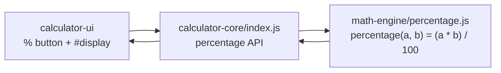

# calculator-core

The **API layer** of the calculator — a thin **delegation** layer that exposes a
**percentage** calculation API and forwards the computation to the nested
[`math-engine`](./math-engine/README.md) module. It deliberately does **not**
re-implement any arithmetic: the single source of truth for computing
"b percent of a" lives in `math-engine/percentage.js`, and this module only
publishes a stable API around it.

Its position in the nested-submodule topology is the middle layer:

```text
parent repository
└── calculator-core/        (API layer — this module)
    └── math-engine/        (computation layer — nested submodule)
        └── percentage.js   percentage(a, b) = (a * b) / 100
```

`calculator-core` is consumed by the sibling **`calculator-ui`** presentation
module: the UI calls this API, this module delegates to `math-engine`, and the
numeric result flows back to the display.

---

## API Surface

The module's `main` entry point is `index.js`. It exports a single **object**
with two **interchangeable** delegating functions — both compute
**"b percent of a"** as `(a * b) / 100`:

| Function | Signature | Returns |
|----------|-----------|---------|
| `percentage` | `percentage(a, b)` | `(a * b) / 100` |
| `calculatePercentage` | `calculatePercentage(a, b)` | `(a * b) / 100` |

Both keys reference the **same** delegating function, so `core.percentage` and
`core.calculatePercentage` are fully interchangeable. Neither performs
computation locally — each calls through to the engine.

### Parameters

| Name | Type | Description |
|------|------|-------------|
| `a` | `number` | The base value. |
| `b` | `number` | The percent to apply. |
| **returns** | `number` | The result of `(a * b) / 100`. |

> **Input hygiene.** Non-numeric input propagates the engine's behavior and
> yields `NaN`. Numeric coercion/validation is intentionally handled at the
> **UI layer** (a presentation concern), so this API stays a minimal, pure
> delegation.

### Node.js / CommonJS usage

Under Node, `require` returns the API object:

```js
const core = require('calculator-core'); // main: index.js

core.percentage(200, 10);         // => 20   (10% of 200)
core.calculatePercentage(50, 10); // => 5    (10% of 50)
```

### Browser `<script>` usage

There is **no bundler**. Load the engine first (it exposes the bare function as
the global `window.percentage`), then load `index.js` (which publishes the API
as the global `window.calculatorCore`):

```html
<script src="math-engine/percentage.js"></script> <!-- defines window.percentage -->
<script src="index.js"></script>                   <!-- defines window.calculatorCore -->
<script>
  window.calculatorCore.percentage(200, 10); // => 20
</script>
```

---

## Engine Wiring

`calculator-core` is a **thin delegation layer** — all computation lives in
`math-engine/percentage.js`. `index.js` resolves the engine function through
whichever runtime it is loaded in and then re-exports it:

- **Node.js:** `const percentage = require('./math-engine/percentage');`
- **Browser:** reads the `window.percentage` global that the engine `<script>`
  publishes when it is loaded first.

Either way, the resolved engine function is wrapped in the API object described
above. Because the core never duplicates the math, `math-engine/percentage.js`
remains the **single source of truth** for the percentage computation.



For the computation details, see the nested engine documentation:
[`math-engine`](./math-engine/README.md).

---

## Build & Test

### Prerequisites

- **Node.js** — Jest 30 supports `^18.14 || ^20 || >=22`; verified on **Node 22.x**.

### Commands

Run from this module's directory:

```bash
cd calculator-core
npm install      # installs jest ^30.4.2 (devDependency)
npm test         # runs jest -> executes index.test.js
```

`npm test` invokes `jest` (declared in this module's `package.json`), which
discovers and runs the module's `*.test.js` files using the default Node test
environment.

### Test coverage

`index.test.js` verifies the **API contract and its delegation to the engine** —
that `percentage` and `calculatePercentage` both forward to
`math-engine/percentage.js` and return `(a * b) / 100`.

---

## Documentation & Scope

This submodule and its nested [`math-engine`](./math-engine/README.md) are
**first-class parts of the project**. Both carry their own `README.md`, and their
sources are annotated with **JSDoc** — no submodule is skipped or excluded from
the documentation.

```text
parent repository        README.md + project overview
└── calculator-core/     README.md (this file) + JSDoc in index.js
    └── math-engine/     README.md + JSDoc in percentage.js
```

---

## License

Released under the **MIT License**, consistent with the `license` field declared
in this module's `package.json`.
