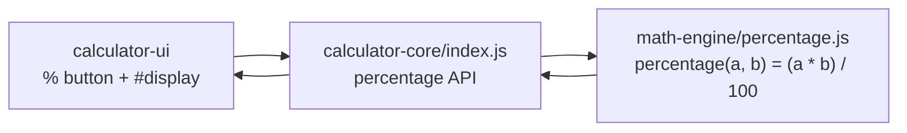

# calculator-core

The **API layer** of the calculator — a thin **delegation** layer that exposes a
**percentage** calculation API and forwards the computation to the nested
[`math-engine`](./math-engine/README.md) module. It deliberately does **not**
re-implement any arithmetic: the single source of truth for computing
"b percent of a" lives in `math-engine/percentage.js`, and this module only
publishes a stable API around it.

Its position in the nested-submodule topology is the middle layer:

```text
parent repository
└── calculator-core/        (API layer — this module)
    └── math-engine/        (computation layer — nested submodule)
        └── percentage.js   percentage(a, b) = (a * b) / 100
```

`calculator-core` is consumed by the sibling **`calculator-ui`** presentation
module: the UI calls this API, this module delegates to `math-engine`, and the
numeric result flows back to the display.

---

## API Surface

The module's `main` entry point is `index.js`. It exports a single **object**
with two **interchangeable** delegating functions — both compute
**"b percent of a"** as `(a * b) / 100`:

| Function | Signature | Returns |
|----------|-----------|---------|
| `percentage` | `percentage(a, b)` | `(a * b) / 100` |
| `calculatePercentage` | `calculatePercentage(a, b)` | `(a * b) / 100` |

Both keys reference the **same** delegating function, so `core.percentage` and
`core.calculatePercentage` are fully interchangeable. Neither performs
computation locally — each calls through to the engine.

### Parameters

| Name | Type | Description |
|------|------|-------------|
| `a` | `number` | The base value. |
| `b` | `number` | The percent to apply. |
| **returns** | `number` | The result of `(a * b) / 100`. |

> **Input hygiene.** This API performs no validation of its own — it forwards
> operands verbatim to the engine, whose **strict** contract therefore applies
> unchanged: any non-`number` operand (a string — including a numeric string
> such as `'10'` or the empty string `''` — `null`, `undefined`, a boolean, an
> array, or an object) yields `NaN`, while valid numbers compute `(a * b) / 100`.
> The `calculator-ui` layer additionally coerces user-entered display text to
> numbers **before** calling (a presentation concern, AAP §0.7.4).

### Node.js / CommonJS usage

Under Node, `require` returns the API object:

```js
const core = require('calculator-core'); // main: index.js

core.percentage(200, 10);         // => 20   (10% of 200)
core.calculatePercentage(50, 10); // => 5    (10% of 50)
```

### Browser `<script>` usage

There is **no bundler**. Load the engine first (it exposes the bare function as
the global `window.percentage`), then load `index.js` (which publishes the API
as the global `window.calculatorCore`):

```html
<script src="math-engine/percentage.js"></script> <!-- defines window.percentage -->
<script src="index.js"></script>                   <!-- defines window.calculatorCore -->
<script>
  window.calculatorCore.percentage(200, 10); // => 20
</script>
```

---

## Engine Wiring

`calculator-core` is a **thin delegation layer** — all computation lives in
`math-engine/percentage.js`. `index.js` resolves the engine function through
whichever runtime it is loaded in and then re-exports it:

- **Node.js:** `const percentage = require('./math-engine/percentage');`
- **Browser:** reads the `window.percentage` global that the engine `<script>`
  publishes when it is loaded first.

Either way, the resolved engine function is wrapped in the API object described
above. Because the core never duplicates the math, `math-engine/percentage.js`
remains the **single source of truth** for the percentage computation.



For the computation details, see the nested engine documentation:
[`math-engine`](./math-engine/README.md).

---

## Build & Test

### Prerequisites

- **Node.js** — Jest 30 supports `^18.14 || ^20 || >=22`; verified on **Node 22.x**.

### Commands

Run from this module's directory (`calculator-core`):

```bash
npm install      # installs jest ^30.4.2 (devDependency)
npm test         # runs jest with default discovery (see note below)
```

> From the parent repository root, run it in a subshell so the `cd` does not
> persist: `(cd calculator-core && npm install && npm test)`.

`npm test` invokes `jest` (declared in this module's `package.json`) with
Jest's **default test discovery**, in the default Node test environment.
Because Jest recurses into subdirectories, running it from `calculator-core/`
discovers **two** suites:

- `index.test.js` — the core API, delegation, and browser-contract tests
  (**13 tests**), and
- `math-engine/percentage.test.js` — the nested engine's own unit tests
  (**7 tests**).

Together they run **20 tests across 2 suites**. Exercising the nested engine
suite alongside the core API is intentional: it validates the whole delegation
path end to end. To run only the core suite in isolation, target it explicitly:

```bash
npx jest index.test.js   # runs just the calculator-core API suite (13 tests)
```

### Test coverage

`index.test.js` verifies the **API contract and its delegation to the engine**:

- **Delegation (proven with a mock/spy).** The engine module is replaced with a
  mock that returns a unique sentinel value; the suite asserts that both
  `percentage` and `calculatePercentage` forward the exact arguments to the
  engine and return its exact result. Because the core returns the sentinel
  (not a computed number), this proves genuine forwarding rather than a copied
  `(a * b) / 100` implementation — an output-only comparison could not.
- **Output behavior.** Separate cases confirm the API computes "b percent of a"
  (`(a * b) / 100`) for representative numeric inputs and does not diverge from
  the real engine's output.
- **Browser (UMD) contract.** The browser branch is evaluated in a VM context
  to confirm it publishes a working `window.calculatorCore` when the engine
  global is present, and **fails fast** — without publishing a broken API —
  when that global is missing or non-callable.

---

## Documentation & Scope

This submodule and its nested [`math-engine`](./math-engine/README.md) are
**first-class parts of the project**. Both carry their own `README.md`, and their
sources are annotated with **JSDoc** — no submodule is skipped or excluded from
the documentation.

```text
parent repository        README.md + project overview
└── calculator-core/     README.md (this file) + JSDoc in index.js
    └── math-engine/     README.md + JSDoc in percentage.js
```

---

## License

Released under the **MIT License**, consistent with the `license` field declared
in this module's `package.json`.
