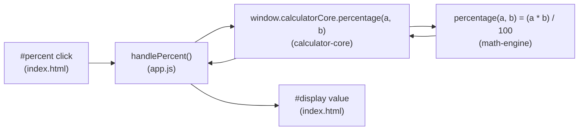

# calculator-ui

The **presentation layer** of the calculator — a minimal, framework-free web UI
built with vanilla HTML, CSS, and JavaScript. It adds a single **Percentage
(`%`)** button that computes a percentage and renders the numeric result into the
shared calculator display. There is **no UI framework and no design system** —
just plain markup, a small stylesheet, and one click handler.

`calculator-ui` is the top layer of the project's nested-module topology and a
**consumer of the sibling [`calculator-core`](../calculator-core/README.md)
percentage API** — it performs no arithmetic of its own:

```text
parent repository
├── calculator-ui/        (presentation layer — this module)
└── calculator-core/      (API layer — the sibling module this UI calls)
    └── math-engine/      (computation layer — nested)
        └── percentage.js  percentage(a, b) = (a * b) / 100
```

The UI reads its operands from the display, asks `calculator-core` to compute the
percentage, and writes the numeric result back into `<input id="display">`.

---

## Files

| File | Role |
|------|------|
| `index.html` | Calculator markup — the shared `#display` input, the `#percent` (`%`) button, a two-press instructions blurb, a live `#status` region, and the ordered `<script>` tags that load the engine, core, and app. Contains **no** inline logic. |
| `app.js` | The click handler / wiring: reads the operand from `#display`, delegates the computation to the `calculator-core` percentage API, and writes the numeric result back to the display. Holds all UI behavior; JSDoc-annotated. |
| `style.css` | Minimal, framework-free styling — 50×40 buttons, a compact card layout, and a visible keyboard focus indicator. |
| `app.test.js` | jsdom-based Jest test suite (**23 tests**) covering the `%` button, the two-press interaction, whole-value numeric coercion, failure-safe display handling, and the missing-`#display` fail-safe (APP-1). |
| `app.node.test.js` | Node-environment Jest suite (**6 tests**, `@jest-environment node`) covering the no-`document` defensive guards and the DOM-free helpers (APP-1). |
| `package.json` | Module manifest declaring the Jest + jsdom dev tooling and the `test` script. |

---

## Percentage Feature & Usage

Clicking the **`%`** button computes a percentage and shows the numeric result in
the display. The operation is a **binary** function, so its signature matches the
calculator's other binary operations:

```text
percentage(a, b) = (a * b) / 100        ("b percent of a")
```

### Two-press interaction model

The UI has a **single `#display` input** and **one `%` button**, so the two
operands are supplied across **two presses** of `%`:

1. **First `%` press** — the current display value is coerced to a number and
   stored as the base `a`; the display is cleared so you can type the percent
   `b`; the `#status` region announces the stored base; and keyboard focus
   returns to the display.
2. **Second `%` press** — the current display value is coerced to the percent
   `b`; `percentage(a, b) = (a * b) / 100` is computed via `calculator-core` and
   written into the display; the stored base is then reset so the next `%` press
   starts a fresh calculation.

### Worked examples

| Keystrokes | Reading | Result shown |
|------------|---------|-------------:|
| `200`, `%`, `10`, `%` | 10% of 200 | `20` |
| `50`, `%`, `12.5`, `%` | 12.5% of 50 | `6.25` |
| `100`, `%`, `0`, `%` | 0% of 100 | `0` |
| `-80`, `%`, `25`, `%` | 25% of -80 | `-20` |

### Input hygiene

Display text is coerced to a **finite number** before it reaches the API using
whole-value parsing, so **non-numeric, empty, or malformed input collapses to a
controlled `0`** rather than propagating `NaN` or `Infinity`. For example, an
empty display, `"10abc"`, or an overflowing value such as `"1e309"` all read as
`0`. If the computation cannot produce a finite result, the display is reset to
`0` and the status region reports the failure — the UI never exposes
`NaN`/`Infinity`.

### Data & control flow



---

## Running the UI

The UI is a **static page — no server and no build step are required**.

1. Open **`calculator-ui/index.html`** directly in a web browser.
2. Type the base value and press **`%`** (the display clears and the status line
   confirms the stored base).
3. Type the percent and press **`%`** again.
4. The computed percentage appears in the display.

### Script load order (engine → core → app)

There is **no bundler**. `index.html` loads three scripts, and their order is
**required** because each publishes a browser global that the next one consumes:

```html
<script src="../calculator-core/math-engine/percentage.js"></script> <!-- defines window.percentage -->
<script src="../calculator-core/index.js"></script>                   <!-- defines window.calculatorCore -->
<script src="app.js"></script>                                        <!-- consumes window.calculatorCore -->
```

This is the project's **UMD / dual-export** consumption model: the same
`calculator-core` files work both under Node `require()` (for the tests) and via a
browser `<script>` include (for this UI). In the browser, `app.js` consumes the
API through the global **`window.calculatorCore`** — an object exposing
`{ percentage, calculatePercentage }` — which `calculator-core/index.js` publishes
after reading the **`window.percentage`** global defined by the engine script. The
relative `../calculator-core/...` paths resolve because the modules live as
in-tree sibling directories under the parent repository.

---

## Build & Test

### Prerequisites

- **Node.js** — Jest 30 supports Node.js `^18.14.0 || ^20.0.0 || ^22.0.0 || >=24.0.0`; verified on
  **Node.js 22.x**.

### Commands

Run from this module's directory (`calculator-ui`):

```bash
npm install   # installs jest ^30.4.2 and jest-environment-jsdom ^30.4.1 (devDependencies)
npm test      # runs jest -> executes app.test.js (jsdom) and app.node.test.js (Node)
```

> From the parent repository root, run it in a subshell so the `cd` does not
> persist: `(cd calculator-ui && npm install && npm test)`.

`npm test` invokes `jest` (declared in this module's `package.json`). The default
test environment is **jsdom** (`"testEnvironment": "jsdom"`), which supplies the
DOM globals the UI tests need. Jest discovers **two** suites here (**29 tests**
total):

- **`app.test.js` (23 tests, jsdom).** Builds a small DOM, simulates clicking the
  `%` button through the two-press interaction, and asserts that the display
  updates correctly, that non-numeric input is coerced to `0`, and that a missing
  `#display` element clears any pending base (the fail-safe policy).
- **`app.node.test.js` (6 tests, Node).** Runs in the default **Node** test
  environment via a `@jest-environment node` docblock (overriding the jsdom
  default for that one file) so `document` is genuinely absent. It proves the
  exported helpers are safe to call without a DOM — `init()` and `handlePercent()`
  never throw and leave the interaction state cleared — and that the DOM-free
  helpers still work.

---

## Documentation & Scope

This submodule is a **first-class part of the project**. Per the project's
documentation mandate, every module — the parent repository and all submodules,
including the nested `math-engine` — carries its own `README.md`, and every
function/API is annotated with **JSDoc**; no submodule is skipped or excluded.
`calculator-ui` is documented by this `README.md` and by the JSDoc in its source
(`app.js`).

Related documentation:

- [Parent repository README](../README.md) — project overview and the
  nested-module architecture.
- [`calculator-core` README](../calculator-core/README.md) — the percentage API
  this UI calls.
- [`math-engine` README](../calculator-core/math-engine/README.md) — the
  `percentage(a, b) = (a * b) / 100` computation.

---

## License

Released under the **MIT License**, consistent with the `license` field declared
in this module's `package.json`.
